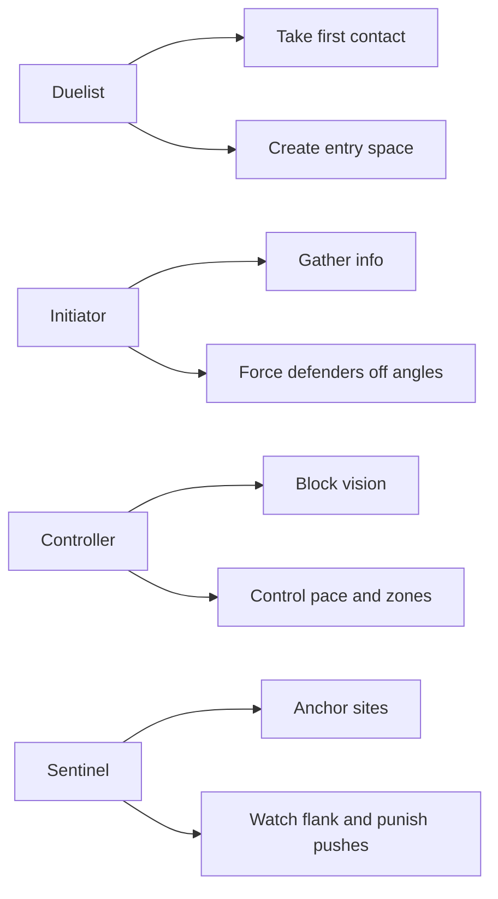

# Complete VALORANT Agent Guide

## Executive summary

entity["company","Riot Games","game developer"]’ current public agent directory lists **29 playable VALORANT agents**. In practical team-building terms, **Duelists** create first contact and convert opening fights, **Initiators** gather info and force defenders off angles, **Controllers** cut sightlines and shape tempo, and **Sentinels** secure map control, lock flanks, and stall or punish pushes. One roster-count wrinkle is that **lore numbering does not perfectly match the playable count**: public pages currently show **29 playable agents**, even though **Miks** is presented as **Agent 30** in public references. citeturn1search1turn20search3turn31search7

## Role objectives

At a high level, the best teams usually let duelists spend utility to **enter or re-peek**, initiators spend utility to **make those entries favorable**, controllers spend utility to **remove the most dangerous sightlines**, and sentinels spend utility to **buy time, hold map space, and make rotates safer**. citeturn1search1turn13search0turn17search0

## Duelists

### Jett

**Role:** Duelist  
**Q – Updraft:** Quick vertical launch. **Use:** break crosshair placement, reach off-angles, combo with knives/dash. **Best timing:** first contact, surprise re-peek, eco/ult rounds.  
**C – Cloudburst:** Short, curved smoke. **Use:** isolate one angle, cover your dash path, emergency obscure a defuse/tap. **Best timing:** just before entry or immediately after an opening duel.  
**E – Tailwind:** Primed dash for instant reposition. **Use:** take first duel, then escape or cross lethal sightlines. **Best timing:** opening peek, Operator contact, hard site entry.  
**X – Blade Storm:** Accurate throwing knives. **Use:** mobile fights, vertical peeks, eco conversion rounds. **Best timing:** low-buy rounds, anti-eco aggression, aerial/off-angle plays.  

**Playstyle:** Jett is the classic first-contact entry. She is strongest when her utility is used to **win or escape the very first duel**, not when it is burned early without space gained.  

**Core tips**
- Prime dash **before** committing to the duel you want to take.
- Spend Cloudbursts on **pathing and isolation**, not long stalls.
- Updraft only when it changes the angle math or makes you hard to trade.

These recommendations align with current kit references and recent high-level Jett guide coverage. citeturn25search1turn25search4turn25search8

### Phoenix

**Role:** Duelist  
**Q – Curveball:** Curving flash around corners. **Use:** pop-flash your own swing or your entry partner’s swing. **Best timing:** right before a close peek, especially on tight corners.  
**C – Blaze:** Curved fire wall that blocks vision and damages enemies. **Use:** split a site, deny one angle, or heal in safety. **Best timing:** executes, anti-rush stall, post-plant angle denial.  
**E – Hot Hands:** Fireball that damages enemies and heals Phoenix. **Use:** flush corners, stall choke pushes, self-heal between fights. **Best timing:** before entering a common close angle or after surviving first contact.  
**X – Run It Back:** Temporary second life from a return marker. **Use:** take a risk-free entry or info play. **Best timing:** hard site hits, retakes, or when your team needs exact defender positions.  

**Playstyle:** Phoenix is a self-sufficient entry who thrives in short-range, tempo-heavy fights. He is best when he **calls his flash timing clearly**, takes space fast, then uses fire to sustain or deny the retake.  

**Core tips**
- Announce every Curveball; team-flashing is Phoenix’s most common mistake.
- Place Run It Back from a **safe marker** that enemies cannot easily camp.
- Use Hot Hands aggressively; holding it too long wastes one of his best tempo tools.

Phoenix’s kit summary and the play recommendations below are consistent with current wiki references and recent 2026 ranked guide coverage. citeturn25search3turn37search0

### Raze

**Role:** Duelist  
**Q – Blast Pack:** Sticky satchel that detonates for movement/displacement. **Use:** clear close pockets, self-launch for entry, or break defender crosshair placement. **Best timing:** first entry burst, anti-utility swing, post-plant reposition.  
**C – Boom Bot:** Rolling scout bot that chases targets. **Use:** clear corners and force defenders either to shoot or move. **Best timing:** just before contact into tight spaces.  
**E – Paint Shells:** Cluster grenade with submunitions. **Use:** punish common anchor spots or force defenders out of cover. **Best timing:** before your team turns the corner or on spike/defuse denial.  
**X – Showstopper:** Rocket launcher ultimate. **Use:** crack a stacked site, punish a trapped defender, or convert a numbers advantage. **Best timing:** committed execute, anti-retake, or punish grouped enemies.  

**Playstyle:** Raze is an area-denial duelist who creates space by making cover unsafe. She is strongest when her damage utility **forces movement first**, then she or her team swings the displaced target.  

**Core tips**
- Send Boom Bot first on cramped entries; do not dry-close-clear with it in hand.
- Satchel for **angle break or movement**, not random chip damage.
- Use grenade to force movement, then peek the displaced player.

Raze’s current kit and 2026 play patterns are reflected in current kit pages and recent guide coverage. citeturn25search0turn25search6turn34search0

### Reyna

**Role:** Duelist  
**Q – Devour:** Consume Soul Orb to heal/overheal. **Use:** chain into the next duel after a kill. **Best timing:** immediately after winning a fight when more contact is likely.  
**C – Leer:** Destructible nearsight eye. **Use:** force defenders to either shoot it or fight blind. **Best timing:** before peeking a held angle or taking space through a choke.  
**E – Dismiss:** Consume Soul Orb to go intangible; invisible in Empress. **Use:** escape trades, reposition, or cross an exposed gap. **Best timing:** immediately after a kill when enemies can trade you.  
**X – Empress:** Combat-stim frenzy with infinite Soul Harvest usage. **Use:** snowball rounds where you expect repeated duels. **Best timing:** swing rounds, clutchable man-disadvantage rounds, or when you have momentum.  

**Playstyle:** Reyna is the purest “carry if you frag” duelist. She offers relatively little team utility beyond Leer, so her value spikes when she is allowed to **win isolated fights and instantly convert them into heal or escape tempo**.  

**Core tips**
- Use Leer to force attention splits, not as a substitute for all entry utility.
- Dismiss is usually more valuable than Devour when you are exposed to a trade.
- Pop Empress when you expect **multiple fights**, not one clean duel.

Reyna’s mechanics and role identity are well supported by current kit pages and 2026 community guide summaries. citeturn25search2turn25search5turn34search3

### Yoru

**Role:** Duelist  
**Q – Blindside:** Bounce flash off hard surfaces. **Use:** create off-angle pop-flashes for your own swing or teleport timing. **Best timing:** just before peek tempo or Gatecrash activation.  
**C – Fakeout:** Decoy that can flash when broken. **Use:** bait shots, fake presence, sell map pressure, or push a defender off discipline. **Best timing:** default rounds, fakes, post-plant confusion.  
**E – Gatecrash:** Rift tether teleport. **Use:** take a risky angle with a prepared escape or create late lurk/entry timing. **Best timing:** before contact, or mid-round after defenders rotate.  
**X – Dimensional Drift:** Intangible scouting ultimate. **Use:** scout site setup, pinch timing, or force defenders to react to multiple threats. **Best timing:** before committed hits or clutch information checks.  

**Playstyle:** Yoru is a deception duelist, not a straight-line entry duelist. He is strongest when he makes defenders **look the wrong way first**, then arrives from the angle or timing they least expect.  

**Core tips**
- Set Gatecrash before your taking space, not after you are already trapped.
- Treat Fakeout as information and pressure utility, not only as a gimmick flash.
- Your best rounds usually combine **fake pressure + real timing**, not one trick alone.

Yoru’s current kit and deception-focused play patterns match the current ability summaries and recent guide coverage. citeturn26search0turn26search3turn37search1

### Neon

**Role:** Duelist  
**Q – Relay Bolt:** Bouncing concuss projectile. **Use:** stun entry angles and force defenders into easier slide fights. **Best timing:** right before sprinting in, or as a rush-stopper on defense.  
**C – Fast Lane:** Twin walls creating a protected corridor. **Use:** cut crossfires and give yourself a lane to burst through. **Best timing:** hard execute or fast retake cross.  
**E – High Gear:** Sprint plus slide charge. **Use:** overwhelm first-contact timing, rotate quickly, or re-peek from a different line. **Best timing:** entry moment, fast defense rotate, or punish a concussed defender.  
**X – Overdrive:** Mobile accuracy lightning beam. **Use:** dominate eco/force rounds or highly mobile entries. **Best timing:** low-buy rounds, fast retakes, or rounds built around speed.  

**Playstyle:** Neon is velocity as pressure. Her best rounds happen when concuss, wall, sprint, and slide are used in one **compressed timing window** so defenders never get a stable fight.  

**Core tips**
- Relay Bolt should land **before** your sprint entry, not after.
- Do not lurk with Neon unless your team composition is extremely specific.
- Save slide for the highest-risk crossing or the follow-up reposition after first contact.

Neon’s current keybinds and speed-first play patterns are supported by current wiki references and recent 2026 guides. citeturn27search0turn34search2

### Iso

**Role:** Duelist  
**Q – Undercut:** Wall-passing debuff bolt that applies Vulnerable and Suppress. **Use:** soften anchor positions before swinging. **Best timing:** just before you or a teammate takes the duel.  
**C – Contingency:** Moving bullet-blocking wall. **Use:** take space through open sightlines or isolate one side of a fight. **Best timing:** committed entry, mid choke cross, anti-Operator pressure.  
**E – Double Tap:** Focus/shield state that can refresh via orbs. **Use:** convert first kill into safe snowball tempo. **Best timing:** before first-contact duel when you expect immediate follow-up fights.  
**X – Kill Contract:** Arena duel ultimate. **Use:** remove the most dangerous defender or break a numbers disadvantage. **Best timing:** when one threat is anchoring too much value, or in high-leverage clutch rounds.  

**Playstyle:** Iso is a duel-focused, self-buffing entry. He is best when he lines up one favorable first fight, **wins it with shield backing**, then immediately uses the refreshed momentum to keep pushing.  

**Core tips**
- Cast Undercut before contact; it is strongest as pre-fight prep.
- Use Contingency to **cross** or **wall off a gunfight**, not as generic cover.
- Ult the player who matters most, not simply the closest target.

Iso’s current kit and current 2026 role guidance align across current references and guide coverage. citeturn26search2turn26search8

### Waylay

**Role:** Duelist  
**Q – Lightspeed:** Burst dash with possible vertical first dash. **Use:** explode into site space or change your elevation during entry. **Best timing:** first committed entry or surprise re-peek.  
**C – Saturate:** Ground-impact Hinder cluster. **Use:** cripple defenders so they cannot strafe, reset recoil, or trade well. **Best timing:** just before you or your team swings.  
**E – Refract:** Beacon snapback while invulnerable in transit. **Use:** take aggressive space with a built-in reset button. **Best timing:** before first contact or risky off-angle peeks.  
**X – Convergent Paths:** Expanding Hinder beam with self speed boost. **Use:** demolish a site’s first layer of defense or shut down a committed push. **Best timing:** executes, anti-rush defense, or man-disadvantage rounds that need tempo.  

**Playstyle:** Waylay is a pressure duelist built around **Hinder + mobility + reset safety**. Compared with Jett or Neon, she is less about pure speed and more about making enemies too crippled to fight back normally before she bursts in.  

**Core tips**
- Refract should already be placed before you take the dangerous peek.
- Saturate first, Lightspeed second; reverse order wastes her best entry pattern.
- Ult chokepoints where enemies cannot easily scatter before the expansion.

Waylay’s current kit and its pressure-entry identity are well supported by current kit pages and 2026 community guide coverage. citeturn26search1turn26search5turn34search1

## Initiators

### Breach

**Role:** Initiator  
**Q – Flashpoint:** Through-wall flash. **Use:** blind a known hold without exposing yourself. **Best timing:** just before your duelist swings or retake timing breaks.  
**C – Aftershock:** Through-wall damage burst. **Use:** clear stubborn corners, plant spots, or post-plant positions. **Best timing:** when you know the target is trapped or committed.  
**E – Fault Line:** Long concuss line. **Use:** start a site hit, deny a retake lane, or support a teammate’s peek at range. **Best timing:** the first beat of an execute or the first beat of a defense hold.  
**X – Rolling Thunder:** Massive terrain-traveling knockup/concuss ultimate. **Use:** crack a full site or retake with overwhelming CC. **Best timing:** high-value execs, retakes, or anti-rush shutdowns.  

**Playstyle:** Breach is pure crowd-control. He is strongest when a teammate is ready to **instantly capitalize** on his stun/flash windows rather than when he throws utility into empty space.  

**Core tips**
- Use Aftershock to clear **known** spots, not speculative ones.
- Breach utility should start teammate action, not come after it.
- Communicate exact stun/flash timing; he is far weaker when teammates are late.

Breach’s kit and crowd-control-first usage are consistent across current kit pages and 2026 guide coverage. citeturn29search0turn29search8turn29search9

### Fade

**Role:** Initiator  
**Q – Seize:** Fear knot that holds, Deafens, and Decays. **Use:** pin a defender in place for an easy swing or utility combo. **Best timing:** just before entry or when a defender is stuck behind cover.  
**C – Prowler:** Tracking nearsight creature. **Use:** clear corners and follow Haunt trails. **Best timing:** immediately after info or to lead a close push.  
**E – Haunt:** Revealing watcher that creates terror trails. **Use:** get the first info on site or during retakes. **Best timing:** before committing to a site or before defenders push into you.  
**X – Nightfall:** Long wave that Marks, Deafens, and Decays. **Use:** flood a site with debuffed enemies or initiate a retake. **Best timing:** committed hits, retakes, or stall-breaking rounds.  

**Playstyle:** Fade is at her best when her utility is chained in order: **Haunt → trail → Prowler/Seize → swing**. She is a tempo initiator who turns brief information into immediate punishment.  

**Core tips**
- Prowler is strongest when it has a trail or a clear chokepoint to follow.
- Seize is a setup tool; coordinate it with damage or a peek.
- Nightfall should signal a committed plan, not a tentative one.

Fade’s current mechanics and standard 2026 play patterns are aligned in current kit pages and guide coverage. citeturn29search2turn39search0

### Gekko

**Role:** Initiator  
**Q – Wingman:** Seek-and-concuss creature that can plant/defuse. **Use:** take first contact utility or create safe spike interactions. **Best timing:** entry follow-up, post-plant spike work, or retake defuse pressure.  
**C – Mosh Pit:** Delayed zoning explosion. **Use:** force anchors or defusers out of a spot. **Best timing:** default plant denial, post-plant denial, or close-clear bursts.  
**E – Dizzy:** Airborne blinding scout. **Use:** flash and reveal defenders while your team follows. **Best timing:** the first beat of a site take or retake.  
**X – Thrash:** Pilotable detain creature. **Use:** catch anchors or post-plant players who cannot easily escape. **Best timing:** before your team floods site or during the start of a retake.  

**Playstyle:** Gekko is a retrieval initiator. His ceiling comes from **throwing utility, taking enough space to reclaim it, then using it again later in the same round**.  

**Core tips**
- Play close enough to recover globules when the round state allows.
- Wingman’s plant/defuse utility is often more valuable than a generic concuss.
- Mosh Pit is a timing weapon—use it when enemies are committed to standing still.

Gekko’s current kit and retrieval-based play identity are supported by current references and 2026 guide coverage. citeturn30search0turn39search1

### KAY/O

**Role:** Initiator  
**Q – FLASH/drive:** Overhand or underhand flash grenade. **Use:** pop your own fights or layer fast support flashes for teammates. **Best timing:** immediately before a peek, with underhand for tight pops.  
**C – FRAG/ment:** Multi-pulse damaging fragment. **Use:** force enemies off default positions and punish trapped players. **Best timing:** before contact on common holds or on spike/defuse denial.  
**E – ZERO/point:** Suppression blade. **Use:** reveal and suppress defenders before committing. **Best timing:** start of execs, anti-sentinel clears, early defense info.  
**X – NULL/cmd:** Suppression pulses and combat-stim state. **Use:** overwhelm utility-heavy sites and let your team fight a “gun-only” round. **Best timing:** committed execs or retakes against strong defensive setups.  

**Playstyle:** KAY/O is an anti-utility initiator. He is best when he strips defenders of their defensive toolkit **before** the duelists and riflers turn the corner.  

**Core tips**
- Knife first, then decide the hit based on who is suppressed.
- Learn quick-pop underhand flashes; they are his best self-entry tool.
- Ult when enemy utility matters most, not just when a fight is starting.

KAY/O’s current kit and suppression-first usage are supported across current ability references and recent 2026 guides. citeturn28search0turn28search5

### Skye

**Role:** Initiator  
**Q – Trailblazer:** Controllable tiger scout with concuss. **Use:** clear close corners and confirm defender positions. **Best timing:** before an entry or early defense info.  
**C – Regrowth:** Team heal channel. **Use:** top teammates up after the first exchange, especially before post-plant or before the next wave of contact. **Best timing:** after site take, after an early duel, between retake phases.  
**E – Guiding Light:** Steerable hawk flash with confirmation when it catches enemies. **Use:** flash exactly the angle your team wants to swing. **Best timing:** right before a teammate peeks or to stop a choke push.  
**X – Seekers:** Three tracking nearsight seekers. **Use:** locate final defenders or make retakes much easier to structure. **Best timing:** before committed execs or the first beat of a retake.  

**Playstyle:** Skye is the most hybrid initiator-support in the pool. She excels when she **scouts first, flashes second, then heals and stabilizes** her team after the opening exchange.  

**Core tips**
- Skye should usually flash **for** the entry, not be the entry.
- Use Regrowth after the first duel phase, not while bullets are still flying.
- Trailblazer from safety; your body is exposed while piloting it.

Skye’s current kit and support-initiator rhythm are well supported by current references and 2026 guide coverage. citeturn28search1turn39search2

### Sova

**Role:** Initiator  
**Q – Shock Bolt:** Damage arrow with charge and bounces. **Use:** clear close cover, punish plant/defuse, and combo off recon info. **Best timing:** when enemies are tagged or stuck.  
**C – Owl Drone:** Pilotable drone with tracking dart. **Use:** clear deep angles safely and mark anchors. **Best timing:** right before entry or at retake start.  
**E – Recon Bolt:** Reveal arrow with charge and bounces. **Use:** gather first info and force defenders either to break it or move. **Best timing:** before deciding the hit, or before a defensive swing.  
**X – Hunter’s Fury:** Three wall-piercing blasts that damage and reveal. **Use:** convert recon/drone tags into kills or deny plant/defuse. **Best timing:** immediately after info lands, or on spike interaction.  

**Playstyle:** Sova is an information initiator with the highest payoff when his info is precise. He is strongest when his reveal utility is immediately followed by **damage, a swing, or an ult conversion**.  

**Core tips**
- Recon is not just “info”—it is permission for your team to act.
- Drone first on dangerous, deep angles instead of sacrificing a player.
- Hold ult for recon/drone combos or spike moments whenever possible.

Sova’s kit and typical 2026 usage patterns are strongly supported by current kit references and guide coverage. citeturn28search2turn39search3

### Tejo

**Role:** Initiator  
**Q – Special Delivery:** Sticky concuss grenade with optional bounce. **Use:** dislodge close defenders or start a close-range push. **Best timing:** just before your team swings a known anchor position.  
**C – Stealth Drone:** Direct-control drone that suppresses and reveals on pulse. **Use:** safely clear site space and disable utility users. **Best timing:** execute start, retake start, or anti-sentinel checking.  
**E – Guided Salvo:** Map-targeted missile strikes. **Use:** force defenders off default holds or split their attention before the hit. **Best timing:** the first committed beat of an execute or anti-retake stall.  
**X – Armageddon:** Tactical line strike of lethal explosions. **Use:** wipe entrenched defenders, stop multiman retakes, or break open a decisive round. **Best timing:** when enemy positions are known and movement is constrained.  

**Playstyle:** Tejo is a long-range pressure initiator. He excels at making defenders give up space **before** his teammates ever face them directly.  

**Core tips**
- Spend Guided Salvo to create movement, then punish the movement.
- Drone from relative safety and communicate exactly who got hit.
- Tejo is strongest in structured hits, not chaotic solo peeks.

Tejo’s current kit and its long-range, ordnance-heavy usage are well supported across current kit references and 2026 guides. citeturn29search1turn29search6turn29search3

## Controllers

### Astra

**Role:** Controller  
**C – Gravity Well:** Star activation that pulls and makes enemies Vulnerable. **Use:** yank anchors from cover or punish defuse/plant commitments. **Best timing:** just before a teammate swings or when enemies are committed to a spot.  
**Q – Nova Pulse:** Star activation that concusses after a delay. **Use:** stun common holds, retake paths, or spike positions. **Best timing:** just before your team peeks or to break a retake timing.  
**E – Nebula / Dissipate:** Star activation into smoke, or fake-smoke recall. **Use:** cut vision, fake pressure, or preserve star flexibility. **Best timing:** execute start, reactive defense stall, or post-plant denial.  
**X – Astral Form / Cosmic Divide:** Overhead star placement mode and ultimate wall. **Use:** set utility globally and, with ult, split fights, bullets, and sound. **Best timing:** pre-exec setup, high-value post-plants, high-value retakes.  

**Playstyle:** Astra is the most macro-oriented controller in the game. Her power comes from **pre-placed stars and rapid interpretation** of what the round needs next: smoke, stun, or pull.  

**Core tips**
- Do your star planning before chaos starts.
- Use Gravity Well as a setup tool, not just generic crowd control.
- Enter Astral Form only when teammates can cover you.

Astra’s unusual button mapping and global-control identity are well supported by current kit references and recent 2026 guide coverage. citeturn24search3turn24search9turn35search1

### Brimstone

**Role:** Controller  
**Q – Incendiary:** Long-lasting molotov. **Use:** deny pushes, punish plants/defuses, or clear close cover. **Best timing:** site anchor denial or spike denial.  
**C – Stim Beacon:** Area combat-stim and speed boost. **Use:** accelerate a hit, win a held corridor fight, or sharpen a retake burst. **Best timing:** just before teammates begin the gunfight.  
**E – Sky Smoke:** Tactical-map smoke deployment. **Use:** remove key sightlines in one synchronized wave. **Best timing:** execute start, retake start, or emergency stall.  
**X – Orbital Strike:** High-DPS zone ultimate. **Use:** force enemies off spike or wipe fixed positions. **Best timing:** spike interaction or a trapped defender.  

**Playstyle:** Brimstone is the simplest and most direct controller: clear smokes, strong lane denial, and reliable team tempo. He is best when his utility is used in **short, coordinated bursts**, not stretched over long defaults.  

**Core tips**
- Don’t stagger smokes randomly; use them to start a clear plan.
- Molly wins rounds on spike timing—preserve it when post-plant matters.
- Stim is strongest when teammates are **about to shoot**, not just moving.

Brimstone’s current kit and straightforward controller identity are consistently described in current kit pages and recent guide coverage. citeturn24search0turn24search5turn24search4

### Clove

**Role:** Controller  
**Q – Meddle:** Delayed Decay burst. **Use:** soften an anchor or punish grouped players before the swing. **Best timing:** the beat before contact or on retake entry.  
**C – Pick-me-up:** Haste and temporary health from a damaged/killed enemy. **Use:** convert a won duel into tempo for the next one. **Best timing:** immediately after a frag when more contact is coming.  
**E – Ruse:** Smoke map placement, usable after death. **Use:** keep executing or stalling even if you die. **Best timing:** standard controller smoke timings; also after death to preserve team plan.  
**X – Not Dead Yet:** Self-resurrection ultimate. **Use:** re-enter a round where one more body can flip the fight. **Best timing:** when your team can cover you and a follow-up kill/assist is realistic.  

**Playstyle:** Clove is an aggression-forward controller. Unlike classic backline smokers, Clove can safely take more space because even death does not fully remove their smoke value.  

**Core tips**
- Take fights where Pick-me-up can matter immediately afterward.
- Save ult for rounds where resurrection can be **protected and converted**.
- Remember your controlling job does not disappear when you die.

Clove’s current kit and aggressive-controller identity are supported by current kit pages and recent 2026 guide coverage. citeturn24search2turn35search2

### Harbor

**Role:** Controller  
**Q – High Tide:** Curvable water wall that slows on cross. **Use:** cut several defender sightlines at once or reshape a retake lane. **Best timing:** committed site hits and retakes.  
**C – Storm Surge:** Delayed whirlpool that slows and nearsights. **Use:** dislodge close defenders and punish committed chokepoint players. **Best timing:** just before your team turns the corner or to stall a rush.  
**E – Cove:** Water smoke that can become shielded. **Use:** protect a plant, isolate one pocket, or create temporary hard cover. **Best timing:** plant moment, retake cross, or emergency rescue smoke.  
**X – Reckoning:** Forward flood that slows and nearsights enemies hit. **Use:** destabilize site anchors or break a coordinated push. **Best timing:** execute opener, anti-rush response, or retake opener.  

**Playstyle:** Harbor is a tempo controller built around **moving pressure** and broad vision denial. His value rises when the team commits hard behind his utility rather than defaulting passively around it.  

**Core tips**
- Curve High Tide with a site plan in mind; random walls waste his biggest strength.
- Spend Cove on the highest-value interaction—usually plant or a lethal cross.
- Harbor is better at **driving** an execute than passively holding a default.

I prioritized current public kit pages here because Harbor’s older launch-era guides describe an outdated version of his kit; the guidance below is anchored to current public references. citeturn31search0turn23search2turn23search5

### Miks

**Role:** Controller  
**Q – Harmonize:** Shared or self combat-stim buff. **Use:** supercharge entry pair timings or help a swing player snowball. **Best timing:** just before planned contact, especially with your duelist.  
**C – M-pulse:** Toggleable Concuss/Healing pulse device. **Use:** heal teammates before the next fight or concuss a defender holding space. **Best timing:** pre-fight setup, post-fight stabilization, anti-rush stall.  
**E – Waveform:** Map-targeted smokes. **Use:** execute standard controller smoke responsibilities with better reach/flexibility. **Best timing:** execute start, retake start, or defensive stall.  
**X – Bassquake:** Forward sonic blast that knocks back, deafens, and slows. **Use:** break entrenched stacks, disrupt rushes, or create an easy flood window. **Best timing:** committed hits, retakes, or anti-rush emergency.  

**Playstyle:** Miks is a hybrid controller-support. He is most valuable when he treats smoking as baseline duty and uses the rest of his kit to **enable one teammate’s timing window** rather than trying to do everything at once.  

**Core tips**
- Decide whether M-pulse is for heal or concuss **before** the fight starts.
- Harmonize is best on the player who will see first contact.
- Bassquake is strongest when enemies are committed and cannot easily spread.

Miks is one of the newest agents in the current public pool; kit and role details are anchored to current public references, with playstyle guidance drawn from recent 2026 guide coverage. citeturn31search2turn31search7turn35search3

### Omen

**Role:** Controller  
**Q – Paranoia:** Wall-passing nearsight/deafen projectile. **Use:** blind multiple defenders through cover and start your team’s swing. **Best timing:** the split-second before peek contact.  
**C – Shrouded Step:** Short teleport. **Use:** reposition unpredictably, access off-angles, or cross small exposure windows. **Best timing:** after smoke/Paranoia pressure or on lurk timings.  
**E – Dark Cover:** Long-lasting precision smoke. **Use:** cut key sightlines, one-way setups, and layered lurk pressure. **Best timing:** executes, defense stall, post-plant angle shaping.  
**X – From the Shadows:** Global teleport ultimate. **Use:** reposition into lurk pressure, gather information, or force defenders to second-guess site distribution. **Best timing:** mid-round rotations, late flanks, isolated site steals.  

**Playstyle:** Omen is the most self-sufficient controller. He combines standard smoke duty with enough personal disruption and movement to create his own openings, especially in ranked and looser defaults.  

**Core tips**
- Paranoia should start the swing, not follow it.
- Teleport after pressure has already drawn eyes elsewhere.
- Omen wins many rounds by threatening space, not only by occupying it.

Omen’s current kit and self-sufficient controller profile are well supported by current kit pages and recent 2026 guide coverage. citeturn31search1turn33search3

### Viper

**Role:** Controller  
**Q – Poison Cloud:** Reusable gas orb smoke. **Use:** anchor a choke, create one-ways, or protect the spike. **Best timing:** contact denial, post-plant denial, or isolated hold setups.  
**C – Snake Bite:** Damaging acid pool with Vulnerable. **Use:** punish anyone stuck in your gas or trying to plant/defuse. **Best timing:** on spike interaction or layered with other toxin utility.  
**E – Toxic Screen:** Long reusable wall consuming fuel. **Use:** split sites and deny crossfires on attack, or force awkward pushes on defense. **Best timing:** executes, site holds, and structured retakes.  
**X – Viper’s Pit:** Massive toxic zone ultimate. **Use:** turn one site or spike area into your territory. **Best timing:** must-win anchor rounds, post-plant lockdowns, or difficult retakes.  

**Playstyle:** Viper is a territorial, persistent controller. Unlike faster controllers, she wants rounds where her utility defines the map and the enemy is forced to **fight through her chosen geometry**.  

**Core tips**
- Think in fuel cycles; Viper wins by timing toggles, not leaving them up forever.
- Snake Bite is deadliest when layered with Decay/Vulnerable logic.
- Pit is a space-ownership ult—plant or anchor around it, do not wander.

Viper’s current kit and map-splitting, fuel-based playstyle are strongly supported by current references and recent 2026 guide coverage. citeturn31search3turn33search0

## Sentinels

### Chamber

**Role:** Sentinel  
**Q – Headhunter:** Equip precision heavy pistol. **Use:** take premium opening shots while preserving rifle economy. **Best timing:** pistol/half-buy rounds, long-angle holds, anti-eco confidence fights.  
**C – Trademark:** Scan trap that creates a slowing field. **Use:** watch flank or punish a predictable lane. **Best timing:** early-round map control and post-plant flank denial.  
**E – Rendezvous:** Teleport anchor escape. **Use:** hold aggressive angles with a built-in disengage. **Best timing:** first-contact defense peeks or off-angle lurks.  
**X – Tour De Force:** Custom sniper ult creating slow field on kill. **Use:** lock an angle or break an execute with one pick. **Best timing:** strong economy leverage rounds, anti-rush defense, operator-value maps.  

**Playstyle:** Chamber is a sentinel that behaves partly like an operator specialist. He is strongest when he takes one sharp first duel, escapes cleanly, then leaves the enemy to push through slowdown and numbers loss.  

**Core tips**
- Set Rendezvous before exposing yourself; that is the whole point of Chamber.
- Trademark is for information and tempo insurance, not a full site hold by itself.
- Take disciplined first-contact shots, then disengage.

Chamber’s current kit and his precision-first sentinel identity are consistent across current kit references and recent 2026 guide coverage. citeturn32search2turn36search2

### Cypher

**Role:** Sentinel  
**Q – Cyber Cage:** Instant throwable smoke/cage with pass-through cue. **Use:** delay a push, protect from a swing, or create one-way style holds. **Best timing:** contact moment, anti-rush stall, or post-plant cover.  
**C – Trapwire:** Covert tether trap. **Use:** secure flanks, hold site lanes, or create layered anti-rush setups. **Best timing:** pre-round setup, post-plant retake lane denial.  
**E – Spycam:** Placeable camera with tracking dart. **Use:** gather info safely and force enemies to reveal themselves destroying it. **Best timing:** early default, late-round lurk watch, retake info.  
**X – Neural Theft:** Reveal all living enemies twice from a corpse. **Use:** instantly solve rotations or post-plant positioning. **Best timing:** as soon as a safe corpse is available and the info will change decisions.  

**Playstyle:** Cypher is an information sentinel who scales with patience. He is strongest when the enemy must constantly respect hidden utility and cannot freely rotate, lurk, or explode through a lane.  

**Core tips**
- Separate your utility layers; do not stack everything to die to one clear.
- Camera is best when it sees what your body does not.
- On attack, Cypher’s value shifts heavily toward flank watch and post-plant setups.

Cypher’s current kit and his info-heavy sentinel role are well supported across current kit pages and recent 2026 guide coverage. citeturn32search1turn32search4turn33search2

### Deadlock

**Role:** Sentinel  
**Q – Sonic Sensor:** Sound-triggered concuss trap. **Use:** punish committed pushes, noisy lurks, or retake lanes. **Best timing:** pre-round setup or post-plant lane denial.  
**C – Barrier Mesh:** Movement-blocking nanowire barrier. **Use:** physically stop or redirect pushes, block retake paths, or protect spike interactions. **Best timing:** early site hold, post-plant lane denial, anti-rush emergency.  
**E – GravNet:** Throwing net that forces crouch/slow. **Use:** cripple a push or ruin a defender’s hold angle before entry. **Best timing:** the instant enemies commit through a choke or before your team swings a held spot.  
**X – Annihilation:** Capture-and-drag ultimate cocoon. **Use:** remove a critical player or force the enemy into a rescue disaster. **Best timing:** man-advantage conversions, site retakes, or anti-entry punishes.  

**Playstyle:** Deadlock is a hardware-denial sentinel. She shines by making attackers **spend time and movement** just to get through a space, then punishing the slowed/forced path.  

**Core tips**
- GravNet is best when the enemy is already committed to a lane.
- Barrier Mesh is tempo utility—use it to buy seconds, not just space.
- Layer sensor behind barrier or pressure; isolated utility is easier to clear.

Deadlock’s current kit and standard 2026 area-denial play patterns are supported by current kit references and guide coverage. citeturn32search3turn32search8turn36search0

### Killjoy

**Role:** Sentinel  
**Q – Alarmbot:** Hunting bot that applies Vulnerable. **Use:** hold flank or debuff the first player into a push. **Best timing:** pre-round setup and post-plant retake path denial.  
**C – Nanoswarm:** Hidden damaging grenade. **Use:** anti-rush choke punishment or spike/defuse denial. **Best timing:** when enemies are committed to a space or spike interaction.  
**E – Turret:** Automated firing turret. **Use:** watch an angle, reveal contact, or help hold a crossfire. **Best timing:** pre-round site setup, mid-round lurk watch, post-plant lane watch.  
**X – Lockdown:** Massive detain device. **Use:** clear a site, force off a retake, or make retakers choose between leaving and fully committing to destroy it. **Best timing:** execute start or retake start in pivotal rounds.  

**Playstyle:** Killjoy is a layered utility sentinel. She is strongest when attackers walk into **bot → debuff → swarm → swing** sequences that cost them health, time, and composure.  

**Core tips**
- Make every gadget answer the question “what happens after first contact?”
- Nanoswarm is strongest on timings, not random activation.
- Stay in range to keep your setup active and responsive.

Killjoy’s current kit and utility-layer sentinel identity are well supported by current kit pages and recent guide coverage. citeturn27search2turn36search1

### Sage

**Role:** Sentinel  
**Q – Slow Orb:** Lingering slow field. **Use:** stall a rush, punish a choke, or make post-plant taps difficult. **Best timing:** first rush contact, retake path denial, anti-defuse.  
**C – Barrier Orb:** Fortifying wall. **Use:** block a lane, reshape plant geometry, or create a must-break delay. **Best timing:** earliest rush contact, plant protection, or post-plant time-buy.  
**E – Healing Orb:** Heal-over-time for ally or self. **Use:** restore the player most likely to take the next important fight. **Best timing:** immediately after the first duel phase, not too late.  
**X – Resurrection:** Full revive of a dead ally. **Use:** turn a numbers deficit into a winnable hold or post-plant. **Best timing:** when the body is coverable and the revived player can matter right away.  

**Playstyle:** Sage is a stall-and-sustain sentinel. She rarely creates openings alone, but she makes your team **live longer and the enemy commit longer**, which often decides the round.  

**Core tips**
- Heal the next important gun first, not necessarily the nearest teammate.
- Wall for time or geometry value; avoid walls that are easy to ignore.
- Sage usually belongs mid-pack on attack, not hard entrying first.

Sage’s current kit and support-sentinel playstyle are strongly supported in current references and 2026 guide coverage. citeturn28search7turn33search1

### Veto

**Role:** Sentinel  
**Q – Chokehold:** Trap fragment that holds, Deafens, and Decays. **Use:** shut a choke or flank path and punish committed movement. **Best timing:** anti-rush defense, flank trap on attack, or post-plant anti-push.  
**C – Crosscut:** Deployable vortex teleport point. **Use:** hold a lane with a fast reposition option or create unexpected lurk timing. **Best timing:** before first contact or before a fake/lurk split begins.  
**E – Interceptor:** Deployable utility-killer field. **Use:** deny incoming destructible/bouncing utility and protect a push or hold from enemy setup tools. **Best timing:** just before an execute or right as a rush begins.  
**X – Evolution:** Full mutation with combat stim, regen, and immunity to debuffs. **Use:** brute-force a critical fight or anchor a high-pressure hold. **Best timing:** man-disadvantage rounds, decisive anchors, or late-round clutch pressure.  

**Playstyle:** Veto is a disruptive sentinel with unusually active mobility. He feels strongest when he combines **anti-utility denial with trap pressure**, then uses Crosscut to make his location hard to pin down.  

**Core tips**
- Interceptor should answer a known utility problem, not be thrown blindly.
- Chokehold is best on committed lanes where enemies cannot easily sidestep.
- Crosscut is strongest when opponents know you *could* still be somewhere else.

Veto is one of the newer current agents, so public guide ecosystems are thinner; kit and role details are anchored to current public references, with playstyle supported by recent Mobalytics coverage. citeturn20search1turn20search7turn38search1turn38search3

### Vyse

**Role:** Sentinel  
**Q – Shear:** Hidden wall trap that rises behind a crossing enemy. **Use:** isolate an entry player from support and trap them in a bad fight. **Best timing:** anti-rush defense, anti-plant setups, or split-fight post-plants.  
**C – Razorvine:** Hidden damage-and-slow nest. **Use:** stop rushes, punish plant attempts, and make planted spike space miserable. **Best timing:** on contact, anti-plant, anti-defuse, or anti-rush choke moments.  
**E – Arc Rose:** Stealthed flash trap/rose. **Use:** create pop-flash holds or retake flashes from planted utility. **Best timing:** when enemies are about to cross your chosen sightline.  
**X – Steel Garden:** Metal-thorn wave that jams primary weapons. **Use:** strip enemy rifles/SMGs at the start of a fight and force them into a disadvantaged duel. **Best timing:** execute opener, anti-rush defense, or retake break.  

**Playstyle:** Vyse is a trap-and-isolation sentinel. She is best when enemies unknowingly cross her setup, get split from teammates, then have to fight while slowed, flashed, or disarmed.  

**Core tips**
- Hide Shear where the enemy’s natural path walks *through* the trigger.
- Razorvine is best when enemies must keep moving through it or stop on the spike.
- Arc Rose should be placed for the fight you expect, not just for generic coverage.

Vyse’s current kit and trap-support profile are supported by current kit references and recent Mobalytics coverage. citeturn32search0turn32search5turn38search0turn38search2

## Compact roster table

The table below condenses the already-cited sections above into one roster snapshot. Riot’s current public agent directory supports the roster count used here. citeturn1search1turn17search0

# Valorant Agents Knowledge Base

## Agent: Astra
Role: Controller
Playstyle: Global star-based controller who flexes smokes, stun, and pull from anywhere.
Tags: global_control, utility_flex, map_wide, crowd_control

---

## Agent: Breach
Role: Initiator
Playstyle: Through-wall CC initiator who starts fights with stun, flash, and displacement.
Tags: cc, stun, flash, wall_penetration, engage

---

## Agent: Brimstone
Role: Controller
Playstyle: Straightforward tempo controller with reliable smokes and strong spike denial.
Tags: smokes, postplant, tempo, simple_execution

---

## Agent: Chamber
Role: Sentinel
Playstyle: Precision sentinel who takes a first pick and escapes with teleport insurance.
Tags: sniper, pick_off, escape, teleport, defensive

---

## Agent: Clove
Role: Controller
Playstyle: Aggressive controller who keeps smoking after death and snowballs off fights.
Tags: aggressive, post_death_utility, snowball, smokes

---

## Agent: Cypher
Role: Sentinel
Playstyle: Information sentinel built around surveillance, flank control, and layered traps.
Tags: info, trap, flank_control, surveillance

---

## Agent: Deadlock
Role: Sentinel
Playstyle: Area-denial sentinel that physically blocks, slows, and captures committed pushes.
Tags: area_denial, slow, block, anti_push

---

## Agent: Fade
Role: Initiator
Playstyle: Info-and-debuff initiator who chains reveal into nearsight and tether pressure.
Tags: reveal, debuff, chain_cc, pressure

---

## Agent: Gekko
Role: Initiator
Playstyle: Retrieval initiator who cycles reusable creature utility through long rounds.
Tags: reusable_utility, sustain, utility_cycle

---

## Agent: Harbor
Role: Controller
Playstyle: Tempo controller with broad moving walls and commit-heavy execute support.
Tags: wall, execute, tempo, map_control

---

## Agent: Iso
Role: Duelist
Playstyle: Duel-heavy duelist who wins first contact and snowballs with shield tempo.
Tags: duelist, shield, first_fight, snowball

---

## Agent: Jett
Role: Duelist
Playstyle: First-contact entry with fast isolation tools and elite survive-the-trade mobility.
Tags: entry, mobility, dash, first_contact

---

## Agent: KAY/O
Role: Initiator
Playstyle: Anti-utility initiator who suppresses setups and supports fast flash swings.
Tags: suppress, anti_utility, flash, disrupt

---

## Agent: Killjoy
Role: Sentinel
Playstyle: Gadget sentinel who punishes pushes with layered bot, turret, and swarm setups.
Tags: turret, trap, lockdown, anti_push

---

## Agent: Miks
Role: Controller
Playstyle: Hybrid controller-support who smokes, buffs, heals, and disrupts in one kit.
Tags: hybrid, support, heal, buff, utility

---

## Agent: Neon
Role: Duelist
Playstyle: Speed duelist who overwhelms defenders with sprint, wall, slide, and concuss tempo.
Tags: speed, rush, entry, stun, fast_play

---

## Agent: Omen
Role: Controller
Playstyle: Self-sufficient controller mixing precise smokes with paranoia and teleport pressure.
Tags: smokes, teleport, mindgame, solo_play

---

## Agent: Phoenix
Role: Duelist
Playstyle: Self-sustaining entry duelist who flashes for himself and heals through fire.
Tags: self_heal, flash, entry, sustain

---

## Agent: Raze
Role: Duelist
Playstyle: Explosive space-maker who clears cover and bursts onto sites with satchel mobility.
Tags: explosive, entry, mobility, clear_angle

---

## Agent: Reyna
Role: Duelist
Playstyle: Feast-or-famine carry duelist who snowballs brutally once she gets kills.
Tags: carry, snowball, self_sustain, frag

---

## Agent: Sage
Role: Sentinel
Playstyle: Sustain-and-stall sentinel focused on wall, slow, heal, and revive value.
Tags: heal, revive, wall, stall

---

## Agent: Skye
Role: Initiator
Playstyle: Hybrid flash-scout-support initiator who enables teammates with info and healing.
Tags: flash, scout, heal, support

---

## Agent: Sova
Role: Initiator
Playstyle: Precision information initiator who converts recon into damage and ult kills.
Tags: recon, info, long_range, ult_combo

---

## Agent: Tejo
Role: Initiator
Playstyle: Long-range ordnance initiator who forces defenders off angles before contact.
Tags: zoning, long_range, pressure, pre_engage

---

## Agent: Veto
Role: Sentinel
Playstyle: Anti-utility sentinel with trap pressure and active repositioning tools.
Tags: anti_utility, trap, reposition

---

## Agent: Viper
Role: Controller
Playstyle: Territorial, fuel-based controller who wins by defining map geometry.
Tags: toxic, zone_control, fuel, map_control

---

## Agent: Vyse
Role: Sentinel
Playstyle: Trap isolation sentinel who splits fights and punishes pathing mistakes.
Tags: isolate, trap, punish, control

---

## Agent: Waylay
Role: Duelist
Playstyle: Hinder-based pressure duelist with explosive entry and safe snapback resets.
Tags: hinder, entry, reset, pressure

---

## Agent: Yoru
Role: Duelist
Playstyle: Deception duelist who wins with misdirection, teleports, and split attention.
Tags: fake, teleport, mindgame, outplay

## Open questions and limitations

A few caveats matter for accuracy. First, **Harbor** has older public articles that describe an earlier version of his kit; this guide prioritizes current public kit pages over older launch-era explanations. Second, **Astra** is an interface edge case: I mapped her abilities to the **practical buttons players use in-match**, while noting that Astral Form/Stars are the underlying system that makes Q/C/E function. Third, for the newest agents—especially **Veto** and **Miks**—current community guide ecosystems are naturally thinner than they are for legacy agents, so the usage/timing notes are a high-confidence gameplay synthesis rather than a deep pro-meta consensus. citeturn31search0turn23search4turn24search3turn22view0turn20search1turn20search3