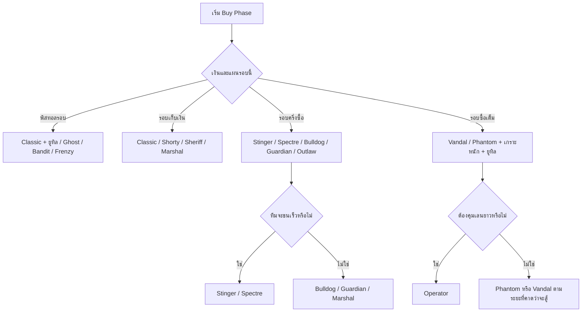

# คู่มืออาวุธ VALORANT ฉบับละเอียด อ่านง่าย และใช้ได้จริง

## บทสรุปผู้บริหาร

ณ ชุดข้อมูลที่ตรวจสอบได้วันที่ 4 พฤษภาคม 2026 คลังอาวุธ VALORANT ฝั่งสาธารณะของ Riot แสดงอาวุธปืนมาตรฐาน 19 กระบอก และอาวุธประชิด 1 ชิ้นคือ **Tactical Knife** รวมเป็น 20 รายการ โดยมี **Bandit** เป็นปืนพกใหม่ที่ถูกเพิ่มเข้ามาอย่างเป็นทางการในแพตช์ 12.00 และอยู่กึ่งกลางระหว่าง Ghost กับ Sheriff ในเชิงราคาและบทบาทการใช้งาน. citeturn27view0turn24search1turn11view0

ถ้าต้องสรุปแบบใช้งานจริงที่สุด: **Classic / Ghost / Bandit / Frenzy** คือแกนของพิสทอลรอบ, **Stinger / Marshal** คือของคุ้มในรอบเงินน้อย, **Spectre / Bulldog / Guardian / Outlaw** คือกระดูกสันหลังของรอบครึ่งซื้อ, **Vandal / Phantom** คือมาตรฐานรอบซื้อเต็ม, ส่วน **Operator / Ares / Odin** เป็นอาวุธเฉพาะทางที่ควรซื้อเมื่อแผนรอบ, แผนที่, และเอเจนต์ของทีมรองรับจริง ๆ. citeturn11view0turn16view0turn16view1turn16view2turn21view0turn21view2turn22view2turn17view0turn21view3turn22view0turn22view1

## วิธีอ่านคู่มือนี้

- ตารางใช้รูปแบบดาเมจ **H/B/L = Head / Body / Leg**  
- ช่อง “ระยะ/ฟิลใช้งาน” เป็นสรุปเชิงปฏิบัติจากช่วงดาเมจ, อัตรายิง, first bullet accuracy, รูปแบบการยิง และคำอธิบายเชิงบทบาทของอาวุธ  
- ตัวเลขสถิติปัจจุบันของปืนส่วนใหญ่ในคู่มือนี้อิงจากหน้าอาวุธรายชิ้นของ Tracker DB; ส่วน **Bandit** ตรวจทานกับแพตช์โน้ต 12.00 ของ Riot และ **มีด** ใช้ข้อมูลความเสียหาย/ความเร็วจาก Valorant Wiki เพราะหน้า Tracker DB ของ Standard Melee ระบุว่า weapon stats ไม่พร้อมใช้งาน. citeturn11view0turn24search1turn19view0turn22view3

> หมายเหตุสำคัญ: คำอธิบายเรื่อง “แรงดีด/ความแม่น” ด้านล่างเป็น **คำแนะนำแบบเล่นจริง** ไม่ใช่กราฟรีคอยล์ดิบทุกกระสอกระสุน

## ตารางอาวุธทั้งหมด

### ปืนพก

หมวดปืนพกตาม Arsenal ทางการของ Riot มี 6 กระบอก: Bandit, Classic, Shorty, Frenzy, Ghost และ Sheriff; ค่าสถานะด้านล่างอิงจากฐานข้อมูลอาวุธรายชิ้น และรายละเอียด Bandit ตรวจทานกับ Riot Patch 12.00 เพิ่มเติม. citeturn27view0turn12view0turn12view1turn14search0turn13view2turn13view0turn21view6turn24search1

| อาวุธ | ราคา | ดาเมจ H/B/L | โหมดยิง / แม็ก | ระยะ/ฟิลใช้งาน | เหมาะซื้อเมื่อ | บทบาท/Agent ที่เหมาะ |
|---|---:|---|---|---|---|---|
| Classic | 0 | 0–30m 78/26/22.1; 30–50m 66/22/18.7 | กึ่งอัตโนมัติ + คลิกขวา 3 นัด / 12 | ใกล้–กลาง; คลิกขวาเด่นระยะประชิด | พิสทอลรอบ, รอบเก็บเงิน | ทุกบทบาท โดยเฉพาะสายที่ต้องเก็บเงินไว้ซื้อสกิล |
| Bandit | 600 | 0–10m 152/39/33; 10–30m 128/39/33; 30–50m 112/34/28 | กึ่งอัตโนมัติ / 8 | ใกล้–กลาง; นัดแรกคม; เน้นยิงหัว | พิสทอลรอบ, รอบเงินน้อยแบบมีลุ้น | Duelist/Initiator สายยิงคม |
| Shorty | 300 | 0–7m 22/11/9.35; 7–15m 12/6/5.1; 15–50m 6/3/2.55 | ลูกซองกึ่งอัตโนมัติ / 2 | ใกล้จัด; มุมแคบ | รอบเก็บเงิน, ปิดมุม, กันดัน | Omen, Viper, Cypher, Killjoy |
| Frenzy | 450 | 0–20m 78/26/22.1; 20–50m 63/21/17.85 | อัตโนมัติ / 15 | ระยะสั้น; ยิงรัวชนะไฟต์เร็ว | พิสทอลรอบบุกเร็ว, บังคับซื้อ | Neon, Raze, Phoenix, Reyna |
| Ghost | 500 | 0–30m 105/30/25.5; 30–50m 87.5/25/21.25 | กึ่งอัตโนมัติ / 13 | กลางเด่น; เงียบ; แตะหัวดี | พิสทอลรอบแบบยืนมุม, เล่นช้า | Sova, Cypher, Omen, Controllers/Initiators |
| Sheriff | 800 | 0–30m 159.5/55/46.75; 30–50m 145/50/42.5 | กึ่งอัตโนมัติ / 6 | กลาง–ไกล; one-tap หัวแรงมาก | รอบเก็บเงินแบบลุ้นคว่ำปืนใหญ่ | Chamber, Reyna, Iso, Jett |

### SMG

ข้อมูลหมวดนี้ยืนยันรายชื่อจาก Riot Arsenal และค่าสถานะจาก Tracker DB; Stinger ใช้ข้อมูลเพิ่มเติมจาก Valorant Wiki เพื่อยืนยันว่าโหมดยิงเสริมเป็น 4 นัดแบบ burst. citeturn27view0turn16view0turn16view1turn23search0

| อาวุธ | ราคา | ดาเมจ H/B/L | โหมดยิง / แม็ก | ระยะ/ฟิลใช้งาน | เหมาะซื้อเมื่อ | บทบาท/Agent ที่เหมาะ |
|---|---:|---|---|---|---|---|
| Stinger | 1100 | 0–15m 67.5/27/22.95; 15–50m 57/23/19 | อัตโนมัติ + ADS burst 4 นัด / 20 | ใกล้เด่น; ยิงรัวจัด; รีคอยล์แรงถ้าสเปรย์ยาว | บังคับซื้อ, ครึ่งซื้อ, เข้าพื้นที่เร็ว | Duelist/Initiator, Clove, Omen |
| Spectre | 1600 | 0–15m 78/26/22.1; 15–30m 66/22/18.7; 30–50m 60/20/17 | อัตโนมัติ / 30 | ใกล้–กลาง; คุมง่าย; ยิงต่อเนื่องดี | รอบชนะพิสทอล, กันทีมประหยัด, ครึ่งซื้อ | Raze, Neon, Phoenix, Yoru, Omen |

### ปืนลูกซอง

Riot จัด Bucky และ Judge อยู่ในหมวดปืนลูกซอง; ตัวเลขสถิติอิงจาก Tracker DB. citeturn27view0turn21view7turn21view8

| อาวุธ | ราคา | ดาเมจ H/B/L | โหมดยิง / แม็ก | ระยะ/ฟิลใช้งาน | เหมาะซื้อเมื่อ | บทบาท/Agent ที่เหมาะ |
|---|---:|---|---|---|---|---|
| Bucky | 850 | 0–8m 40/20/17; 8–12m 26/13/11.05; 12–50m 18/9/7.65 | ปั๊ม + Alt air burst / 5 | ประชิดมาก; มุมแคบ | รอบเก็บเงิน, กัน rush, ปิด choke | Cypher, Killjoy, Deadlock, Sage |
| Judge | 1850 | 0–10m 34/17/14.45; 10–15m 20/10/8.5; 15–50m 14/7/5.95 | อัตโนมัติ / 5 | ประชิด; กดค้างได้; สโมก/มุมลึกโหด | ครึ่งซื้อ, กันทีมประหยัด, anchor site | Raze, Omen, Jett, Neon, Cypher |

### ปืนไรเฟิล

Riot Arsenal จัด Bulldog, Guardian, Phantom และ Vandal ไว้เป็นไรเฟิล; Bulldog ใช้ข้อมูลเพิ่มจาก Valorant Wiki เพื่อยืนยัน burst 3 นัดใน ADS, ส่วน Phantom/Vandal ใช้คำอธิบายจาก Valorant Wiki เพื่อช่วยอธิบายบทบาทระยะยิง. citeturn27view0turn16view2turn21view0turn22view2turn17view0turn23search1turn0search4turn0search5

| อาวุธ | ราคา | ดาเมจ H/B/L | โหมดยิง / แม็ก | ระยะ/ฟิลใช้งาน | เหมาะซื้อเมื่อ | บทบาท/Agent ที่เหมาะ |
|---|---:|---|---|---|---|---|
| Bulldog | 2050 | 0–50m 115.5/35/29.75 | อัตโนมัติ + ADS burst 3 นัด / 24 | กลาง–ไกล; budget rifle ที่คุ้มมาก | ครึ่งซื้อ, โบนัสรอบ | Initiator/Controller เล่นระยะกลาง |
| Guardian | 2250 | 0–50m 195/65/48.75 | กึ่งอัตโนมัติ / 12 | กลาง–ไกล; นัดแรกแม่นมาก | ครึ่งซื้อ, คนยิงคม | Sentinel, Initiator, Chamber |
| Phantom | 2900 | 0–20m 156/39/33.15; 20–50m 140/35/29.75 | อัตโนมัติ / 30 | ใกล้–กลาง; silenced; spray ดี | ซื้อเต็ม, กันทีมประหยัด, spam smoke | Omen, Viper, Raze, Phoenix |
| Vandal | 2900 | 0–50m 160/40/34 | อัตโนมัติ / 25 | กลาง–ไกล; ไม่มีฟอลล์ออฟ | ซื้อเต็มมาตรฐาน | ทุกบทบาท โดยเฉพาะ Jett, Reyna, Iso, Chamber |

### ปืนสไนเปอร์

Marshal, Outlaw และ Operator อยู่ในหมวดสไนเปอร์ตาม Riot Arsenal; Marshal/Outlaw ใช้คำอธิบายจาก Valorant Wiki เพื่อยืนยันบทบาทระยะและ target ที่เหมาะ, Operator ใช้คำอธิบายจาก Valorant Wiki ยืนยันว่าเป็น bolt-action และมี dual zoom. citeturn27view0turn21view1turn21view2turn21view3turn25search0turn25search1turn0search6

| อาวุธ | ราคา | ดาเมจ H/B/L | โหมดยิง / แม็ก | ระยะ/ฟิลใช้งาน | เหมาะซื้อเมื่อ | บทบาท/Agent ที่เหมาะ |
|---|---:|---|---|---|---|---|
| Marshal | 950 | 0–50m 202/101/85.85 | สไนเปอร์นัดเดี่ยว / 5 | ไกลเด่น; ADS แม่นมาก | รอบเก็บเงิน, โบนัสรอบ | Jett, Chamber, คนถือมุมยาว |
| Outlaw | 2400 | 0–50m 238/140/119 | สไนเปอร์ 2 นัดต่อแม็ก / 2 | กลาง–ไกล; ลงโทษเกราะเบา | ครึ่งซื้อ, ลงโทษทีมเกราะเบา | Jett, Chamber, ดีเฟนส์ถือเลนยาว |
| Operator | 4700 | 0–50m 255/150/120 | bolt-action, dual zoom / 5 | ไกลจัด; คุมพื้นที่ | ซื้อเต็มเฉพาะทาง | Jett, Chamber, ทีมเน้นคุมเลนยาว |

### อาวุธหนัก

Riot จัด Ares และ Odin อยู่ในหมวดอาวุธหนัก; ค่าสถานะอิงจาก Tracker DB และคำอธิบายบทบาทการกดดัน/ถือไซต์จาก Valorant Wiki. citeturn27view0turn22view0turn22view1turn25search2turn25search3turn25search11

| อาวุธ | ราคา | ดาเมจ H/B/L | โหมดยิง / แม็ก | ระยะ/ฟิลใช้งาน | เหมาะซื้อเมื่อ | บทบาท/Agent ที่เหมาะ |
|---|---:|---|---|---|---|---|
| Ares | 1600 | 0–30m 75/30/25.5; 30–50m 70/28/23.8 | อัตโนมัติ / 50 | กลาง; spam และ suppress ดี | ครึ่งซื้อ, กัน rush, ยิงทะลุ | Sova, Fade, Cypher, anchor site |
| Odin | 3200 | 0–30m 95/38/32.3; 30–50m 77.5/31/26.35 | อัตโนมัติ / 100 | กลาง–ไกลผ่านกำแพง; ถือไซต์โหด | ซื้อเต็มแบบเฉพาะทาง | Sova, Fade, Cypher, Killjoy |

### อาวุธประชิด

หน้า Arsenal ทางการยืนยันชื่อและหมวดของ Tactical Knife; หน้า Tracker DB ระบุว่าไม่มี weapon stats ให้ Standard Melee จึงใช้ตัวเลข damage / run speed จาก Valorant Wiki. citeturn27view0turn19view0turn22view3

| อาวุธ | ราคา | ดาเมจ | โหมดยิง | ระยะ/ฟิลใช้งาน | เหมาะใช้เมื่อ | บทบาท/Agent ที่เหมาะ |
|---|---:|---|---|---|---|---|
| Tactical Knife | 0 | 0–8m: ด้านหน้า 50/75 (ฟัน/แทง), ด้านหลัง 100/150 | ฟัน / แทง | ประชิดมาก; วิ่งเร็วสุด 6.75 m/s | หมุนตำแหน่งเร็ว, ทำลายสิ่งของ, หมดกระสุน | ทุกบทบาท |

## คำแนะนำใช้งานรายอาวุธ

### ปืนพก

**Classic** — จุดเด่นของ Classic คือ “ฟรีแต่ไม่แย่” เพราะยังยืนยิงระยะกลางได้ และคลิกขวา 3 นัดช่วยเก็บไฟต์ประชิดได้ดีมากเมื่อเข้ามุมแคบหรือเล่น trade ใกล้ ๆ กัน. ถ้าเอเจนต์ของคุณต้องใช้งบกับสกิลเยอะในพิสทอลรอบ Classic มักคุ้มที่สุด เพราะให้ทั้งยูทิลและความยืดหยุ่นโดยไม่ต้องเสี่ยง all-in กับปืนแพง. citeturn12view0turn23search2

**Bandit** — Bandit เหมาะกับคนที่อยากได้ปืนพก “ยิงคมกว่า Ghost แต่ไม่ทุ่มเท่า Sheriff” โดยเฉพาะเมื่อแผนรอบคือเข้ามุมสั้นถึงกลางและยังอยากเหลือเงินไว้ซื้อสกิลหลัก. ในทางปฏิบัติ Bandit เด่นมากเมื่อคุณมั่นใจการยิงหัว เพราะใกล้ ๆ สามารถ one-tap เป้าหมายเกราะเต็มได้ แต่พอออกไกลเกิน 10 เมตร ดาเมจหัวจะตกจนไม่ใช่ one-shot ใส่ heavy shield แล้ว. citeturn24search1turn12view1

**Shorty** — Shorty ไม่ใช่ปืนดวลทั่วไป แต่เป็น “เครื่องมือซุ่มฆ่า” ที่ดีที่สุดในราคา 300 หากคุณมี smoke, one-way, teleport หรือมุมแคบให้เล่น. ถ้ารอบนั้นต้องยืนเปิดมุมยาวหรือ retake พื้นที่กว้าง Shorty จะด้อยค่ามากทันที ดังนั้นให้ซื้อเมื่อคุณรู้ชัดว่าจะได้ไฟต์ระยะประชิดจริง ๆ เท่านั้น. citeturn13view0turn27view0

**Frenzy** — Frenzy ชนะรอบด้วยความดุในระยะสั้น ไม่ใช่ด้วยความนิ่งในระยะไกล. ถ้าแผนทีมคือบุกเร็ว วิ่งชน trade ต่อเนื่อง หรือเล่นมุมแคบในพิสทอลรอบ Frenzy มีมูลค่าสูงมาก; แต่ถ้ารอบนั้นจะเล่นช้า ถือมุมไกล หรือยืน tap พิสทอลยาว ๆ Ghost/Bandit มักตอบโจทย์กว่า. citeturn14search0turn27view0

**Ghost** — Ghost คือปืนพกที่ “สมดุลที่สุด” สำหรับคนที่ต้องเปิดไฟต์ระยะกลาง, ล็อกมุมยาว หรือเล่น lurk เพราะเงียบ, นัดแรกค่อนข้างคม และยังยิงต่อเนื่องได้ไม่ลำบาก. ถ้าคุณชอบพิสทอลรอบที่ไม่ต้อง all-in เข้าระยะใกล้ Ghost มักเป็นตัวเลือกที่ปลอดภัยและเสถียรที่สุด. citeturn13view2turn27view0

**Sheriff** — Sheriff คือปืนคว่ำรอบโดยตรง: ถ้ายิงหัวได้ คุณมีสิทธิ์ชนะไฟต์กับคนถือไรเฟิลแม้อยู่ในรอบเก็บเงิน. แต่เพราะราคาเต็ม 800 และแม็กมีแค่ 6 นัด Sheriff ควรถูกซื้อเมื่อคุณตั้งใจ “เล่นยิงคมจริง ๆ” ไม่ใช่ซื้อเพราะอยากรู้สึกมั่นใจเฉย ๆ. citeturn21view6turn27view0

### SMG

**Stinger** — Stinger คือของคุ้มมากในรอบบังคับซื้อ เพราะ 1100 แลกกับอัตรายิงที่สูงมากและ DPS ระยะใกล้ที่กดดันเกินราคา. มันดีที่สุดเมื่อทีม call เข้าพื้นที่เร็ว, วิ่งเทรด, หรือดันระยะต่ำกว่า 15 เมตร; ถ้าจะใช้ในระยะกลางให้พึ่ง ADS burst และหลีกเลี่ยงการสเปรย์ยาวโล่ง ๆ. citeturn16view0turn23search0

**Spectre** — Spectre คือปืน “กันทีมประหยัดเงิน” ที่ง่ายและเสถียรที่สุด เพราะแม็กใหญ่, คุมง่าย, และทำงานได้ดีมากกับการวิ่งแล้วยิงระยะสั้นถึงกลาง. จุดอ่อนคือไฟต์ไกลตรง ๆ จึงไม่ควรใช้มันเป็นเหตุผลให้คุณ dry peek เลนยาวแข่งกับไรเฟิล; ใช้มันเก็บพื้นที่ใกล้, clear มุม, และเล่นโบนัสรอบจะคุ้มที่สุด. citeturn16view1turn27view0

### ปืนลูกซอง

**Bucky** — Bucky เป็นตัวเลือกที่ดีมากเมื่อคุณรู้ว่าศัตรูต้องผ่าน choke แคบหรือจะชนสโมกเข้ามา เพราะราคาถูกมากเมื่อเทียบกับศักยภาพการล้มเป้าในระยะประชิด. แต่ถ้าฝั่งตรงข้ามเริ่มเคลียร์มุมดีขึ้น ใช้ utility เปิดมุม หรือเล่นระยะห่าง Bucky จะตกมูลค่าเร็วมากและควรถูกเปลี่ยนออกทันที. citeturn21view7turn27view0

**Judge** — Judge เหมาะกับผู้เล่นที่ตั้งใจ “ยึดพื้นที่สั้น ๆ หนึ่งช่องให้ตาย” ไม่ว่าจะเป็นการ anchor site, ซ่อนใน smoke หรือเล่นมุมสูง/มุมแคบ. บนแผนที่หรือรอบที่ต้อง retake ยาว ๆ หรือยิงข้ามพื้นที่เปิด Judge จะคุ้มค่าน้อยลงอย่างชัดเจน. citeturn21view8turn27view0

### ปืนไรเฟิล

**Bulldog** — ถ้าคุณอยากมีไรเฟิลในมือแต่เงินยังไม่ถึง Vandal/Phantom, Bulldog คือคำตอบที่ดีที่สุด. ซื้อ Bulldog เพราะตั้งใจใช้ ADS burst ที่ระยะกลาง ไม่ใช่เพราะคิดว่าจะสเปรย์ชนะไรเฟิลแพงกว่าแบบตรง ๆ. citeturn16view2turn23search1

**Guardian** — Guardian เป็นปืนของคนที่มีวินัยการยิงจริง เพราะนัดแรกแม่นมากและดาเมจสูงพอจะ one-tap หัวทุกระยะ. มันเด่นสุดในรอบครึ่งซื้อ, โบนัสรอบ, หรือฝั่งรับที่ถือมุมยาว; ถ้าคุณชอบสเปรย์กวาดหลายเป้า Phantom/Vandal จะใช้ง่ายกว่า. citeturn21view0turn27view0

**Phantom** — Phantom คือไรเฟิลที่ดีที่สุดสำหรับไฟต์ใกล้ถึงกลาง, ยิงผ่าน smoke, และสเปรย์หลายตัวต่อเนื่อง เพราะเก็บ recoil ง่ายกว่าและมี silencer. แต่เมื่อจุดปะทะแรกของคุณมักเป็นเลนยาวมาก ๆ Phantom จะเสียเปรียบ Vandal ตรงที่หัว 140 ที่เกิน 20 เมตรไม่พอ one-shot heavy shield. citeturn22view2turn0search5

**Vandal** — Vandal คือคำตอบมาตรฐานเมื่อคุณต้องการ one-tap ทุกระยะโดยไม่สน damage falloff. ยิ่งแผนที่หรือมุมที่คุณเล่นมีการยิงเปิดยาว, hold angle ยาว หรือ duel แบบ “ใครคมกว่าชนะ” Vandal ยิ่งคุ้มค่ากว่า Phantom อย่างชัดเจน. citeturn17view0turn0search4

### ปืนสไนเปอร์

**Marshal** — Marshal คือสไนเปอร์ประหยัดที่โหดเกินราคามากในรอบเก็บเงินหรือโบนัสรอบ เพราะ body 101 พอเก็บคนไม่มีเกราะได้ทันที และ headshot ปิดงานได้ทุกเป้าหมาย. ถ้าทีมตรงข้ามน่าจะ half-buy หรือเดินชนเลนยาว Marshal คือหนึ่งในวิธีที่คุ้มที่สุดในการเอารอบกลับมา. citeturn21view1turn25search0

**Outlaw** — Outlaw อยู่กึ่งกลางระหว่าง Marshal กับ Operator และจุดขายจริงคือ body 140 ที่ลงโทษคนใส่เกราะเบาแรงมาก. ปืนนี้ควรถูกหยิบเมื่อคุณคาดว่าอีกฝั่งจะบังคับซื้อ/ครึ่งซื้อ, กด light shield หรือชอบ peek ซ้ำเลนเดิม โดยไม่จำเป็นต้องลงทุนถึงระดับ Operator. citeturn21view2turn25search1

**Operator** — Operator เป็นอาวุธคุมพื้นที่ ไม่ใช่อาวุธ “ยิงแล้วค่อยคิด” เพราะถ้ายิงพลาดจะเสียจังหวะและเงินรอบมหาศาล. ให้ซื้อเมื่อตำแหน่ง, แผนที่, utility support และตัวผู้เล่นรองรับจริง โดยเฉพาะ Jett หรือ Chamber ที่มีเครื่องมือออกจากไฟต์หลังยิงนัดแรก. citeturn21view3turn0search6

### อาวุธหนัก

**Ares** — Ares เหมาะกับเกมที่คุณต้อง spam, suppress, กัน rush หรือเล่นกับข้อมูลจากสกิล มากกว่าการเปิดดวลคม ๆ แบบไรเฟิล. ถ้าคุณเป็น Sova/Fade/Cypher หรือเล่นไซต์ที่ชอบยิงทะลุผนัง Ares สามารถให้มูลค่าเกินราคาได้มาก; แต่ถ้าต้องเป็นคนเปิดหน้าเข้าพื้นที่ ปืนนี้ไม่คล่องเท่าปืนประเภทอื่น. citeturn22view0turn25search2

**Odin** — Odin เป็นปืนเฉพาะทางสำหรับ defender anchor และผู้เล่นที่รู้จุด wallbang/ยิงกดดันจริง ๆ เพราะแม็กใหญ่, DPS สูง และควบคุมพื้นที่ได้ดีมากเมื่อมีข้อมูลเป้าหมาย. ถ้าไม่มีแผนใช้มันกับผนังบาง, spam lane, หรือยึดไซต์ยาว ๆ การซื้อไรเฟิลมักจะคุ้มกว่าในเชิงความคล่องตัวและความยืดหยุ่น. citeturn22view1turn25search3turn25search11

### อาวุธประชิด

**Tactical Knife** — มีดไม่ใช่อาวุธซื้อ แต่เป็นเครื่องมือจัดการจังหวะรอบ: มันทำให้คุณวิ่งเร็วที่สุด, หมุนไซต์เร็วที่สุด, และทำลายวัตถุไวขึ้น. ในการสังหารจริงให้คิดว่ามีดน่าเชื่อถือเฉพาะตอนประชิดมากจริง ๆ หรือโจมตีด้านหลัง; อย่าพยายาม “โชว์หล่อ” ถ้าปืนยังมีทางปิดงานได้ปลอดภัยกว่า. citeturn22view3turn19view0

## แพทเทิร์นการซื้อรายรอบ

คำแนะนำส่วนนี้สังเคราะห์จากราคาปัจจุบันของอาวุธและบทบาทการใช้งานใน Arsenal/ฐานข้อมูลอาวุธปัจจุบัน. citeturn11view0turn27view0

### รอบพิสทอล
- **เล่นสมดุล/อยากเก็บยูทิล**: Classic + ยูทิล, หรือ Ghost  
- **จะวิ่งชน/เข้าระยะใกล้**: Frenzy  
- **มั่นใจการยิงหัวและยังอยากเหลือเงินบางส่วน**: Bandit  
- **เล่นมุมแคบเฉพาะทาง**: Shorty  
- **Sheriff** ใช้ได้ แต่เป็นการ all-in มาก เพราะกินงบทั้งรอบ

### รอบเก็บเงิน
- ถ้าเน้นวินัยทีม: **Classic / Shorty / มีด + ยูทิลขั้นต่ำ**  
- ถ้าอยากลุ้นคว่ำปืนใหญ่: **Sheriff** หรือ **Marshal**  
- ถ้าจะเล่นมุมแคบในสโมก: **Shorty** มีมูลค่าสูงมากเกินราคา

### รอบครึ่งซื้อ
- **ทีมจะชนเร็ว**: Stinger, Spectre  
- **ทีมจะเล่นระยะกลาง/ถือมุม**: Bulldog, Guardian  
- **ทีมคาดว่าอีกฝั่งเกราะเบา**: Outlaw  
- **สายสไนป์ประหยัด**: Marshal  
- **ไซต์ที่ยิงทะลุได้เยอะ**: Ares เป็นตัวเลือกเฉพาะทาง

### รอบซื้อเต็ม
- มาตรฐานคือ **Vandal หรือ Phantom + เกราะหนัก + ยูทิลหลักครบ**  
- ถ้าต้องคุมเลนยาวจริง: **Operator**  
- ถ้าต้องถือไซต์และยิงทะลุจากข้อมูล: **Odin**  
- ถ้าเงินตึงกว่ามาตรฐานแต่ยังอยากมีไรเฟิล: **Bulldog / Guardian**

### รอบกันทีมประหยัดเงินของฝั่งตรงข้าม
- **Spectre** ใช้ง่ายที่สุด  
- **Judge / Bucky** ดีมากถ้าศัตรูต้องเดินเข้าคุณ  
- **Phantom** เด่นเมื่อคาดว่าจะมีหลายเป้าเข้ามาพร้อมกันหรือมี smoke spam

### หลักคิดสำคัญที่สุด
- อย่าซื้อปืนที่เก่งที่สุดสำหรับ “ตัวคุณ” ถ้ามันทำให้ “เศรษฐกิจทีม” แตก  
- ถ้ารอบนี้ต้อง save เพื่อให้รอบหน้ามีไรเฟิลครบ 5 คน อย่าทำลายแผนด้วยการซื้อ Sheriff คนเดียวแบบไร้แผน  
- การชนะด้วยปืนด้อยกว่ามักมาจาก **ระยะที่เหมาะ + utility + การเทรด** มากกว่ามาจากราคาปืน

## คำแนะนำตามบทบาท

คำแนะนำด้านล่างเป็นการจับคู่ “บทบาทในทีม” เข้ากับ “หน้าที่ของอาวุธ” จากราคา, ระยะใช้งาน, และรูปแบบการดวลในตารางข้างต้น. citeturn27view0turn11view0

### Duelist
Duelist ควรเลือกปืนตาม “รูปแบบการเข้าพื้นที่” มากกว่าตามความชอบล้วน ๆ: ถ้าจะเข้าระยะสั้นเร็ว **Frenzy / Stinger / Spectre** จะให้มูลค่าสูงมาก, แต่ถ้าต้องเปิด duel ยาว **Bandit / Sheriff / Vandal** จะตอบโจทย์กว่า. ในรอบซื้อเต็ม ถ้าคุณเป็น Jett และแผนทีมมีการปั้นเลนยาวให้ชัดเจน **Operator** เป็นตัวเลือกที่ควรพิจารณาก่อนใคร. citeturn14search0turn12view1turn16view0turn16view1turn17view0turn21view3

### Initiator
Initiator มักต้องเหลือเงินไว้กับยูทิล จึงเหมาะกับ **Ghost / Bandit / Classic** ในพิสทอลรอบ และ **Bulldog / Guardian** ในรอบครึ่งซื้อที่ต้องยิงซัพพอร์ตจากระยะกลาง. ถ้าเป็นสายให้ข้อมูลอย่าง Sova/Fade และแผนที่เอื้อการยิงทะลุ **Ares / Odin** จะมีค่ามากขึ้นทันทีเพราะข้อมูลทำให้กระสุนทุกชุดมีความหมาย. citeturn13view2turn12view1turn12view0turn16view2turn21view0turn22view0turn22view1

### Controller
Controller ต้องรักษาเงินสำหรับ smoke/ยูทิลหลัก จึงเด่นกับ **Classic, Ghost, Bandit และ Shorty** มากกว่าการ all-in กับ Sheriff บ่อย ๆ. ในรอบซื้อเต็ม **Phantom** มักเหมาะกว่า Vandal สำหรับหลาย Controller เพราะ silencer และรูปแบบการยิงต่อเนื่องเข้ากับการเล่นผ่านสโมกและพื้นที่แคบ. citeturn12view0turn13view2turn12view1turn13view0turn22view2

### Sentinel
Sentinel ได้ประโยชน์สูงจากอาวุธมุมแคบและอาวุธยึดพื้นที่ เช่น **Shorty, Bucky, Judge, Guardian และ Vandal** ขึ้นกับระยะของไซต์ที่ตนถือ. Chamber เป็นกรณีพิเศษที่ใช้ประโยชน์จาก **Sheriff, Marshal, Outlaw และ Operator** ได้โดดเด่นกว่าตัวอื่น เพราะชุดสกิลช่วยเซฟจังหวะยิงและคุมเลนยาว. citeturn13view0turn21view7turn21view8turn21view0turn17view0turn21view6turn21view1turn21view2turn21view3

## แหล่งอ้างอิงหลัก

- **Riot Games — VALORANT Arsenal**: ใช้ยืนยันรายชื่ออาวุธอย่างเป็นทางการ, หมวดอาวุธ, และคำอธิบายบทบาทของแต่ละปืน citeturn27view0  
- **Riot Games — แพตช์โน้ต 12.00**: ใช้ยืนยันการเปิดตัว Bandit และรายละเอียดราคา/แม็กกาซีน/บทบาทของปืนใหม่ citeturn24search1  
- **Tracker.gg Valorant Weapons Database**: ใช้เป็นฐานข้อมูลตัวเลขปัจจุบันของราคา, ดาเมจ, อัตรายิง, ขนาดแม็ก, reload, และ first bullet accuracy ของอาวุธส่วนใหญ่ citeturn11view0turn12view0turn12view1turn14search0turn13view2turn13view0turn21view6turn16view0turn16view1turn21view7turn21view8turn16view2turn21view0turn22view2turn17view0turn21view1turn21view2turn21view3turn22view0turn22view1turn19view0  
- **Valorant Wiki / Fandom**: ใช้เสริมคำอธิบายพฤติกรรมอาวุธที่สำคัญ เช่น burst mode ของ Classic/Stinger/Bulldog, บทบาทของ Marshal/Outlaw/Operator และข้อมูลมีดที่ Tracker DB ไม่แสดง citeturn23search2turn23search0turn23search1turn25search0turn25search1turn0search6turn22view3  

## ข้อจำกัดที่ควรรู้

- หน้า Arsenal สาธารณะของ Riot ให้รายชื่อและบทบาท แต่ไม่ได้รวมตารางตัวเลขสถิติทั้งหมดในหน้าเดียว  
- ตัวเลขมีดในคู่มือนี้มาจาก Valorant Wiki เพราะหน้า Tracker DB ของ Standard Melee ระบุว่าไม่มี weapon stats  
- หาก Riot ปรับสมดุลอาวุธในแพตช์ถัดไปหลังวันที่ 4 พฤษภาคม 2026 ให้ยึดค่าจาก client ล่าสุดเป็นหลัก citeturn27view0turn19view0turn22view3