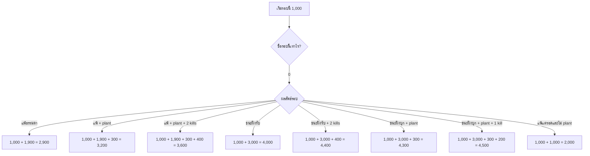
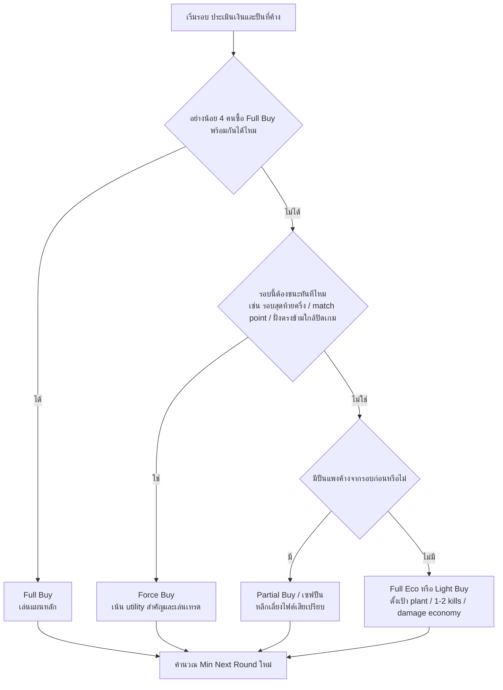

# คู่มือ VALORANT ภาษาไทยฉบับใช้งานจริง

## บทสรุปผู้บริหาร

รายงานนี้สรุปภาพรวมที่ใช้งานได้จริงสำหรับผู้เล่นและผู้สอน ตั้งแต่ Agent ทั้งโรสเตอร์ปัจจุบัน, แผนที่มาตรฐานทั้งหมด, ปืนในคลังอาวุธหลัก, ไฮไลต์ของ Patch 12.08, ระบบเศรษฐกิจ และสถานการณ์ตัดสินใจที่เจอบ่อยในเกม โดยยึด Riot เป็นแหล่งหลักก่อน แล้วใช้ Valorant Wiki และ Mobalytics เป็นแหล่งเสริมเมื่อหน้าทางการไม่ได้อธิบายเชิงลึกพอ. citeturn15view0turn14view0turn3view0turn17view0turn19view0turn27search8

ใจความสำคัญแบบสั้นที่สุดมีอยู่ 5 ข้อ:  
หนึ่ง บทบาทชนะเกมใน VALORANT ไม่ได้วัดที่ “คิลเยอะ” อย่างเดียว แต่ดูว่าใครสร้างพื้นที่, ใครให้ข้อมูล, ใครตัดมุม, และใครยื้อเวลาได้คุ้มที่สุด. สอง แผนที่ส่วนใหญ่ชนะด้วยการคุม choke และ timing มากกว่าการวิ่งชน. สาม ระบบเงินมีผลต่อทุกการตัดสินใจ โดยเฉพาะ plant, kill, loss bonus และการรู้ว่าเมื่อไรควร save หรือ force. สี่ Patch 12.08 ไม่ได้เป็นแพตช์ที่พลิก meta ด้วยตัวเลขบัฟ/เนิร์ฟใหญ่ในคิวมาตรฐาน แต่มีผลชัดมากกับ map pool, โหมด Skirmish: Ascension และตาราง Premier. ห้า ถ้าจะไต่อันดับให้เร็ว ให้ฝึก 3 เรื่องก่อนเสมอ: การใช้ utility ตามบทบาท, การคุมเงินทีม, และการอ่านรอบจากจังหวะเวลา. citeturn15view0turn16view0turn7view5turn26search8turn37search1turn38search1turn27search6

## คู่มือ Agent

รายชื่อและการแบ่งบทบาทด้านล่างอิงกับโรสเตอร์ปัจจุบันของเกม: Controller 7 ตัว, Duelist 8 ตัว, Initiator 7 ตัว, Sentinel 7 ตัว รวมเป็น 29 ตัว โดยชื่อสกิลยึดตามดัชนีความสามารถปัจจุบันของ Valorant Wiki และหน้าทางการของ Riot สำหรับตัวใหม่/ตัวที่มีการรีเวิร์กชุดสกิลในช่วงหลัง. สำหรับ Agent ที่มี **passive** เพิ่มเติม ผมจะพูดถึงใน “วิธีเล่น” แต่จะนับสกิลหลักตาม **พื้นฐาน / ลายเซ็น / อัลติ** เป็นหลักเพื่อให้อ่านง่าย. citeturn17view0turn19view0turn33search0turn35search5turn32search1turn31search4turn34search0

### สรุปบทบาทแบบเร็ว

| บทบาท | หน้าที่หลัก | รายชื่อ Agent |
|---|---|---|
| Controller | คุมมุม, ปิดวิสัยทัศน์, ชะลอจังหวะบุก/รีเทค | Astra, Brimstone, Clove, Harbor, Miks, Omen, Viper |
| Duelist | เปิดพื้นที่, หา first blood, บีบมุมให้ทีมเข้าตาม | Iso, Jett, Neon, Phoenix, Raze, Reyna, Waylay, Yoru |
| Initiator | ให้ข้อมูล, เปิดมุม, กด utility รับไซต์ | Breach, Fade, Gekko, KAY/O, Skye, Sova, Tejo |
| Sentinel | กันหลัง, ล็อกพื้นที่, ยื้อไซต์, ลงโทษคนบุก | Chamber, Cypher, Deadlock, Killjoy, Sage, Veto, Vyse |

### Controller

Controller ที่ดีไม่ใช่แค่ “กดควันให้ครบ” แต่ต้องรู้ว่าเมื่อไรควรควันเพื่อ **default**, เมื่อไรควรเก็บควันไว้สำหรับ **execute/retake**, และควรวางควันให้ “ชิด choke” เพื่อไม่เปิดพื้นที่ฟรีให้ศัตรูเล่นรอบควัน. นี่คือแกนของการเล่น Controller ที่ Riot และไกด์เชิงแข่งขันอธิบายตรงกัน. citeturn38search1turn17view0turn19view0turn35search5turn33search0

**Astra** — Controller วางแผนล่วงหน้า คุมพื้นที่ได้ครบทั้งดึง สตัน และควัน  
- **ลายเซ็น: Stars / Astral Form** — เข้าโหมดแผนที่เพื่อวางดาวล่วงหน้า  
- **พื้นฐาน: Gravity Well** — ดึงศัตรูเข้าจุดกลางและทำให้โดนแรงขึ้น เหมาะกับการหยุด rush, ดึงคนออกจากหลังกล่อง, หรือบังคับให้หลุดมุม  
- **พื้นฐาน: Nova Pulse** — สตันเป็นวง ใช้เปิด swing ให้เพื่อน, กันคนกด defuse, หรือหยุดคนชน smoke  
- **พื้นฐาน: Nebula / Dissipate** — ควันทรงกลมและควันยุบสั้น ใช้ตัดมุมหรือหลอก timing  
- **อัลติ: Cosmic Divide** — กำแพงยาวกันกระสุนและลดเสียง ใช้ execute, retake หรือ stick defuse  
- **วิธีเล่น:** Astra เก่งเมื่อคุณ “คิดก่อนรอบ” มากกว่า “แก้สด” อย่าวางดาวมั่วทุกจุด ให้เตรียม 2–3 ดาวสำหรับ choke สำคัญ, post-plant และแผน fallback เสมอ

**Brimstone** — Controller ตรงไปตรงมา ควันง่าย ใช้งานเสถียร  
- **พื้นฐาน: Stim Beacon** — บัฟอัตรายิง/รีโหลด เหมาะกับจังหวะบุกเร็วหรือกันไซต์แบบเอาจริง  
- **พื้นฐาน: Incendiary** — มอลลี่พื้นที่ ใช้กัน plant, กัน defuse, บังคับคนออกจากมุม  
- **ลายเซ็น: Sky Smoke** — ควันแม่นและลงไว เหมาะกับ execute ที่ต้องการ timing ชัด  
- **อัลติ: Orbital Strike** — ลำแสงทำดาเมจหนัก ใช้ kill planter/defuser หรือเคลียร์พื้นที่แคบ  
- **วิธีเล่น:** Brimstone เด่นในแผน “ปิด 2–3 มุมพร้อมกันแล้วบุกทันที” ถ้าคุณลง smoke แล้วทีมยังไม่เดิน แปลว่า utility ถูกเผาฟรี

**Clove** — Controller เน้นปะทะ ได้มูลค่าต่อแม้ตาย  
- **พื้นฐาน: Pick-me-up** — เก็บพลังจากศัตรูที่เพิ่งตายเพื่อฮีลและเร่งจังหวะบุก/รีเทค  
- **พื้นฐาน: Meddle** — ลูก decay สำหรับทำให้ศัตรูเปราะช่วงสั้น เหมาะกับเปิดมุมให้ duelists เก็บงาน  
- **ลายเซ็น: Ruse** — ควันแบบ tactical map และยังใช้งานต่อได้หลังตาย  
- **อัลติ: Not Dead Yet** — คืนชีพตัวเองชั่วคราว ต้องปิดงานให้ได้เพื่ออยู่ต่อ  
- **วิธีเล่น:** Clove คือ Controller ที่เล่นใกล้กว่าเพื่อนร่วมคลาส ใช้กับทีมที่ชอบเทรดไว เพราะควันหลังตายทำให้แผนไม่พังง่าย

**Harbor** — Controller สายกำแพงน้ำ เน้นบีบพื้นที่และทำไซต์ให้เดินได้  
- **พื้นฐาน: Storm Surge** — วงน้ำระเบิดที่ทำ **Nearsight + Slow** เหมาะกับการไล่คนออกจาก chokepoint  
- **พื้นฐาน: High Tide** — กำแพงน้ำโค้งได้ ใช้ตัดหลายมุมพร้อมกันตอนเข้าไซต์  
- **ลายเซ็น: Cove** — smoke ทรงโดมพร้อมเกราะ เหมาะกับ plant/defuse ที่ต้องการกัน spam  
- **อัลติ: Reckoning** — คลื่นน้ำใหญ่พุ่งไปข้างหน้า ทำให้ศัตรูช้าและมองใกล้ลง  
- **วิธีเล่น:** Harbor ปัจจุบันเล่นเชิงรุกกว่าสมัยเดิมมาก ให้คิดว่าเขาเป็น Controller ที่ “เปิดทางเดิน” มากกว่า “แค่ควัน” และพลังจะสูงสุดเมื่อทีมเดินตามกำแพงพร้อมกัน. citeturn35search5turn35search6

**Miks** — Controller สายซัพพอร์ตทีมไฟต์ จังหวะเร็ว กดดันด้วยเสียง  
- **พื้นฐาน: M-pulse** — เลือกโหมด **สตัน** หรือ **ฮีล** เป็นวง ใช้ได้ทั้งหยุดชนและพยุงทีม แต่ต้องระวังการวางวงฮีลทับพื้นที่ที่ศัตรูเข้าถึง  
- **พื้นฐาน: Harmonize** — ให้ Combat Stim แก่ตัวเองและเพื่อน รีเฟรชเมื่อมี kill  
- **ลายเซ็น: Waveform** — smoke แบบเลือกตำแหน่งบนแผนที่ เหมาะกับ execute ที่ต้องคุมหลายมุมพร้อมกัน  
- **อัลติ: Bassquake** — คลื่นเสียงผลัก ถ่วง และทำให้ไม่ได้ยิน เหมาะกับ retake, บังคับคนหลุดมุม, หรือเปิดไซต์  
- **วิธีเล่น:** Miks เหมาะกับทีมที่เล่นเป็นจังหวะเดียวกัน ถ้าทีมเดินพร้อม utility เขาจะให้ “มูลค่ารวม” สูงมากกว่าการเล่น solo. citeturn33search0turn33search1turn33search2turn33search3turn33search5turn22search4

**Omen** — Controller สายสร้างจังหวะ ป่วนแผนที่ได้ดี  
- **พื้นฐาน: Shrouded Step** — เทเลพอร์ตระยะสั้น ใช้ย้ายมุม, ขึ้นจุดสูง, หลบ timing  
- **พื้นฐาน: Paranoia** — nearsight ทะลุกำแพง เปิดทาง push หรือช่วย retake  
- **ลายเซ็น: Dark Cover** — ควันทรงกลมระยะไกล คุมทั้ง default และ exec  
- **อัลติ: From the Shadows** — เทเลพอร์ตทั่วแผนที่ ใช้ fake, lurk, เก็บ spike, ปิดหลัง  
- **วิธีเล่น:** Omen เก่งเมื่อคุณทำให้คู่ต่อสู้ “อ่านไม่ออก” ไม่ต้องเทเลพอร์ตโชว์ทุกครั้ง บางทีแค่เสียงหรือ presence ก็ทำให้ rotation ฝั่งตรงข้ามเสียทรงแล้ว

**Viper** — Controller สายคุมพื้นที่ยาว ๆ และเก่งมากใน post-plant  
- **พื้นฐาน: Snake Bite** — มอลลี่ acid กินเลือดและลงโทษคนที่ฝืนอยู่ในจุด  
- **พื้นฐาน: Poison Cloud** — smoke ทรงกลมที่เปิดปิดได้  
- **ลายเซ็น: Toxic Screen** — กำแพงพิษข้ามจุด ใช้แบ่งไซต์หรือบีบ retake path  
- **อัลติ: Viper’s Pit** — พิษคลุมพื้นที่ใหญ่ เก่งสุดเมื่อยึดพื้นที่ไว้ก่อน  
- **วิธีเล่น:** Viper ต้องบริหารเชื้อเพลิงให้คุ้ม อย่าเปิดทุกอย่างพร้อมกันนานเกินจำเป็น และถ้าคุณได้ plant แบบปลอดภัย เธอคือหนึ่งในตัวปิดรอบที่ดีที่สุดของเกม

### Duelist

Duelist ที่ถูกต้องต้อง “สร้างพื้นที่” ให้ทีมมากกว่ายืนรอปิดคิลท้ายรอบ การเปิดไซต์, การบังคับ crosshair ศัตรู, และการเรียก timing ให้เพื่อนตาม คือหัวใจของบทบาทนี้. citeturn37search1turn17view0turn19view0turn31search4

**Iso** — Duelist สายดวลตรง ๆ เอาชนะ 1v1 ด้วย tempo ที่ตัวเองควบคุม  
- **พื้นฐาน: Contingency** — กำแพงพลังเคลื่อนที่ ใช้ตัด vision และกันกระสุนบางทิศ  
- **พื้นฐาน: Undercut** — ทำให้ศัตรูเปราะ เหมาะกับเปิดมุมแคบหรือ combo กับเพื่อน  
- **ลายเซ็น: Double Tap** — เข้าโหมดพร้อมรับโล่หลังเก็บ objective จาก kill  
- **อัลติ: Kill Contract** — ลากเป้าหมายไป 1v1  
- **วิธีเล่น:** Iso เด่นเมื่อคุณเลือกไฟต์เอง อย่าฝืนชนหลายมุมพร้อมกัน ใช้ utility บังคับให้เกิด 1v1 หรือ 2v1 เสมอ

**Jett** — Duelist สาย mobility เปิดไซต์เร็วที่สุดตัวหนึ่ง  
- **พื้นฐาน: Cloudburst** — smoke สั้น ใช้บังมุมหนึ่งจังหวะตอน dash/escape  
- **พื้นฐาน: Updraft** — ลอยขึ้นสูง ใช้เปลี่ยนระดับยิงหรือเซ็ต entry  
- **ลายเซ็น: Tailwind** — dash สร้างพื้นที่และรีเซ็ตมุมศัตรู  
- **อัลติ: Blade Storm** — มีดแม่นสูง เหมาะกับ eco, round ปืนเบา, หรือ clutch  
- **วิธีเล่น:** จุดแข็งของ Jett คือ “ทำให้มุมรับปืนใช้งานไม่ได้” อย่า dash เข้าแบบไม่มีเพื่อนตามหรือไม่มี smoke/flash รองรับ เพราะจะกลายเป็นแค่ตายฟรี

**Neon** — Duelist จังหวะเร็ว บุกและแตกไซต์ด้วยความเร็ว  
- **พื้นฐาน: Fast Lane** — กำแพงคู่ตัดหลายมุมพร้อมกัน  
- **พื้นฐาน: Relay Bolt** — สตันเปิดมุมหรือกันคนยืนใกล้  
- **ลายเซ็น: High Gear** — วิ่งเร็วและต่อ slide เพื่อเปิดพื้นที่  
- **อัลติ: Overdrive** — ยิงไฟฟ้าคล่องตัวสูง เหมาะกับ eco punishes และ run-down  
- **วิธีเล่น:** Neon ไม่เก่งถ้าเล่นช้าเกินไป ใช้ตอนทีม commit ชัด แล้วเร่งเกมให้ศัตรูเล็งคุณไม่ทัน

**Phoenix** — Duelist สาย self-entry เล่นคนเดียวได้ดี  
- **พื้นฐาน: Blaze** — กำแพงไฟบังสายตาและฮีลตัวเอง  
- **พื้นฐาน: Hot Hands** — มอลลี่ไฟ ฮีลตัวเองได้  
- **พื้นฐาน: Curveball** — flash หักมุม เปิดเองได้ง่าย  
- **อัลติ: Run It Back** — มีชีวิตสำรอง ใช้เก็บข้อมูลหรือเปิดไฟต์ฟรี  
- **วิธีเล่น:** Phoenix ดีมากใน rank ถ้าคุณเล่นแบบ “แฟลชแล้วเดินทันที” อย่าปา flash แล้วรอ เพราะคู่ต่อสู้จะรีเซ็ตตาได้ทัน

**Raze** — Duelist ปะทะด้วย damage utility และ mobility  
- **พื้นฐาน: Boom Bot** — หาข้อมูล/ไล่มุมบังคับให้ศัตรูยิง  
- **พื้นฐาน: Blast Pack** — mobility และเคลียร์ระยะใกล้  
- **ลายเซ็น: Paint Shells** — ระเบิดกวาดมุม/หยุด plant/หยุด rush  
- **อัลติ: Showstopper** — rocket เปิดยึดไซต์หรือ kill คนติดมุม  
- **วิธีเล่น:** Raze ควรเอายูทิลิตี้ไป “บังคับให้ศัตรูย้าย” ไม่ใช่ปา hoping for miracle kill อย่างเดียว

**Reyna** — Duelist พึ่งพา aim และการเก็บ kill มากที่สุด  
- **พื้นฐาน: Leer** — ตา nearsight เปิดมุม  
- **พื้นฐาน: Devour** — ฮีล/overheal จาก soul orb  
- **พื้นฐาน: Dismiss** — หลบเทรด รีโพซิชันหลัง kill  
- **อัลติ: Empress** — เพิ่มความเร็วและทำให้วงจรฆ่าไหลขึ้นมาก  
- **วิธีเล่น:** Reyna แข็งเมื่อคุณชนะไฟต์แรก ถ้ารอบไหน aim gap ไม่มา เธอจะให้ utility กับทีมน้อยกว่าตัวเปิดตัวอื่นอย่างชัดเจน

**Waylay** — Duelist ไทยสายเข้าออกเร็วมาก เล่นรอบจังหวะได้ยอดเยี่ยม  
- **พื้นฐาน: Saturate** — ลูกแสงทำ **Hinder** ลดความเร็วการเคลื่อนที่และอาวุธ  
- **พื้นฐาน: Lightspeed** — dash เดี่ยวหรือ dash สองจังหวะ จังหวะแรกดันขึ้นสูงได้  
- **ลายเซ็น: Refract** — วาง beacon แล้วกดย้อนกลับแบบ invulnerable  
- **อัลติ: Convergent Paths** — ลำแสงพื้นที่กว้าง ทำ Hinder และบัฟความเร็วให้ตัวเอง  
- **วิธีเล่น:** Waylay เหมาะกับการเปิดไฟต์แบบ “เข้า-เช็กมุม-ถอยกลับ” อย่าใช้ Refract หนีอย่างเดียว ให้ใช้เป็นเครื่องมือกดพื้นที่แล้วกลับมารวมกับทีม. citeturn31search4turn31search0turn31search1turn31search2turn31search3turn29search0

**Yoru** — Duelist สายหลอกและ lurk ที่ยืดหยุ่นที่สุด  
- **พื้นฐาน: Fakeout** — decoy/clone ไว้ bait ยิงหรือหลอก rotation  
- **พื้นฐาน: Blindside** — flash เด้งกำแพง เปิดมุมประหลาดได้ดี  
- **ลายเซ็น: Gatecrash** — วาร์ประยะไกล ใช้ split, fake, regroup  
- **อัลติ: Dimensional Drift** — ล่องหนสอดแนมและเล่น fake  
- **วิธีเล่น:** Yoru ไม่ควรถูกเล่นแบบ random อย่างเดียว จุดแข็งจริงคือการทำให้ศัตรูอ่าน “จำนวนคน” และ “จุดบุกจริง” ผิด

### Initiator

Initiator ชนะเกมด้วยการเปลี่ยนมุมอันตรายให้ทีมยิงง่ายขึ้น หลักคิดง่าย ๆ คือ **เอาข้อมูลก่อน แล้วค่อยให้ crowd control หรือ follow-up**. ถ้าเปิดยูทิลิตี้แล้วทีมไม่พร้อม swing มูลค่าจะหายไปเยอะมาก. citeturn17view0turn19view0turn34search0

**Breach** — Initiator สายกดกำแพงและชน site  
- **พื้นฐาน: Aftershock** — ระเบิดทะลุกำแพง เคลียร์มุมแคบ  
- **พื้นฐาน: Flashpoint** — แฟลชทะลุกำแพง  
- **ลายเซ็น: Fault Line** — สตันเป็นแนวกว้าง  
- **อัลติ: Rolling Thunder** — สตัน/ยกล้มพื้นที่ใหญ่  
- **วิธีเล่น:** Breach ต้องเล่น “พร้อมเพื่อน” ถ้าแฟลชหรือสตันแล้วไม่มีคนตาม จะเสียค่าพื้นที่ฟรี

**Fade** — Initiator สายข้อมูลและลากคนออกจาก comfort zone  
- **พื้นฐาน: Prowler** — ตัวไล่หาเป้าหมายและทำให้มองแคบลง  
- **พื้นฐาน: Seize** — จับล็อกพื้นที่/หน่วง/ทำให้ combo ดาเมจได้  
- **ลายเซ็น: Haunt** — reveal ตำแหน่ง  
- **อัลติ: Nightfall** — คลื่นกว้างเปิด trail ทำให้ตามเก็บง่าย  
- **วิธีเล่น:** Fade เก่งในแผนที่มุมแคบ ใช้ Prowler + swing ให้เป็นชุด อย่าปล่อย Prowler ไปเดี่ยว ๆ แล้วไม่มีคนตาม

**Gekko** — Initiator ที่ยืดหยุ่นมากและเด่นเรื่อง plant/retake  
- **พื้นฐาน: Mosh Pit** — วงระเบิดพื้นที่กว้าง เหมาะกับบีบคนออกจากมุม  
- **พื้นฐาน: Wingman** — วิ่ง stun ได้ และช่วย plant/defuse ได้  
- **ลายเซ็น: Dizzy** — ยิงพลาสมาใส่ศัตรูให้เสียการมอง  
- **อัลติ: Thrash** — ควบคุมตัว detain ศัตรู  
- **วิธีเล่น:** Gekko ชนะรอบด้วย “ความคุ้ม” มากกว่าความเร็ว เก็บลูกกลับมาใช้ต่อให้ได้ และวาง Wingman ให้ทีมเล่นต่อจากมัน ไม่ใช่ปล่อยไปลำพัง

**KAY/O** — Initiator สายปิด utility ฝั่งตรงข้าม  
- **พื้นฐาน: FRAG/ment** — มอลลี่ดาเมจหนักช่วงกลางวง  
- **พื้นฐาน: FLASH/drive** — แฟลชโยนเองหรือโยนให้เพื่อน  
- **ลายเซ็น: ZERO/point** — suppress พร้อมให้ข้อมูลว่ามีใครโดนบ้าง  
- **อัลติ: NULL/cmd** — suppress pulse รอบตัว บุกได้แรงและมีโอกาส revive  
- **วิธีเล่น:** KAY/O เหมาะกับการเปิดไซต์ที่มี sentinel เยอะมาก กด knife ให้โดนก่อน แล้วค่อย exec

**Skye** — Initiator ซัพพอร์ตทีมได้ครบ flash-info-heal  
- **พื้นฐาน: Regrowth** — ฮีลเพื่อนเป็นหลัก  
- **พื้นฐาน: Trailblazer** — ตัววิ่งเช็กมุมและ stun  
- **ลายเซ็น: Guiding Light** — เหยี่ยวแฟลชพร้อมให้ info ว่าโดนหรือไม่  
- **อัลติ: Seekers** — ติดตามเป้าหมาย 3 คน  
- **วิธีเล่น:** Skye ต้องสื่อสารเยอะ โดยเฉพาะจังหวะ pop flash ถ้าทีมรู้ว่าจะ pop เมื่อไร คุณจะเปิดมุมได้สะอาดมาก

**Sova** — Initiator สายข้อมูลระยะไกลและ lineups  
- **พื้นฐาน: Owl Drone** — drone เช็กมุมลึกและแท็กเป้า  
- **พื้นฐาน: Shock Bolt** — ลูกไฟฟ้าสำหรับเคลียร์มุม/ตัด plant/defuse  
- **ลายเซ็น: Recon Bolt** — reveal พื้นที่  
- **อัลติ: Hunter’s Fury** — ยิงทะลุแผนที่เป็นเส้น  
- **วิธีเล่น:** Sova ไม่ได้มีค่าแค่ lineups การเปิด drone ให้เพื่อนตามเข้าและยิงจากข้อมูลสด ๆ สำคัญพอ ๆ กัน

**Tejo** — Initiator สาย top-down pressure บังคับศัตรูย้ายตำแหน่ง  
- **พื้นฐาน: Stealth Drone** — drone ควบคุมได้ กด pulse เพื่อ suppress + reveal  
- **พื้นฐาน: Special Delivery** — ระเบิด sticky concuss และทำดาเมจ  
- **ลายเซ็น: Guided Salvo** — เลือกจุดยิงมิสไซล์ได้สูงสุด 2 จุด  
- **อัลติ: Armageddon** — กำหนดเส้นทาง air strike กวาดพื้นที่เป็นแนวยาว  
- **วิธีเล่น:** Tejo เก่งมากเวลา site anchor ชอบยืนมุมเดิม ใช้ missile บังคับให้เขาขยับก่อน แล้วให้ duelists เข้าเก็บพื้นที่ต่อ. citeturn34search0turn34search1turn34search2turn34search3turn34search4turn23search6

### Sentinel

Sentinel มีหน้าที่ทำให้แผนศัตรู “เสียเวลาและเสียความมั่นใจ” จุดร่วมของทุกตัวคือ กัน flank, ยื้อไซต์, และบังคับให้ฝั่งบุกใช้ utility เพิ่มเพื่อผ่าน choke. citeturn17view0turn19view0turn32search1turn24search9

**Chamber** — Sentinel สายยิงคมและ re-peek ได้ปลอดภัย  
- **พื้นฐาน: Trademark** — slow trap กัน flank/หยุดดัน  
- **พื้นฐาน: Headhunter** — ปืนพกแรงสูง  
- **ลายเซ็น: Rendezvous** — วาร์ปถอยเซฟหลัง peek  
- **อัลติ: Tour De Force** — สไนป์แรงพร้อมสร้าง slow  
- **วิธีเล่น:** Chamber ไม่ใช่ตัวยื้อไซต์แบบ KJ/Cypher เขาเก่งที่ “peek แล้วไม่โดนเทรด”

**Cypher** — Sentinel สายข้อมูลและอ่านแผน  
- **พื้นฐาน: Trapwire** — ลวดกัน flank/กันชน  
- **พื้นฐาน: Cyber Cage** — ควันเล็กตัดทางและหลอกเสียง  
- **ลายเซ็น: Spycam** — กล้องให้ข้อมูลสด  
- **อัลติ: Neural Theft** — เปิดตำแหน่งศัตรู  
- **วิธีเล่น:** Cypher เก่งมากเมื่อวาง utility เป็น “ชั้น” เช่น wire ด้านนอก cage ด้านใน และตัวคุณรอ punish จังหวะที่เขายิงกล้อง/ลวด

**Deadlock** — Sentinel สายปิดทางบุกแบบบังคับทิศ  
- **พื้นฐาน: Barrier Mesh** — กำแพงแบ่งช่องทางเดิน  
- **พื้นฐาน: Sonic Sensor** — ดักเสียงดังและ stun  
- **ลายเซ็น: GravNet** — บังคับเป้าหมายติดกับ/เคลื่อนที่แย่ลง  
- **อัลติ: Annihilation** — จับศัตรูใส่ cocoon  
- **วิธีเล่น:** Deadlock เด่นตอนยื้อ choke และฟันเนลเส้นทางเดิน ให้คิดเป็นตัว “แบ่งใครจะเข้ามาทางไหน” มากกว่าตัวเฝ้าข้อมูลล้วน ๆ

**Killjoy** — Sentinel สาย anchor site ที่คุมพื้นที่ได้นิ่งมาก  
- **พื้นฐาน: Nanoswarm** — trap ดาเมจพื้นที่  
- **พื้นฐาน: Alarmbot** — หาตำแหน่งและลง debuff ให้เพื่อนยิงง่ายขึ้น  
- **ลายเซ็น: Turret** — ข้อมูล + chip damage  
- **อัลติ: Lockdown** — บังคับศัตรูถอยออกจากพื้นที่ใหญ่  
- **วิธีเล่น:** KJ แข็งใน post-plant และ anti-rush อย่ากอง utility ทั้งหมดในจุดเดียวเกินไป ให้มีชั้นหน้า-ชั้นหลังสำหรับ retake ด้วย

**Sage** — Sentinel ซัพพอร์ตและชะลอจังหวะดีที่สุดตัวหนึ่ง  
- **พื้นฐาน: Barrier Orb** — กำแพงบล็อกทาง  
- **พื้นฐาน: Slow Orb** — ลูกสโลว์  
- **ลายเซ็น: Healing Orb** — ฮีล  
- **อัลติ: Resurrection** — ชุบเพื่อน  
- **วิธีเล่น:** Sage ชนะรอบจากเวลา ใช้กำแพงและสโลว์เพื่อ “ซื้อวินาที” ให้ทีม rotate อย่ามองว่าเธอมีค่าแค่ฮีลเท่านั้น

**Veto** — Sentinel สายตัด utility และทำให้คนบุกต้องใช้ปืนล้วน  
- **พื้นฐาน: Crosscut** — วาง vortex เป็นจุดเทเลพอร์ตกลับ  
- **พื้นฐาน: Chokehold** — trap จับศัตรูให้อยู่กับที่ พร้อม deafen + decay  
- **ลายเซ็น: Interceptor** — วางอุปกรณ์ตัด utility บางประเภท  
- **อัลติ: Evolution** — เปิดโหมด mutation ได้ combat stim, regeneration และกัน debuff  
- **วิธีเล่น:** Veto เก่งมากกับทีมที่พึ่ง flash/nade/โยน utility เข้าไซต์ ถ้าคุณอ่าน timing ศัตรูออก Interceptor จะทำให้ execute ของอีกฝั่งเสียรูปทันที. citeturn32search1turn32search0turn32search3turn32search4turn32search2turn22search6

**Vyse** — Sentinel สาย trap เชิงพื้นที่และตัดอาวุธ  
- **พื้นฐาน: Razorvine** — หนามโลหะสำหรับยื้อ choke และลงโทษคนที่วิ่งผ่าน  
- **พื้นฐาน: Shear** — กับดักกำแพงปิดหลังศัตรูเมื่อเดินผ่าน  
- **ลายเซ็น: Arc Rose** — flash ซ่อนวางบนผนังได้  
- **อัลติ: Steel Garden** — ทำให้ศัตรูเสีย primary weapon ชั่วคราว  
- **วิธีเล่น:** Vyse เก่งกับ choke แคบและแผนดักจังหวะสองชั้น เช่น Shear ปิดหลัง แล้วตามด้วย Razorvine/peek พร้อมเพื่อน. citeturn24search9turn24search10turn24search12turn24search13

## คู่มือ Map

ภาพรวมแผนที่ทั้งหมด 12 แผนที่อ้างอิงจากหน้า Maps ทางการของ Riot และหน้ารายละเอียดแผนที่ใน Valorant Wiki โดยคอลัมน์ “ควรเล่นยังไง” เป็นการสังเคราะห์เชิงปฏิบัติจากโครงสร้างแผนที่, ไดนามิกพิเศษ และ choke หลักของแต่ละแผนที่. citeturn14view0turn14view1turn14view2turn14view3turn14view4turn14view5turn25search1turn25search3turn25search4

| แผนที่ | ภาพรวมสั้น | ฝั่งบุกควรเล่นยังไง | ฝั่งรับควรเล่นยังไง | จุดคอขวดและ timing สำคัญ |
|---|---|---|---|---|
| **Corrode** | 3 เลน 2 ไซต์ ป้องกันเป็นชั้น ๆ | เปิดต้นรอบช้า ค่อย ๆ เอา mid control แล้วค่อย split ไซต์ | ไม่จำเป็นต้องยืนหน้า choke ตลอด ให้ถอยเล่นชั้นสองและเล่น crossfire | A Main / Mid / B Main; ถ้ายึดพื้นที่ชั้นแรกไม่ได้ อย่าฝืน commit เร็ว |
| **Abyss** | แผนที่เสี่ยงตกเหว ไม่มีขอบกันตก | ใช้ utility บีบแนวขอบและดันคนออกจาก off-angle, spacing ต้องดี | เล่นมุมลึกใกล้เหวได้ แต่ห้าม overpeek; retake ต้องช้าและเป็นชุด | A Main / Mid / B Main; 5–10 วิแรกอย่าแยกเดี่ยว |
| **Sunset** | 3 เลนมาตรฐาน เน้น mid มาก | ถ้าได้ mid เกมจะง่ายขึ้นมาก โดยเฉพาะ split เข้า B | ฝั่งรับต้องระวัง mid collapse และอย่าเสีย market/free link ง่าย ๆ | A Main / Mid / B Main; mid control ก่อนค่อย commit จะเสถียรกว่า |
| **Lotus** | 3 ไซต์ มี rotating doors, breakable wall, silent drop | default ให้เยอะ ขาย fake ด้วยเสียงประตูและบีบให้ฝ่ายรับสับสน | ต้องเก็บข้อมูลตลอด เพราะมี 3 ไซต์และ rotate เยอะมาก | A Main / A Tree / B Main / C Mound; ชนะจาก info มากกว่า raw aim |
| **Pearl** | 2 ไซต์ ไม่มี gimmick เชิงกลไก แต่ lane ยาว | เน้น mid split และการเปิดมุมระยะกลาง-ไกลให้แคบลง | ถ้าปล่อย mid ฟรีจะโดน split หนัก โดยเฉพาะ A | A Main / Art / Mid Plaza / B Long; เล่น default 20–30 วิก่อนจะดี |
| **Fracture** | โครงสร้าง H ฝั่งบุกเข้าได้หลายด้าน | ต้องบุกแบบ sync มากกว่าบุกไวเดี่ยว ๆ ใช้ pinch จากสองทาง | ฝั่งรับควรเล่น proactive info หรือเตรียม retake เพราะโดน夹ง่าย | Dish / A Main / Arcade / B Main; utility sync สำคัญที่สุด |
| **Breeze** | ไซต์กว้างมาก ระยะยิงไกลมาก | เล่น default, lurk, และ wall-based execute จะดีกว่า 5 คนชน | รักษา info และ flank discipline สำคัญกว่าการยืนดันลึก | A Main / Mid Doors / B Main / Hall; อย่า dry peek ยาว ๆ แบบไม่มี utility |
| **Icebox** | แนวตั้งสูง มี rope/zipline และมุมซ้อนเยอะ | เคลียร์ชั้นบน-ล่างพร้อมกัน ใช้ utility ก่อนออกจาก choke | ฝั่งรับเล่น off-angle ได้ดี แต่ต้องรู้จุด fallback สำหรับ retake | A Belt / A Main / Mid Tube / B Green; เข้าไซต์ทีละคนมักพัง |
| **Ascent** | mid เปิดกว้าง มีประตูปิดได้ | ถ้าจะเล่น Ascent ให้เคารพ mid ก่อน เพราะ mid เปิดทุกอย่าง | ฝั่งรับควร contest mid เร็ว แล้วใช้ประตู/market door เล่นสองชั้น | A Main / Mid Top / Cat / B Main; ถ้าได้ mid pick ให้รีบเร่งจังหวะ |
| **Split** | แนวตั้งจัด มี ropes และ choke แคบ | mid สำคัญมาก ถ้าไม่เล่น mid จะเข้ายาก | ฝั่งรับยื้อ choke เก่งมาก ใช้ utility เก็บเวลาให้คุ้ม | A Main / Mid Mail / Vents / B Main; รอ utility พร้อมก่อนแตกไซต์ |
| **Haven** | 3 ไซต์ ไม่มีใครถือทุกมุมได้ | default และ fake ดีมาก เพราะฝั่งรับ overrotate ง่าย | ฝั่งรับต้องเล่นข้อมูลและสลับยืนอย่างมีวินัย | A Long / A Short / Garage / C Long; probe 15–20 วิแล้วค่อย commit |
| **Bind** | ไม่มี mid มี teleporters และ one-way doors | ใช้ TP ทำ fake/rotate ได้แรงมาก แต่ต้องคอนโทรล Showers/Hookah ก่อน hit | anchor แข็ง ๆ แล้วค่อย rotate จากข้อมูลจริง ไม่ใช่แค่เสียง | A Short / Showers / B Long / Hookah; TP ดีถ้าใช้หลอก “ครั้งสำคัญ” ไม่ใช่ทุกครั้ง |

### หลักจำเรื่อง timing ของแผนที่

ถ้าอยากอ่านแผนที่ให้เร็วขึ้น ให้จำ 4 คำนี้: **probe, confirm, explode, reset**.  
- **Probe** คือเช็กมุมต้นรอบเพื่อดูว่าอีกฝั่งยืนรับหนักที่ไหน  
- **Confirm** คือได้ข้อมูลจริงจาก utility, เสียง, กล้อง, dart, flash hit  
- **Explode** คือทั้งทีมเดินพร้อมกัน ไม่ใช่ทีละคน  
- **Reset** คือถอนแผนแล้วไปใหม่ ถ้า utility สำคัญถูกเผาไปหมดหรือ timing หมดแล้ว

ผู้เล่น rank กลางจำนวนมากแพ้เพราะ “explode ช้าเกินไป” หรือ “ไม่ยอม reset ทั้งที่แผนแรกถูกอ่านออก” มากกว่าแพ้เพราะ aim อย่างเดียว. ความต่างระหว่างทีมที่นิ่งกับทีมที่หัวร้อนมักอยู่ตรงนี้. citeturn14view0turn14view1turn14view2turn14view5turn25search1turn25search3turn25search4

## คลังอาวุธ

ข้อมูลชื่อปืน, หมวดหมู่ และราคาอ้างอิงจากหน้า Arsenal ทางการและตาราง Credits ปัจจุบันของ Valorant Wiki ส่วนหมายเหตุการใช้งานเป็นสรุปเชิงปฏิบัติจากชนิดอาวุธ, fire mode และบทบาทของปืนแต่ละกระบอก. citeturn3view0turn9view0turn36search1turn36search0turn36search3

| อาวุธ | ประเภท | ราคา | หมายเหตุการใช้งาน |
|---|---|---:|---|
| Classic | Sidearm | ฟรี | ปืนเริ่มต้น ใช้ tap กลาง ๆ ได้ และ alt-fire burst ใช้ในระยะใกล้ |
| Shorty | Sidearm | 300 | ยิงใกล้แรงมาก เหมาะกับมุมแคบ, smoke, anti-rush |
| Frenzy | Sidearm | 450 | ปืนพกอัตโนมัติ เล่น run-and-gun ระยะใกล้ดี |
| Ghost | Sidearm | 500 | tap แม่น เงียบ และคุม pistol round ง่าย |
| Bandit | Sidearm | 600 | ปืนพกกึ่งอัตโนมัติแม่น ใช้ชนะ duel ระยะใกล้-กลางได้ดี โดยเฉพาะใส่เกราะเบา |
| Sheriff | Sidearm | 800 | ดาเมจแรงมาก เก่งกับคนยิงคม แต่ tempo ช้าและพลาดแล้วเจ็บ |
| Stinger | SMG | 1,100 | ปืน force buy ระยะใกล้ดีมาก ADS burst มีประโยชน์บางจังหวะ |
| Spectre | SMG | 1,600 | ใช้ง่าย เคลื่อนที่ยิงได้ดีกว่า rifle เหมาะกับ bonus / anti-eco |
| Bucky | Shotgun | 850 | ปืนถูกสำหรับล็อกมุมใกล้ ถ้าเล่น drop/smoke/choke จะคุ้มมาก |
| Judge | Shotgun | 1,850 | ยิง spam ระยะใกล้รุนแรง เหมาะกับ anti-rush และตำแหน่งบีบ |
| Bulldog | Rifle | 2,050 | budget rifle ที่สมดุล ADS burst ใช้กลางระยะดี |
| Guardian | Rifle | 2,250 | กึ่งอัตโนมัติแม่นมาก เหมาะกับคน tap คมหรือเล่น anti-half buy |
| Phantom | Rifle | 2,900 | spray นิ่มกว่า เล่นใกล้-กลาง, smoke spam และ multi-kill ง่าย |
| Vandal | Rifle | 2,900 | one-tap ทุกระยะ ถ้า aim ดีจะคุ้มสุดใน duel เปิดยาว |
| Marshal | Sniper Rifle | 950 | eco sniper ค่าตัวคุ้มมาก โดยเฉพาะแผนที่เปิด |
| Outlaw | Sniper Rifle | 2,400 | เด่นในการลงโทษเกราะเบาและการถือมุมกลางระยะด้วยงบไม่ถึง Operator |
| Operator | Sniper Rifle | 4,700 | ปืน pick ที่ทรงพลังสุด แต่พลาดแล้วเสีย economy หนัก |
| Ares | Machine Gun | 1,600 | ยิง spam choke/wallbang ดี ใช้กันไซต์หรือ anti-eco ได้คุ้ม |
| Odin | Machine Gun | 3,200 | ปืนสาย suppress / wallbang / hold choke ด้วย volume |
| Tactical Knife | Melee | ฟรี | วิ่งเร็วสุด ใช้หมุน map, ทำลายของ และเป็นอาวุธสำรองสุดท้าย |

### วิธีเลือกปืนแบบใช้งานจริง

หลักพื้นฐานง่ายมาก:  
- ถ้าต้องการ **ยิงคมตัวต่อตัว** → Vandal / Guardian / Sheriff  
- ถ้าต้องการ **spray และเก็บหลายมุมติดกัน** → Phantom / Spectre  
- ถ้าต้องการ **ลงโทษมุมแคบ** → Judge / Bucky / Shorty  
- ถ้าต้องการ **ถือมุมยาว** → Marshal / Operator / Vandal  
- ถ้างบน้อยแต่ยังอยากมี “power spike” → Bulldog, Guardian, Stinger คือจุดคุ้มราคาที่สำคัญมาก

สำหรับการเล่น rank จริง ๆ ปืน “คุ้มที่สุดต่อราคา” มักจะไม่ใช่ปืนแพงสุดเสมอไป แต่เป็นปืนที่เข้ากับแผนของรอบนั้น เช่น Spectre ใน bonus, Guardian ในครึ่งซื้อ, หรือ Marshal บน Breeze/Ascent. citeturn3view0turn36search0turn36search2turn36search4

## Patch 12.08

Patch 12.08 อย่างเป็นทางการลงวันที่ 28 เมษายน 2026 และจุดใหญ่ของแพตช์นี้คือ **Skirmish: Ascension**, การเปลี่ยน map rotation, การกลับมาของ Premier บน PC และชุด bug fixes หลายรายการ. สิ่งสำคัญสำหรับผู้เล่นจริงคือ นี่ไม่ใช่แพตช์ที่มีตัวเลขบัฟ/เนิร์ฟ Agent หรืออาวุธจำนวนมากในคิวมาตรฐาน แต่เป็นแพตช์ที่เปลี่ยน “สิ่งที่คุณต้องซ้อม” มากกว่า “ตัวไหนเก่งขึ้นเพราะตัวเลข”. citeturn15view0turn16view0

### สรุปไฮไลต์

| หมวด | สิ่งที่ Riot เปลี่ยน | ผลกระทบเชิงปฏิบัติ |
|---|---|---|
| Map Rotation | **Ascent เข้า**, **Bind ออก** จาก Competitive และ Deathmatch | ทีมต้องกลับไปซ้อม mid control บน Ascent และหยุดยึด pool รอบแข่งขันบน Bind ชั่วคราว |
| โหมดใหม่ | **Skirmish: Ascension** แบบ 1v1 / 2v2 ใช้ Agent ที่ถูกคัดไว้ 14 ตัวและหยิบมาได้เพียง 1 สกิลต่อคน | เป็นโหมดซ้อม gunfight + micro-utility ที่ดี และใช้ฝึก timing แบบสั้นได้ |
| ระบบอาวุธใน Skirmish | ไม่มีระบบเงิน, รอบ 1–4 ใช้ **Bandit/Sheriff**, รอบ 5–8 ใช้ **Guardian/Bulldog**, รอบ 9+ ใช้ **Vandal/Phantom** | โหมดนี้เน้นฝึก phase ของอาวุธชัดมาก โดยเฉพาะ pistol และ low-tier rifle |
| Premier | Premier PC กลับมาใน Stage V26A3, เริ่มแมตช์ 6 พฤษภาคม และมีตาราง 6 สัปดาห์ | ทีม Premier ต้องเตรียมตารางซ้อมและ map pool ให้พร้อมเร็วขึ้น |
| โหมดจำกัดเวลา | Knockout ออกจากเกม | คนที่ใช้โหมดนี้วอร์มมือ/เล่นสบาย ต้องย้ายไป Skirmish หรือคิวอื่น |
| Bug Fixes | แก้หลายจุดให้กับ Miks, Veto, KAY/O, Neon, Tejo, Gekko, Yoru, Viper, Sage | meta ตัวเลขไม่เปลี่ยนชัด แต่ความสม่ำเสมอของ ability interactions ดีขึ้น |

citeturn15view1turn15view2turn16view0

### เรื่อง buff / nerf ที่ควรรู้จริง ๆ

ถ้าถามแบบตรงไปตรงมา: **Patch 12.08 ไม่ได้ประกาศ buff/nerf ตัวเลขใหญ่สำหรับ Agent หรืออาวุธในคิวมาตรฐาน**. สิ่งที่ใกล้เคียง “ผลต่อสมดุล” ที่สุดคือ  
- การนำ Ascent กลับเข้ามา ซึ่งทำให้ controller/initiator ที่คุม mid เก่งมีค่าขึ้นตามธรรมชาติ  
- การเอา Bind ออก ซึ่งลดน้ำหนักของ comp และ playbook บางชุด  
- bug fixes ที่ทำให้ interaction ของบางสกิลเสถียรขึ้น เช่น Veto, Miks, Gekko, Tejo, Viper, Sage ฯลฯ.  

ดังนั้น ถ้าคุณเป็นผู้เล่น rank ธรรมดา คำตอบคือ **ซ้อม Ascent และซ้อมยิงให้คมบนโหมด Skirmish** จะให้ผลกว่าไล่หาว่า “ตัวไหนบัฟ” ในแพตช์นี้. นี่เป็นข้อสรุปเชิงปฏิบัติจากบันทึกอย่างเป็นทางการของ 12.08 เอง. citeturn16view0turn30search13

## เศรษฐกิจและการตัดสินใจ

ข้อมูลเครดิตมาตรฐานของ Unrated/Competitive อ้างอิงจากตาราง Credits ปัจจุบัน, คำอธิบายเศรษฐกิจที่ Riot ปรับไว้ตั้งแต่ Patch 1.11 และกฎรอบของโหมดมาตรฐาน; ส่วนตัวอย่างการตัดสินใจ force/save อ้างอิงไกด์เชิงแข่งขันของ Mobalytics ร่วมด้วย. citeturn7view5turn6search2turn26search8turn27search6

## ระบบเศรษฐกิจและการคำนวณเงินรอบต่อรอบ

### รายได้และค่าพื้นฐานที่ต้องจำ

| เหตุการณ์ | เครดิตที่ได้ | หมายเหตุ |
|---|---:|---|
| เริ่ม pistol ของแต่ละครึ่ง | 800 | เป็นเงินตั้งต้น |
| ชนะรอบ | 3,000 | ทุกคนในทีมที่ชนะได้เท่ากัน |
| แพ้รอบแรกติดสตรีค | 1,900 | loss bonus ขั้นแรก |
| แพ้รอบที่สองติดกัน | 2,400 | loss bonus ขั้นสอง |
| แพ้รอบที่สามขึ้นไป | 2,900 | loss bonus ขั้นสูงสุด |
| ฆ่า 1 ตัว | 200 | ได้ทั้งฝั่งบุก/รับ |
| ปลูก Spike | 300 | ได้ทั้งทีมฝั่งบุก |
| Defuse Spike | 0 เครดิตเพิ่มโดยตรง | แต่คน defuse ได้ **1 ult point** |
| Assist | 0 เครดิตแยก | ไม่ถูกนับเป็น income source มาตรฐาน |
| เงินสูงสุดที่ถือได้ | 9,000 | เกินกว่านี้จะล้นทิ้ง |

ตารางนี้ยึดจาก Credits page ในโหมดมาตรฐาน, คู่มือเศรษฐกิจของ ONE Esports, และคู่มือ Spike ของ Red Bull. ONE Esports ระบุชัดว่าการ **defuse ไม่ให้โบนัสเครดิตเพิ่ม**, ขณะที่ Red Bull ระบุว่าผู้ที่ defuse สำเร็จจะได้ **1 ult point**. นอกจากนี้ Credits page ไม่ระบุ assist เป็นแหล่งรายได้ของโหมด Unrated/Competitive จึงสรุปได้ว่า **assist ไม่ได้ให้เครดิตแยก** ในระบบ economy มาตรฐาน. citeturn16view0turn21view0turn19view0

มีอีกกฎที่ผู้เล่นแรงก์มักพลาด: ถ้าคุณ “แพ้แต่รอดพร้อมเซฟปืน” ในบางกรณี คุณจะไม่ได้ loss bonus ปกติ แต่จะได้เพียง **1,000 เครดิต** เท่านั้น ได้แก่ **ฝ่ายบุกที่แพ้โดยไม่ plant แล้วรอด**, หรือ **ฝ่ายรับที่รอดหลัง Spike ระเบิด**. นี่คือเหตุผลว่าทำไมการ “เซฟให้ถูกสถานการณ์” สำคัญมาก—บางครั้งการรอดชีวิตคุ้มเพราะเก็บปืนไว้, แต่บางครั้งก็ทำให้รอบถัดไปเงินแย่กว่าที่คิดถ้าคุณไม่มีอาวุธแพงติดตัว. citeturn16view0

### Full buy ควรนับที่เท่าไร

ถ้าคิดแบบใช้งานจริง **full buy benchmark** ที่ปลอดภัยคือประมาณ **4,400 เครดิต** สำหรับเซ็ต “Phantom/Vandal 2,900 + Heavy Shield 1,000 + utility ราว 500” และสำหรับเอเจนต์ที่กิน utility หนัก ตัวเลขอาจแตะ **4,700** ได้ไม่ยาก. แหล่งชุมชนอย่าง Mobalytics ให้ช่วง full buy ตั้งแต่ **3,300–4,700** ตามโล่และ utility ที่เหลือ ส่วน ONE Esports ใช้กรอบจำง่ายว่า “ประมาณ **4,500+**”. ดังนั้นถ้าคุณเล่น ranked ทั่วไป ให้จำว่า **4,400 คือเส้นปลอดภัย**, **4,700 คือเส้นสบายมือของเอเจนต์กินของ**. citeturn21view1turn21view0

### สูตรคิดเร็ว

ถ้าจะประเมินว่ารอบหน้า “ซื้อเต็มได้ไหม” ให้ใช้สูตรนี้

**เงินรอบหน้า = เงินปัจจุบัน − เงินที่ซื้อรอบนี้ + รายได้จากผลรอบ + โบนัส plant + ค่า kill**

ถ้าฝั่งรับ **defuse สำเร็จ** ให้ถือว่าเป็น “ผลรอบ = ชนะ + 3,000” และเพิ่มแค่ **ult point** ไม่ใช่เครดิต. ถ้าเป็น assist ให้มองว่า **ไม่มีเครดิตเพิ่ม**. citeturn16view0turn21view0turn19view0

### แผนผังคิดเร็วจากเงินเริ่ม 1,000

แผนภาพนี้สมมติว่า **คุณไม่ซื้ออะไรเลยในรอบปัจจุบัน** เพื่อดูเพดานเงินรอบถัดไปจากเงินตั้งต้น 1,000 เครดิต. กรอบเป้าหมายคือ **full buy 4,400**. citeturn16view0turn21view0turn21view1

### ตัวอย่างคำนวณละเอียด

| สถานการณ์ | เครดิตที่ได้รอบนี้ | เงินรอบหน้า | ห่างจาก full buy 4,400 เท่าไร |
|---|---:|---:|---:|
| แพ้ธรรมดา, 0 kill, ไม่ plant | 1,900 | 2,900 | ขาด 1,500 |
| แพ้, plant สำเร็จ, 0 kill | 2,200 | 3,200 | ขาด 1,200 |
| แพ้, plant + 2 kills | 2,600 | 3,600 | ขาด 800 |
| ชนะฝั่งรับ, 0 kill | 3,000 | 4,000 | ขาด 400 |
| ชนะฝั่งรับ + 2 kills | 3,400 | 4,400 | พอดี |
| ชนะฝั่งบุก + plant, 0 kill | 3,300 | 4,300 | ขาด 100 |
| ชนะฝั่งบุก + plant + 1 kill | 3,500 | 4,500 | เกิน 100 |
| แพ้แต่รอดโดยไม่ plant | 1,000 | 2,000 | ขาด 2,400 |

จากตารางนี้จะเห็นภาพชัดว่า **มีแค่บางผลลัพธ์เท่านั้นที่พาคุณจาก 1,000 ไปถึง full buy ในรอบเดียว** ถ้าคุณเซฟหมด: เช่น “ชนะฝั่งรับพร้อม 2 kills” หรือ “ชนะฝั่งบุกพร้อม plant และ 1 kill”. ถ้าคุณเริ่มจาก 1,000 แล้วคิดจะ **partial buy** ในรอบนี้ คุณควรเปิด buy menu แล้วดูค่า **Min. Next Round** เทียบกับเป้า 4,400–4,700; ถ้าหลุดต่ำกว่านั้น ให้หยุดซื้อก่อน เพราะคุณกำลังทำให้รอบถัดไปไม่มี rifle + shield + utility ครบ. citeturn16view0turn21view1turn21view0

### กฎใช้งานจริงสำหรับ eco และ partial buy

หลักง่ายที่สุดคือ **“ซื้อพร้อมทีม”** ถ้าทีมส่วนใหญ่ full buy ไม่ได้ ให้คิดถึงการ **light buy / eco พร้อมกัน** มากกว่ามีสองคนฝืน rifle แล้วอีกสามคนถือปืนพก เพราะ full utility 5 คนพร้อมกันมีค่ากว่ากำลังยิงของคนสองคนในหลายสถานการณ์. และเมื่อใครสักคนใกล้เพดาน 9,000 ให้ช่วยซื้อให้เพื่อนแทน เพื่อไม่ให้เครดิตล้นทิ้ง. citeturn21view1turn16view0

### ตารางรายได้เครดิตและผลตอบแทนสำคัญ

| รายการ | เครดิต / ผลที่ได้ |
|---|---:|
| เงินเริ่มต้นแต่ละครึ่ง | 800 |
| คิล | +200 |
| Plant Spike | +300 |
| ชนะรอบ | +3,000 |
| แพ้รอบแรก | +1,900 |
| แพ้ติดกันรอบที่ 2 | +2,400 |
| แพ้ติดกันรอบที่ 3 เป็นต้นไป | +2,900 |
| แพ้แต่ฝั่งบุกยังรอดโดย **ไม่** ได้ plant | **ได้เพียง 1,000** |
| แพ้แต่ฝั่งรับยังรอดหลัง Spike ระเบิด | **ได้เพียง 1,000** |
| เครดิตสูงสุดที่ถือได้ | 9,000 |
| Plant / Defuse สำเร็จ | ได้ **1 แต้ม Ultimate** ต่อครั้ง |
| Assist | **ไม่มีรายการเครดิตแยก** ในตารางเศรษฐกิจมาตรฐาน |
| Defuse bonus แยกต่างหาก | **ไม่ระบุเป็นเครดิตแยก**; สิ่งที่ได้คือเครดิตจากชนะรอบ + 1 แต้ม Ultimate |

citeturn7view5turn26search8turn26search0

### สูตรคำนวณง่ายที่สุด

**เงินรอบหน้า = เงินคงเหลือปลายรอบ + เครดิตจากผลรอบ + เครดิตจากคิล + เครดิตจาก plant**

โดยทั่วไปให้จำ threshold พื้นฐานไว้แบบนี้  
- **Full buy ไรเฟิลขั้นต่ำ** = Vandal/Phantom 2,900 + Heavy Shield 1,000 = **3,900**  
- **Full buy พร้อมยูทิลิตี้บางส่วน** = ประมาณ **4,200–4,800+** แล้วแต่ Agent  
- **Operator full buy ขั้นต่ำ** = 4,700 + 1,000 = **5,700** ก่อนนับสกิล

### ตัวอย่างคำนวณจากเงินตั้งต้น 1,000

**สถานการณ์ A — eco จริง ไม่ซื้ออะไร, ฝั่งบุกแพ้แต่ plant ได้ 1 ครั้ง และได้ 1 kill**  
- เงินตั้งต้น: 1,000  
- ใช้ไป: 0  
- แพ้รอบ: +1,900  
- plant: +300  
- 1 kill: +200  
- **รวมเงินรอบหน้า = 3,400**  
- สรุป: ยัง **ขาด 500** ถึง rifle + heavy แบบขั้นต่ำ

**สถานการณ์ B — eco จริง ไม่ซื้ออะไร, ฝั่งบุกแพ้แต่ plant ได้ และได้ 2 kills**  
- เงินตั้งต้น: 1,000  
- แพ้รอบ: +1,900  
- plant: +300  
- 2 kills: +400  
- **รวมเงินรอบหน้า = 3,600**  
- สรุป: ยัง **ขาด 300** ถึง rifle + heavy ขั้นต่ำ

**สถานการณ์ C — save เต็ม, ชนะรอบด้วย 1 kill**  
- เงินตั้งต้น: 1,000  
- ชนะรอบ: +3,000  
- 1 kill: +200  
- **รวมเงินรอบหน้า = 4,200**  
- สรุป: ซื้อ rifle + heavy ได้แล้ว และเหลือ 300 สำหรับ utility/sidearm upgrade

**สถานการณ์ D — ฝั่งบุกแพ้และรอด แต่ไม่ได้ plant**  
- เงินตั้งต้น: 1,000  
- special loss case: +1,000 เท่านั้น  
- **รวมเงินรอบหน้า = 2,000**  
- สรุป: นี่คือหนึ่งในรอบที่เศรษฐกิจพังที่สุดของเกม เพราะการ “เซฟแต่ไม่ทำ plant” บนฝั่งบุกให้เงินน้อยมาก

**สถานการณ์ E — คุณมีปืนแพงค้างจากรอบก่อน แม้แพ้รอบแต่ได้ special 1,000**  
- เครดิตอาจดูน้อย  
- แต่ถ้าคุณรอดพร้อม Vandal/Operator มูลค่าจริงของ loadout รอบหน้าจะสูงกว่าตัวเลขเครดิตมาก  
- สรุป: เวลาอ่าน economy ห้ามดู “เงิน” อย่างเดียว ต้องดู “ปืนที่ค้าง” ด้วย

citeturn7view5turn6search2turn27search6

### แผนภาพตัดสินใจ Save หรือ Fight

แผนนี้ย่อหลักการแข่งขันที่ใช้ได้จริงที่สุด: ถ้าทีมซื้อเต็มพร้อมกันได้ก็ซื้อเต็ม, ถ้ารอบนั้น “จำเป็นต้องชนะทันที” ก็ force, ถ้าไม่จำเป็นและซื้อไม่พร้อมกันให้รักษา economy ก่อน. หลักนี้สอดคล้องกับไกด์เศรษฐกิจของ Mobalytics และกติกาเครดิตของเกม. citeturn27search6turn7view5

### สถานการณ์ในเกมที่เจอบ่อยและควรทำอย่างไร

ด้านล่างคือ “สถานการณ์จริง” ไล่จากง่ายไปยาก ที่ใช้สอนผู้เล่นได้ดีมาก

**สถานการณ์ 1**  
**Pistol ฝั่งบุก ได้ plant แล้วเหลือ 4v3**  
ทำ: เล่น post-plant เป็น crossfire อย่าวิ่งไล่คิล เพราะ plant ให้เครดิตและได้ tempo แล้ว

**สถานการณ์ 2**  
**แพ้ pistol แต่ได้ plant**  
ทำ: ทีมสามารถพิจารณา force/half-buy ได้จริง เพราะ plant + loss bonus ทำให้รอบ 2 ไม่จนเท่าการแพ้แบบไม่ได้ plant

**สถานการณ์ 3**  
**แพ้รอบและรอดหลายคนบนฝั่งบุก แต่ไม่ได้ plant**  
ทำ: มักควร save รอบถัดไป เพราะคุณจะได้เพียง 1,000 เครดิตในกรณีนี้ และเศรษฐกิจจะแตกถ้าฝืนซื้อ. citeturn7view5turn6search2

**สถานการณ์ 4**  
**ฝั่งรับนำคน 4v2 และ spike ยังไม่ลง**  
ทำ: ตั้ง crossfire และคุมพื้นที่ ไม่ต้องวิ่งไล่ duel เดี่ยว ๆ

**สถานการณ์ 5**  
**ฝั่งรับเสีย opening pick ที่ A แต่ยังไม่มีข้อมูล spike**  
ทำ: อย่า 5 คน rotate ทันที รอ utility/กล้อง/dart ยืนยันก่อน โดยเฉพาะบน Haven และ Lotus

**สถานการณ์ 6**  
**คุณเป็น Duelist และ Controller ลง smoke เรียบร้อยแล้ว**  
ทำ: ต้องเข้าใน timing window ทันที ถ้าช้า smoke จะหมดและ round จะเสียมูลค่า. citeturn37search1turn38search1

**สถานการณ์ 7**  
**คุณเป็น Controller และทีมยัง default อยู่**  
ทำ: อย่าลง smoke execute หมดตั้งแต่ต้นรอบ ควรเก็บอย่างน้อยบางส่วนไว้สำหรับ hit จริงหรือ retake. citeturn38search1

**สถานการณ์ 8**  
**Anti-eco แล้วเจอศัตรูใช้ Shorty/Judge ใน choke แคบ**  
ทำ: ถือระยะ ปา utility ก่อน อย่าดันใส่ smoke แคบด้วยปืนราคาแพง

**สถานการณ์ 9**  
**Post-plant เหลือเวลาเยอะและฝ่ายคุณนำคน**  
ทำ: ถอยไปเล่น utility / lineups / crossfire ไม่ต้องเปิดหน้าให้ฟรี

**สถานการณ์ 10**  
**Retake 2v4 ไม่มีควัน ไม่มีแฟลช และเวลาเหลือน้อย**  
ทำ: ส่วนใหญ่ควร save ปืน โดยเฉพาะถ้าคุณถือ rifle/Operator แพง

**สถานการณ์ 11**  
**คุณมี 3,700 เครดิตก่อนรอบสำคัญ**  
ทำ: ดูทั้งทีมก่อน ถ้าเพื่อนส่วนใหญ่ยัง full buy ไม่ได้ การฝืนซื้อ solo rifle มักทำให้ทีมแตก economy พร้อมกันช้า

**สถานการณ์ 12**  
**รอบสุดท้ายก่อนสลับฝั่ง**  
ทำ: force ทุกอย่าง เพราะเงินจะรีเซ็ตหลังจบครึ่ง

**สถานการณ์ 13**  
**ศัตรูใกล้แต้มปิดเกม**  
ทำ: force เช่นกัน เพราะไม่มีประโยชน์ที่จะ save ไปตายพร้อมเงิน. แนวคิดนี้เป็นข้อยกเว้นสำคัญของ economy playbook. citeturn27search6

**สถานการณ์ 14**  
**บน Lotus/Haven ได้ข้อมูลว่าศัตรูกระจายหลายจุด**  
ทำ: อย่ารีบ commit 5 คนเร็วเกินไป ใช้ default, fake, ประตู, และ noise กด rotation ก่อน

**สถานการณ์ 15**  
**คุณถือ Marshal/Bandit/Guardian ในรอบครึ่งซื้อ**  
ทำ: เล่นมุมที่มีโอกาสยิงก่อนและถอยได้ อย่าพยายาม re-clear site แบบ rifle full buy

**สถานการณ์ 16**  
**ทีมคุณได้ opening kill ที่ mid**  
ทำ: เร่งต่อทันทีถ้ามีคนใกล้ เพราะ opening pick จะมีค่าที่สุดก่อนที่ rotation จะมา

**สถานการณ์ 17**  
**ฝั่งรับวาง utility ไว้หมดแล้วและสัญญาณบุกไม่มาฝั่งคุณ**  
ทำ: อย่าออก roam ลึกโดยไม่จำเป็น เก็บ utility ไว้ retake บางส่วนจะคุ้มกว่า

**สถานการณ์ 18**  
**1v2 หรือ 1v3 clutch และเวลาเหลือน้อย**  
ทำ: แยกไฟต์ให้เป็น 1v1, รีเซ็ตตำแหน่งหลัง kill, และใช้เสียง/สไปค์บังคับศัตรู ไม่ต้องรีบเปิดทุกมุมพร้อมกัน

## แหล่งข้อมูลหลัก

แหล่งที่ควรเปิดเทียบต่อถ้าจะทำเอกสารสอนหรืออัปเดตคู่มือเป็นประจำ มีดังนี้

- **Riot Games — Agents** สำหรับรายชื่อ Agent และบทบาททางการ. citeturn1view0  
- **Riot Games — Maps** สำหรับภาพรวมแผนที่และธีมการออกแบบทางการ. citeturn14view0turn14view1turn14view2turn14view3turn14view4turn14view5  
- **Riot Games — Arsenal** สำหรับภาพรวมคลังอาวุธทางการ. citeturn3view0  
- **Riot Games — Patch Notes 12.08** สำหรับไฮไลต์แพตช์ล่าสุดที่ถามถึงโดยตรง. citeturn15view0turn16view0  
- **Riot Games — Patch Notes 12.05 / 12.00 / 11.07b / 12.06** สำหรับ Miks, Harbor รีเวิร์ก, Veto และ Waylay ที่มีผลกับชุดสกิลปัจจุบัน. citeturn22search4turn35search6turn22search6turn29search0  
- **Valorant Wiki — Agents / Abilities / Credits** สำหรับดัชนีรายชื่อสกิล, ราคาอาวุธ, และรายละเอียดกลไกที่ Riot ไม่ได้รวบเต็มไว้ในหน้าเดียว. citeturn17view0turn19view0turn7view5  
- **Mobalytics — Controller Guide / Duelist Guide / Economy Guide** สำหรับแนวคิดเชิงโค้ชเรื่องบทบาทและเศรษฐกิจ. citeturn38search1turn37search1turn27search6

ถ้าต้องทำเวอร์ชัน “ใช้งานสอน” ต่อจากรายงานนี้ แนะนำให้แตกเป็น 4 ชุดย่อย: คู่มือ Agent ตาม role, คู่มือ map pool, ใบสรุป economy 1 หน้า, และ playbook สถานการณ์ clutch/retake/save สำหรับใช้ทบทวนก่อนแข่ง.