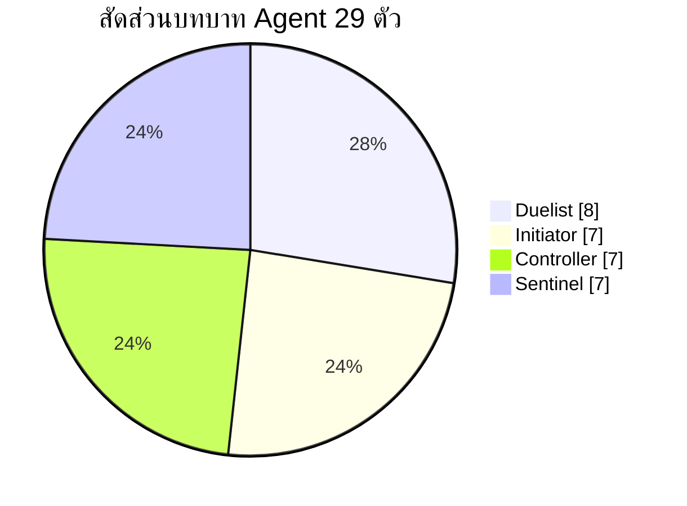

# รายงานสรุปข้อมูลเกม VALORANT สำหรับแพตช์ 12.08

## บทสรุปผู้บริหาร

- แพตช์ 12.08 ของ VALORANT ออกวันที่ 28 เมษายน 2026 และแกนหลักของแพตช์นี้คือ **Skirmish: Ascension**, การสลับแผนที่ **Ascent เข้า / Bind ออก** ในคิว Competitive และ Deathmatch, การกลับมาของ **Premier** บน PC และชุด **bug fixes** จำนวนหนึ่ง โดย **ไม่มีการประกาศ buff / nerf / rework ของ Agent หรืออาวุธแบบตรง ๆ** ในโน้ตทางการของแพตช์นี้เลย citeturn3view0turn3view3  
- Skirmish: Ascension เป็นโหมดแรงค์จำกัดเวลาแยกจาก 5v5 ปกติ เล่นได้ทั้ง 1v1 และ 2v2 มี ladder แยกบน FTW, ใช้ Agent แบบจำกัดรายชื่อ 14 ตัว, ให้ใช้เพียง 1 สกิลต่อ Agent และใช้อาวุธแบบ staged rounds ทำให้โหมดนี้เน้น mechanical skill และ clutch มากกว่าเมตา 5v5 ปกติ citeturn2view1turn2view2turn3view1  
- ดังนั้น “เมตา” ที่ขยับจริงในเกมหลักหลัง 12.08 จึงมาจาก **การเปลี่ยน map pool** มากกว่าจาก balance patch: การกลับมาของ Ascent ดันค่าให้กับ comp ที่ชอบ mid control, initiator สายข้อมูล, sentinel ยืน anchor และ Operator angles ขณะที่การถอด Bind ออกทำให้ comp สาย no-mid, teleporter fake และ close-quarters exec ถูกใช้น้อยลงใน ranked/premier โดยธรรมชาติ ข้อนี้เป็นการวิเคราะห์จากแผนที่และการหมุนเวียน map pool ของ Riot ไม่ใช่ถ้อยคำ balance ตรงจากผู้พัฒนา citeturn3view0turn23view0  
- Premier Stage V26A3 เริ่มรอบใหม่ โดยมีแมตช์วันเสาร์ตั้งแต่ 9 พฤษภาคม ถึง 13 มิถุนายน 2026 และ playoffs วันที่ 20–21 มิถุนายน 2026 ทำให้ทีมที่เล่น Premier ต้องย้ายภาระซ้อมจาก Bind ไป Ascent ทันที citeturn3view3  

## แพตช์ 12.08 และผลกระทบเชิงเมตา

ตารางนี้สรุป “ของที่เปลี่ยนจริง” ใน 12.08 และแปลผลเชิงการเล่นให้สั้นที่สุด โดยยึด Riot patch notes เป็นหลัก และใช้บทสรุปจากสื่อ esports เป็นแหล่งประกอบเท่านั้น citeturn2view0turn2view1turn2view3

# Valorant Patch 12.08 Meta Impact Knowledge Base

## Category: Balance
Changes:
- ไม่มี buff / nerf / rework ของ Agent หรือ Weapon
Practical_Impact:
- เมตา 5v5 ไม่ได้เปลี่ยนจากตัวเลขหรือสกิล
- การเปลี่ยนแปลงมาจาก map pool และโหมดใหม่
Tags: balance, no_change, meta_stable

---

## Category: Map Rotation
Changes:
- Ascent เข้า (IN)
- Bind ออก (OUT)
Practical_Impact:
- ต้องกลับไปซ้อม:
  - mid control
  - anti-operator utility
  - sentinel anchor setup
- meta shift ไปที่ Ascent
Tags: map_rotation, ascent, bind, meta_shift

---

## Category: New Mode (Skirmish: Ascension)
Changes:
- โหมดใหม่แบบ ranked-limited (Act 3)
Practical_Impact:
- ใช้ฝึก:
  - aim
  - clutch
  - flash timing
- ไม่สะท้อน meta 5v5 เต็มรูปแบบ
Tags: skirmish, practice, aim_training

---

## Category: Limited Time Mode Rotation
Changes:
- Knockout ถูกนำออก
Practical_Impact:
- ผู้เล่น LTM จะย้ายไป Skirmish
Tags: mode_removal, ltm

---

## Category: Premier
Changes:
- Stage V26A3 กลับมา
- ระยะเวลา 6 สัปดาห์
- มี playoffs หลายวัน
Practical_Impact:
- ทีมต้อง:
  - อัปเดต playbook
  - เตรียม map pool เร็วขึ้น
Tags: premier, competitive, schedule

---

## Category: Bug Fixes
Changes:
- แก้ Agent:
  - Miks, Veto, KAY/O, Neon, Tejo, Gekko, Yoru, Viper, Sage
- แก้ settings / replay บน PC
Practical_Impact:
- interaction เสถียรมากขึ้น
- meta ไม่เปลี่ยน แต่ consistency ดีขึ้น
Tags: bugfix, stability, consistency

ในเชิงรายละเอียดของ Skirmish: Ascension, Riot ระบุไว้ชัดว่าโหมดนี้เป็นประสบการณ์ competitive แบบจำกัดเวลาที่ใช้ Agent pool แบบคัดเฉพาะ, อนุญาตแค่ 1 ability ต่อ Agent, มีรอบอาวุธแบบ staged weapons และแยก ladder ระหว่าง 1v1 กับ 2v2 โดยเริ่มเล่นได้ตั้งแต่ 29 เมษายน ถึง 22 มิถุนายน 2026 บน FTW site. Roster ที่ใช้ในโหมดนี้ประกอบด้วย Jett, Waylay, Chamber, Cypher, Omen, Phoenix, Yoru, Iso, Sage, Raze, Vyse, KAY/O, Breach และ Veto พร้อมสกิลเดี่ยวที่กำหนดตายตัวต่อ Agent. citeturn3view0turn2view1turn2view2

ส่วน bug fixes ที่ “พอมีผลต่อความรู้สึกเมตา” มากที่สุดคือการแก้ interaction ของ **Viper’s Toxic Screen**, การแก้เคส **Sage resurrection ภายใน Viper decay**, และการแก้ **Tejo’s Armageddon targeting** เพราะทั้งหมดเป็นเคสที่ทำให้ round outcome เพี้ยนได้เมื่อเกิดจริง แต่ Riot ไม่ได้นำเสนอสิ่งเหล่านี้ในฐานะ balance changes จึงควรตีความว่าเป็น **reliability fixes** มากกว่า power shift. citeturn3view2turn3view3

ไทม์ไลน์ด้านล่างสรุปวันประกาศและหน้าต่างการใช้งานที่สำคัญจาก Riot และ FTW อย่างเป็นลำดับเวลา citeturn2view1turn2view2turn3view3

# Valorant Patch 12.08 Timeline Knowledge Base

## Event: Skirmish Announcement
Date: 2026-04-27
Details:
- Riot เปิดตัว "Skirmish: Ascension"
Impact:
- ผู้เล่นเริ่มเตรียมตัวสำหรับโหมดใหม่
Tags: announcement, skirmish

---

## Event: Patch Notes Release
Date: 2026-04-28
Details:
- Patch Notes 12.08 ถูกเผยแพร่
- Ascent เข้า (IN)
- Bind ออก (OUT)
- Premier Stage V26A3 ถูกประกาศ
Impact:
- meta shift ไปที่ Ascent
- ทีมต้องปรับ map pool
Tags: patch_notes, map_rotation, premier

---

## Event: Skirmish Live
Date: 2026-04-29
Details:
- โหมด Skirmish: Ascension เปิดให้เล่น
Impact:
- ใช้ฝึก aim / clutch / timing
Tags: skirmish, live, practice

---

## Event: Premier Weekly Matches Start
Date: 2026-05-09
Details:
- เริ่มแข่ง Premier รายสัปดาห์ (วันเสาร์)
Impact:
- ทีมต้องเริ่มแข่งขันจริง
Tags: premier, weekly_match

---

## Event: Premier Regular Season End
Date: 2026-06-13
Details:
- จบฤดูกาลปกติ
Impact:
- เตรียมเข้าสู่รอบ playoff
Tags: premier, season_end

---

## Event: Premier Playoffs Round 1
Date: 2026-06-20
Details:
- เริ่ม playoff รอบแรก
Impact:
- การแข่งขันเข้มข้นขึ้น
Tags: premier, playoff

---

## Event: Premier Playoffs Continue
Date: 2026-06-21
Details:
- แข่ง playoff ต่อเนื่อง
Impact:
- ทีมต้องรักษาฟอร์ม
Tags: premier, playoff

---

## Event: Skirmish Challenge End
Date: 2026-06-22
Details:
- สิ้นสุดกิจกรรม Skirmish: Ascension
Impact:
- โหมดฝึกพิเศษถูกปิด
Tags: skirmish, event_end

## รายชื่อ Agent ทั้ง 29 ตัวพร้อมสกิลและวิธีเล่น

คีย์สกิลในตารางด้านล่างใช้รูปแบบ **Q / C / E / X ตาม current client mapping** จากฐานข้อมูล Agent ปัจจุบัน และสรุปแนวใช้สกิล/การเล่นให้อ่านง่ายในเชิงโค้ช ไม่ใช่การคัดลอกคำอธิบายแบบยาวจากหน้าเว็บทางการทั้งหมด citeturn14view0turn19view2

จาก roster ปัจจุบัน Agent ทั้ง 29 ตัวแบ่งเป็น **Duelist 8, Initiator 7, Controller 7, Sentinel 7** ตาม current agent pages. citeturn24view0turn25view0turn25view1turn26view0turn26view1turn26view2turn27view0turn27view1turn28view0turn28view1turn28view2turn29view1turn29view2turn31view0turn31view1turn31view2turn34view0turn34view1turn35view0turn35view1turn36view2turn37search1turn37search2

**Duelists**

# Valorant Duelist Agent Knowledge Base

## Agent: Jett
Role: Duelist
Abilities:
- Q (Updraft): ขึ้นมุมสูง / reposition แนวตั้ง
- E (Tailwind): dash หนีหรือเปิดมุมเร็ว
- C (Cloudburst): smoke สั้น ควบคุมทิศทางได้
- X (Blade Storm): มีดแม่นสูง ใช้แทนปืนได้
Use_Case_Timing:
- Q/E ใช้ตอนเปิดมุมแรก หรือหนี trade
- C ใช้ครอสหรือแก้ smoke
- X ใช้ตอน eco หรือรอบต้องประหยัด
Playstyle:
- entry / Operator carry
- ยิงแล้วถอย (hit-and-run)
Tags: duelist, entry, mobility, sniper

---

## Agent: Waylay
Role: Duelist
Abilities:
- Q (Lightspeed): dash สองจังหวะ
- E (Refract): วาง beacon แล้วย้อนกลับ
- C (Saturate): Hinder ลดความเร็วศัตรู
- X (Convergent Paths): beam ใหญ่ + เพิ่ม speed
Use_Case_Timing:
- E ก่อน peek เสี่ยง
- C ก่อนเข้าหรือกัน retake
- Q ใช้หลัง utility ทีมเปิด
- X ใช้เปิดไซต์
Playstyle:
- entry ที่ต้องวางแผน escape
Tags: duelist, mobility, tactical_entry

---

## Agent: Iso
Role: Duelist
Abilities:
- Q (Undercut): ยิงทะลุทำให้ศัตรู Vulnerable + Suppress
- E (Double Tap): ได้โล่กัน 1 hit
- C (Contingency): กำแพงกันกระสุน
- X (Kill Contract): ดึงศัตรูไป 1v1
Use_Case_Timing:
- E ก่อน duel
- Q/C ก่อน swing มุมยาก
- X ใช้ดึง carry หรือ anchor ออก
Playstyle:
- เน้น isolate duel
- บังคับ 1v1
Tags: duelist, duel, isolate

---

## Agent: Neon
Role: Duelist
Abilities:
- Q (Relay Bolt): concuss กระเด้งพื้น
- E (High Gear): วิ่งเร็ว + slide
- C (Fast Lane): กำแพงวิชั่นคู่
- X (Overdrive): ยิงแม่นขณะวิ่ง
Use_Case_Timing:
- Q ก่อนเข้ามุม
- C ใช้ครอสไซต์
- E ใช้เปิดพื้นที่เร็ว
- X ใช้ตอน rush หรือ eco
Playstyle:
- hyper-entry
- เร่ง tempo ทีม
Tags: duelist, speed, rush

---

## Agent: Phoenix
Role: Duelist
Abilities:
- Q (Curveball): flash โค้ง
- E (Hot Hands): fire zone + heal
- C (Blaze): กำแพงไฟ
- X (Run It Back): ได้ชีวิตฟรี
Use_Case_Timing:
- Q ตอนออกมุม
- E เคลียร์มุมใกล้
- C แบ่งไซต์
- X ใช้ entry / retake
Playstyle:
- self-sufficient
- เล่นคนเดียวได้
Tags: duelist, self_heal, entry

---

## Agent: Raze
Role: Duelist
Abilities:
- Q (Blast Pack): satchel mobility
- E (Paint Shells): grenade แตกย่อย
- C (Boom Bot): bot เช็คมุม
- X (Showstopper): rocket AoE
Use_Case_Timing:
- C/E เคลียร์มุมก่อนเข้า
- Q ใช้ mobility หรือหยุด defuse
- X ใช้ปิดไซต์
Playstyle:
- explosive entry
Tags: duelist, explosive, entry

---

## Agent: Reyna
Role: Duelist
Abilities:
- Q (Devour): heal หลัง kill
- E (Dismiss): หลบหนี / invis
- C (Leer): nearsight
- X (Empress): combat boost
Use_Case_Timing:
- C ก่อน duel
- Q/E หลัง kill ทันที
- X ใช้ตอนมั่นใจ chain kills
Playstyle:
- snowball fragger
Tags: duelist, snowball, carry

---

## Agent: Yoru
Role: Duelist
Abilities:
- Q (Blindside): flash กระเด้ง
- E (Gatecrash): teleport
- C (Fakeout): clone หลอก
- X (Dimensional Drift): invis scout
Use_Case_Timing:
- C/E ใช้ fake หรือ lurk
- Q คอมโบกับ TP
- X ใช้ scout หรือ flank
Playstyle:
- trickster / mindgame
Tags: duelist, deception, lurk

ที่มาเรื่องชื่อ Agent, บทบาท, และคีย์สกิลของ Duelist table มาจาก Riot roster/current pages และฐานข้อมูลปัจจุบันของ Jett, Waylay, Iso, Neon, Phoenix, Raze, Reyna, Yoru โดยเฉพาะ Phoenix/Yoru ใช้ Riot current page และ current secondary references เสริมเพราะ web preview บางหน้าไม่แสดง ability blocks ครบทุกบรรทัด citeturn14view0turn19view1turn19view0turn28view2turn31view0turn40view0turn32view1turn34view2turn42search14turn42search18turn43search1turn43search2

**Initiators**

# Valorant Initiator Agent Knowledge Base

## Agent: Breach
Role: Initiator
Abilities:
- Q (Flashpoint): flash ทะลุกำแพง
- E (Fault Line): concuss เป็นเส้นยาว
- C (Aftershock): burst damage หลังผนัง
- X (Rolling Thunder): quake ขนาดใหญ่
Use_Case_Timing:
- Q/E ก่อนให้ duelists swing
- C ไล่คนในซอกหรือหยุด defuse
- X ใช้เปิดไซต์หรือ retake
Playstyle:
- support-entry initiator
- เน้นคอมโบกับทีม
Tags: initiator, cc, stun, teamplay

---

## Agent: Fade
Role: Initiator
Abilities:
- Q (Seize): จับศัตรู + debuff (Deafened / Decayed)
- E (Haunt): reveal + trail
- C (Prowler): ไล่ตาม trail + nearsight
- X (Nightfall): wave ทำ mark + debuff
Use_Case_Timing:
- E เปิดข้อมูลก่อนเข้า
- C ไล่ตาม trail
- Q ล็อกเป้าให้ทีมยิง
- X ใช้เปิดไซต์หรือ retake
Playstyle:
- info + hunt initiator
Tags: initiator, reveal, debuff, tracking

---

## Agent: Gekko
Role: Initiator
Abilities:
- Q (Wingman): concuss + plant/defuse
- E (Dizzy): ยิง flash พลาสมา
- C (Mosh Pit): zone damage
- X (Thrash): detain ศัตรู
Use_Case_Timing:
- E/Q ก่อนเข้าไซต์
- C กดพื้นที่ plant/defuse
- X ใช้เปิดหรือ retake
Playstyle:
- flexible initiator
- เด่นเรื่อง objective control
Tags: initiator, utility, objective

---

## Agent: KAY/O
Role: Initiator
Abilities:
- Q (FLASH/drive): flash แบบขว้างเร็ว/ช้า
- E (ZERO/point): suppression knife
- C (FRAG/ment): molly damage หลายรอบ
- X (NULL/cmd): suppress pulse + revive state
Use_Case_Timing:
- E เปิดไซต์ก่อน trade
- Q ใช้ self-pop หรือ support
- C ไล่มุม / หยุด defuse
- X ใช้ก่อน hard execute
Playstyle:
- anti-ability initiator
- tempo เร็ว
Tags: initiator, suppress, anti_utility

---

## Agent: Skye
Role: Initiator
Abilities:
- Q (Trailblazer): tiger concuss
- E (Guiding Light): hawk flash ควบคุมได้
- C (Regrowth): heal teammates
- X (Seekers): หา 3 เป้าหมาย
Use_Case_Timing:
- E/Q ใช้เปิดข้อมูลก่อน swing
- C ใช้หลังไฟต์หรือก่อน retake
- X ใช้ล็อกตำแหน่งก่อนเข้า
Playstyle:
- all-round initiator
Tags: initiator, flash, heal, support

---

## Agent: Sova
Role: Initiator
Abilities:
- Q (Shock Bolt): ยิง damage เด้งผนัง
- E (Recon Bolt): reveal bolt
- C (Owl Drone): drone + mark
- X (Hunter’s Fury): ยิงทะลุกำแพง
Use_Case_Timing:
- E/C ก่อนเข้าไซต์หรือ retake
- Q เคลียร์ trap / มุม
- X ยิงตามข้อมูล (plant/defuse)
Playstyle:
- long-range info initiator
Tags: initiator, recon, lineup, long_range

---

## Agent: Tejo
Role: Initiator
Abilities:
- Q (Special Delivery): sticky concuss grenade
- E (Guided Salvo): ยิงมิสไซล์ 2 จุด
- C (Stealth Drone): drone suppress + reveal
- X (Armageddon): strike line damage สูง
Use_Case_Timing:
- C เปิดข้อมูลก่อน hit
- E บีบ anchor ออกจากตำแหน่ง
- Q ปิดมุม
- X ใช้เปิดทางหรือ retake
Playstyle:
- artillery initiator
- บังคับพื้นที่จากระยะไกล
Tags: initiator, artillery, zoning, control

ที่มาเรื่องชื่อ Agent, บทบาท, และคีย์สกิลของ Initiator table มาจาก Riot roster/current pages และฐานข้อมูลปัจจุบันของ Breach, Fade, Gekko, KAY/O, Skye, Sova และ Tejo citeturn14view0turn25view0turn27view1turn28view0turn31view2turn34view1turn35view0turn35view1

**Controllers**

# Valorant Controller Agent Knowledge Base

## Agent: Astra
Role: Controller
Abilities:
- Q (Nova Pulse): concuss จากดาว
- E (Nebula / Dissipate): smoke หรือเก็บดาว
- C (Gravity Well): ดึงศัตรู + Vulnerable
- X (Astral Form / Cosmic Divide): วางดาว / กำแพงตัดเสียง
Use_Case_Timing:
- วางดาวก่อน execute
- ใช้ Q/C ตอนศัตรูติดมุม
- X ใช้แบ่งไซต์ / post-plant / retake
Playstyle:
- macro controller
- คุม tempo จากระยะไกล
Tags: controller, global_control, macro, utility

---

## Agent: Brimstone
Role: Controller
Abilities:
- Q (Incendiary): molly กดพื้นที่
- E (Sky Smoke): smoke จากแผนที่
- C (Stim Beacon): เพิ่ม fire rate + speed
- X (Orbital Strike): laser damage สูง
Use_Case_Timing:
- E ก่อนเข้าไซต์
- Q หลัง plant หรือหยุด push
- C ตอน commit
- X ใช้ clear จุดสำคัญ
Playstyle:
- controller ตรงไปตรงมา
- เด่น exec และ post-plant
Tags: controller, execute, postplant, simple

---

## Agent: Clove
Role: Controller
Abilities:
- Q (Meddle): grenade ทำ decay
- E (Ruse): smoke ใช้ได้แม้ตาย
- C (Pick-me-up): haste + HP ชั่วคราว
- X (Not Dead Yet): revive ตัวเอง
Use_Case_Timing:
- E คุมเส้นเข้าเสมอ
- Q ก่อน swing
- C หลังได้ kill
- X ใช้เมื่อมีโอกาส chain kill
Playstyle:
- fragging controller
- เล่นกับทีมและ trade ดี
Tags: controller, aggressive, trade, sustain

---

## Agent: Harbor
Role: Controller
Abilities:
- Q (High Tide): กำแพงน้ำปรับทิศ
- E (Cove): smoke + shield กันกระสุน
- C (Storm Surge): slow + nearsight
- X (Reckoning): คลื่นน้ำกดพื้นที่
Use_Case_Timing:
- Q/E ใช้ตอนข้ามพื้นที่โล่ง
- C ปิดมุมหรือหยุด push
- X เปิดไซต์หรือ retake
Playstyle:
- controller สาย cross map
- ตัดมุม Operator
Tags: controller, wall, execute, anti_op

---

## Agent: Miks
Role: Controller
Abilities:
- Q (Harmonize): stim ทีม
- E (Waveform): map smokes
- C (M-pulse): concuss หรือ heal
- X (Bassquake): knockback + deafen + slow
Use_Case_Timing:
- E ก่อน execute
- Q ตอน commit
- C ใช้ sustain หรือ defense
- X เปิดทางหรือหยุด push
Playstyle:
- support-controller
- ขับ tempo ทีม
Tags: controller, support, tempo, teamplay

---

## Agent: Omen
Role: Controller
Abilities:
- Q (Paranoia): nearsight + deafen
- E (Dark Cover): long smoke
- C (Shrouded Step): teleport สั้น
- X (From the Shadows): teleport ทั่วแผนที่
Use_Case_Timing:
- E ใช้ default หรือ execute
- Q ก่อน swing
- C ใช้ reposition หรือเล่นมุม
- X ใช้ lurk / fake / scout
Playstyle:
- flexible controller
- เล่น fake และ lurk ได้ดี
Tags: controller, flexible, teleport, mindgame

---

## Agent: Viper
Role: Controller
Abilities:
- Q (Poison Cloud): orb smoke ทำ decay
- E (Toxic Screen): กำแพงพิษ
- C (Snake Bite): molly + Vulnerable
- X (Viper’s Pit): คุมพื้นที่ขนาดใหญ่
Use_Case_Timing:
- Q/E ใช้ default ยืดเวลา
- C หลัง plant หรือหยุด rush
- X ใช้ยึดไซต์หรือกัน retake
Playstyle:
- controller สาย attrition
- เด่น post-plant
Tags: controller, zone_control, postplant, defense

ที่มาเรื่องชื่อ Agent, บทบาท, และคีย์สกิลของ Controller table มาจาก Riot roster/current pages และฐานข้อมูลปัจจุบันของ Astra, Brimstone, Clove, Harbor, Miks, Omen และ Viper citeturn14view0turn24view0turn25view1turn26view1turn28view1turn29view2turn31view1turn37search1

**Sentinels**

# Valorant Sentinel Agent Knowledge Base

## Agent: Chamber
Role: Sentinel
Abilities:
- Q (Headhunter): ปืนพกแรงสูง
- E (Rendezvous): วางจุด TP หนี
- C (Trademark): trap slow กัน flank
- X (Tour De Force): sniper พิเศษ
Use_Case_Timing:
- E วางก่อน peek เสี่ยง
- C ใช้กัน flank หรือ main
- Q/X ใช้ตอน eco หรือถือมุมยาว
Playstyle:
- sentinel สาย aim / pick
- คล้าย Operator player
Tags: sentinel, sniper, pick, mobility

---

## Agent: Cypher
Role: Sentinel
Abilities:
- Q (Cyber Cage): ควัน + audio cue
- E (Spycam): กล้อง reveal
- C (Trapwire): tripwire slow + reveal
- X (Neural Theft): reveal ทั้งทีม
Use_Case_Timing:
- C/E วางก่อนเริ่มรอบ
- Q เปิดตอนศัตรูเข้า
- X ใช้ทันทีหลังได้ kill
Playstyle:
- info sentinel
- เด่น anchor และ flank control
Tags: sentinel, info, trap, defense

---

## Agent: Deadlock
Role: Sentinel
Abilities:
- Q (Sonic Sensor): ตรวจเสียง + concuss
- E (GravNet): บังคับ crouch + slow
- C (Barrier Mesh): wall บล็อกทาง
- X (Annihilation): cocoon kill
Use_Case_Timing:
- Q/C ตั้งกัน rush
- E ใช้หยุด entry
- X ใช้จับตัวเปิดหรือ post-plant
Playstyle:
- anti-rush sentinel
- เก่งใน choke
Tags: sentinel, anti_rush, control, choke

---

## Agent: Killjoy
Role: Sentinel
Abilities:
- Q (ALARMBOT): detect + Vulnerable
- E (TURRET): ป้อมยิงอัตโนมัติ
- C (Nanoswarm): molly ซ่อน
- X (Lockdown): detain พื้นที่ใหญ่
Use_Case_Timing:
- E/Q วางก่อน round
- C ใช้ deny plant / defuse
- X ใช้ยึดไซต์หรือ retake
Playstyle:
- anchor sentinel มาตรฐาน
- เด่น setup และ post-plant
Tags: sentinel, anchor, setup, postplant

---

## Agent: Sage
Role: Sentinel
Abilities:
- Q (Slow Orb): slow field
- E (Healing Orb): heal
- C (Barrier Orb): wall
- X (Resurrection): revive teammate
Use_Case_Timing:
- C ใช้ตัดทาง / delay hit
- E หลังไฟต์
- Q ตอนโดน rush
- X ใช้เมื่อ revive แล้วทีมตั้งรูปได้
Playstyle:
- support sentinel
- ยืดเวลา / stabilize round
Tags: sentinel, support, heal, stall

---

## Agent: Veto
Role: Sentinel
Abilities:
- Q (Chokehold): trap + debuff
- E (Interceptor): anti-utility device
- C (Crosscut): vortex teleport
- X (Evolution): regen + stim + immune debuff
Use_Case_Timing:
- E ตั้งรับ utility หนัก
- Q ดัก choke
- C ใช้ reposition
- X ใช้ถือไซต์หรือ retake
Playstyle:
- anti-utility sentinel เชิงรุก
Tags: sentinel, anti_utility, aggressive

---

## Agent: Vyse
Role: Sentinel
Abilities:
- Q (Shear): hidden wall trap
- E (Arc Rose): trap flash
- C (Razorvine): slow + damage
- X (Steel Garden): jam อาวุธหลักศัตรู
Use_Case_Timing:
- E/Q วางก่อน round
- C ใช้หยุด push หรือ retake
- X ใช้ก่อน exec/retake
Playstyle:
- funnel sentinel
- บังคับศัตรูเข้าช่องแคบ
Tags: sentinel, trap, funnel, control

ที่มาเรื่องชื่อ Agent, บทบาท, และคีย์สกิลของ Sentinel table มาจาก Riot roster/current pages และฐานข้อมูลปัจจุบันของ Chamber, Cypher, Deadlock, Killjoy, Sage, Veto และ Vyse citeturn14view0turn26view0turn26view2turn27view0turn29view1turn34view0turn37search2turn36view2

## แผนที่ทั้ง 12 และแนวทางเล่นแบบย่อยง่าย

คำแนะนำด้านล่างเป็น **analytical synthesis** จากเลย์เอาต์และคำอธิบายแผนที่ทางการของ Riot รวมถึงบริบท callouts/guide ปัจจุบันของแผนที่ใหม่อย่าง Corrode เพื่อให้ใช้งานได้จริงใน ranked มากกว่าจะเป็นคำอธิบาย lore ของแผนที่ citeturn23view0turn22view0turn44search0turn44search1

# Valorant Map Strategy Knowledge Base

## Map: Corrode
Structure:
- 3-lane
- layered defense
Attack_Strategy:
- เร็ว mid แล้ว split เข้าไซต์
- ใช้ flash / molly เคลียร์มุมซ้อน
Defense_Strategy:
- เก็บ info mid
- ถอยเล่น crossfire ชั้นใน
Key_Chokepoints:
- A Main, Mid/Elbow, B Main
Common_Utility:
- Smoke: Mid Connector, A Heaven, B Backsite
Tags: map, split, mid_control, default

---

## Map: Abyss
Structure:
- 2 sites
- มี death drops
Attack_Strategy:
- เล่นช้า
- ใช้ positioning บังคับศัตรูตกขอบ
- mid split สำคัญ
Defense_Strategy:
- ลงโทษคน overpeek
- retake เป็นทีม
Key_Chokepoints:
- A Main, Mid, B Main
Common_Utility:
- Smoke: A Bridge/Heaven, B Pillar/Backsite
Tags: map, positioning, punish, slow_play

---

## Map: Sunset
Structure:
- 3-lane
- mid-focused
Attack_Strategy:
- คุม mid ก่อน
- split B ผ่าน Market/Boba
Defense_Strategy:
- ห้ามเสีย mid ฟรี
Key_Chokepoints:
- Top Mid, Market, Boba, A Elbow, B CT
Tags: map, mid_control, split

---

## Map: Lotus
Structure:
- 3 sites
- rotating doors
Attack_Strategy:
- ใช้เสียงประตู fake
- default กว้าง
Defense_Strategy:
- เก็บ info A/C Main
- rotate ด้วย door
Key_Chokepoints:
- A Main/Tree, B Main, C Main/Mound
Common_Utility:
- Smoke: Tree, B Site, C Waterfall/CT
Tags: map, fake, rotation, info

---

## Map: Pearl
Structure:
- no special mechanics
- long lanes
Attack_Strategy:
- ชนะ mid → split B
- หรือเล่น long ทีละด้าน
Defense_Strategy:
- ห้ามเสีย Art/Mid
Key_Chokepoints:
- Mid Connector/Art, A Dugout, B Link/Heaven
Tags: map, mid_control, long_range

---

## Map: Fracture
Structure:
- attackers เข้าสองฝั่ง
Attack_Strategy:
- pinch พร้อมกัน
- utility ต้อง sync
Defense_Strategy:
- push info บางจังหวะ
- ไม่งั้นโดนบีบสองด้าน
Key_Chokepoints:
- A Main/A Drop, B Main/Arcade
Common_Utility:
- Smoke: A Heaven, B Canteen/Tower
Tags: map, pinch, coordination

---

## Map: Breeze
Structure:
- open map
- long sightlines
Attack_Strategy:
- ใช้ wall/smoke ครอสพื้นที่
- lurk doors/halls
Defense_Strategy:
- ใช้ Operator
- หลีกเลี่ยง duel ยาวโดยไม่มี util
Key_Chokepoints:
- A Nest/Pyramids, Mid Top/Doors, B CT/Backsite
Tags: map, long_range, operator

---

## Map: Icebox
Structure:
- vertical
- zipline
Attack_Strategy:
- smoke/wall คลุม plant
- เคลียร์มุมสูงก่อน
Defense_Strategy:
- ตั้ง utility ที่ choke
- retake จาก rafters/backsite
Key_Chokepoints:
- A Screens/410/Nest, B Yellow/Orange/CT
Tags: map, vertical, plant_control

---

## Map: Ascent
Structure:
- mid-centric
- มีประตูเปิด/ปิด
Attack_Strategy:
- default ช้า
- คุม mid แล้ว split
Defense_Strategy:
- contest mid
- ใช้ one-way
- sentinel anchor สำคัญ
Key_Chokepoints:
- Top Mid, Market, Cat, A Tree/Heaven, B Market/CT
Tags: map, mid_control, default, meta

---

## Map: Split
Structure:
- vertical mid
- ropes
Attack_Strategy:
- คุม Mid Mail/Vents
- split เป็นหลัก
Defense_Strategy:
- heaven crossfire
- stall choke
Key_Chokepoints:
- Mid Vent/Mail, A Heaven/Screens, B Heaven/Garage
Tags: map, vertical, choke

---

## Map: Haven
Structure:
- 3 sites
Attack_Strategy:
- default กระจาย
- punish rotation
Defense_Strategy:
- เร่ง info
- rotate เร็ว
Key_Chokepoints:
- A Long, Garage, C Long
Common_Utility:
- Smoke: A Heaven/CT, B Window, C Platform
Tags: map, default, rotation

---

## Map: Bind
Structure:
- 2 sites
- ไม่มี mid
- teleport
Attack_Strategy:
- control Hookah/Showers
- ใช้ TP fake
Defense_Strategy:
- anchor extremities
- rotate จาก info จริง
Key_Chokepoints:
- A Short/Showers, B Long/Hookah
Common_Utility:
- Smoke: A Heaven/Truck, B CT/Elbow
Tags: map, teleport, fake, execute

ในมุมเชิงเมตา “เล่นยังไงให้ชนะขึ้น” ถ้าสรุปแบบสั้นจริง ๆ: **Ascent, Split, Sunset, Pearl** ต้องให้ค่ากับ **mid control** สูง; **Lotus, Haven** ต้องคิดเรื่อง **rotation** มากกว่าแค่ site hit; **Bind, Fracture** ต้องซ้อม **timing พร้อมกันหลายทาง**; **Breeze, Icebox, Abyss** ต้องจัด utility เพื่อรับมือ **ระยะยิงยาวและมุมแนวตั้ง** ให้ดีเป็นพิเศษ citeturn23view0turn22view0

## อาวุธทั้ง 19 ปืน + 1 มีด และตารางซื้อสำหรับแต่ละ Agent

ชื่อหมวดอาวุธอ้างอิงจาก Riot Arsenal และราคาจาก current weapons database ที่อัปเดตชุดอาวุธปัจจุบัน ซึ่งรวม **Bandit** และ **Outlaw** แล้วเรียบร้อย citeturn6view0turn21view0turn8search1

# Valorant Weapon Knowledge Base

## Weapon: Classic
Category: Sidearm
Price: 0
Recoil_Accuracy:
- สมดุล
- alt-fire เด่นระยะใกล้
Best_Buy_Phase:
- pistol
- eco
Tags: pistol, free, close_range

---

## Weapon: Bandit
Category: Sidearm
Price: 600
Recoil_Accuracy:
- semi-auto แม่น
- ยิงหัวคุ้ม
Best_Buy_Phase:
- light-buy
- eco
Tags: pistol, precision, budget

---

## Weapon: Shorty
Category: Sidearm
Price: 300
Recoil_Accuracy:
- spread สูง
- โหดระยะประชิด
Best_Buy_Phase:
- eco
- anti-eco
- มุมแคบ
Tags: shotgun, close_range, ambush

---

## Weapon: Frenzy
Category: Sidearm
Price: 450
Recoil_Accuracy:
- ยิงรัวแรง
- คุมระยะไกลยาก
Best_Buy_Phase:
- force
- close-range fight
Tags: pistol, automatic, aggressive

---

## Weapon: Ghost
Category: Sidearm
Price: 500
Recoil_Accuracy:
- silenced
- tap แม่น
Best_Buy_Phase:
- pistol
- light-buy
Tags: pistol, silent, precision

---

## Weapon: Sheriff
Category: Sidearm
Price: 800
Recoil_Accuracy:
- recoil สูง
- one-tap ได้
Best_Buy_Phase:
- eco
- half-buy
Tags: pistol, high_damage, one_tap

---

## Weapon: Stinger
Category: SMG
Price: 1100
Recoil_Accuracy:
- recoil พุ่งแรง
- DPS สูงใกล้
Best_Buy_Phase:
- force
- anti-eco
Tags: smg, close_range, fast

---

## Weapon: Spectre
Category: SMG
Price: 1600
Recoil_Accuracy:
- silenced
- spray คุมง่าย
Best_Buy_Phase:
- force
- bonus
- anti-eco
Tags: smg, balanced, mobility

---

## Weapon: Bucky
Category: Shotgun
Price: 850
Recoil_Accuracy:
- ใกล้แรงมาก
- ไกลตกแรง
Best_Buy_Phase:
- eco
- anti-rush
Tags: shotgun, defense, choke

---

## Weapon: Judge
Category: Shotgun
Price: 1850
Recoil_Accuracy:
- auto shotgun
- spam ใกล้โหด
Best_Buy_Phase:
- force
- anti-eco
- smoke play
Tags: shotgun, aggressive, choke

---

## Weapon: Bulldog
Category: Rifle
Price: 2050
Recoil_Accuracy:
- ADS burst เสถียร
- full-auto กลาง ๆ
Best_Buy_Phase:
- half-buy
- bonus
Tags: rifle, budget, mid_range

---

## Weapon: Guardian
Category: Rifle
Price: 2250
Recoil_Accuracy:
- semi-auto แม่นมาก
- พึ่ง aim
Best_Buy_Phase:
- half-buy
- long angle
Tags: rifle, precision, long_range

---

## Weapon: Phantom
Category: Rifle
Price: 2900
Recoil_Accuracy:
- recoil นุ่ม
- silenced
Best_Buy_Phase:
- full-buy
- anti-eco
- spray site
Tags: rifle, spray, silent

---

## Weapon: Vandal
Category: Rifle
Price: 2900
Recoil_Accuracy:
- recoil เด้งกว่า Phantom
- headshot ทุกระยะ
Best_Buy_Phase:
- full-buy มาตรฐาน
Tags: rifle, one_tap, standard

---

## Weapon: Marshal
Category: Sniper
Price: 950
Recoil_Accuracy:
- เบา คล่อง
- one-tap หัวแรง
Best_Buy_Phase:
- eco
- bonus
Tags: sniper, eco, fast

---

## Weapon: Outlaw
Category: Sniper
Price: 2400
Recoil_Accuracy:
- ยิง 2 นัด
- ลงโทษ light armor
Best_Buy_Phase:
- half-buy
Tags: sniper, anti_light

---

## Weapon: Operator
Category: Sniper
Price: 4700
Recoil_Accuracy:
- one-shot body
- ถือมุมดีที่สุด
Best_Buy_Phase:
- full-buy (เศรษฐกิจพร้อม)
Tags: sniper, expensive, one_shot

---

## Weapon: Ares
Category: Heavy
Price: 1600
Recoil_Accuracy:
- spray ยาว
- wallbang ดี
Best_Buy_Phase:
- force
- anti-rush
Tags: heavy, spam, wallbang

---

## Weapon: Odin
Category: Heavy
Price: 3200
Recoil_Accuracy:
- fire rate สูง
- spam แรงมาก
Best_Buy_Phase:
- full-buy (เฉพาะแผน)
Tags: heavy, suppression, control

---

## Weapon: Tactical Knife
Category: Melee
Price: 0
Recoil_Accuracy:
- ไม่มี recoil
- วิ่งเร็วที่สุด
Best_Buy_Phase:
- ใช้ movement
- ปิดงาน
Tags: melee, mobility, utility

หมายเหตุ: คอลัมน์ recoil/accuracy และช่วงซื้อเป็นการสังเคราะห์จากหมวดอาวุธ, ราคาปัจจุบัน, และรูปแบบการยิงของฐานข้อมูลอาวุธ ไม่ใช่ “คำแนะนำทางการ” ตรงจาก Riot แต่ยึดชุดข้อมูลอาวุธปัจจุบันเป็นฐานทั้งหมด citeturn6view0turn21view0turn21view1turn21view2turn8search1

ตารางแนะนำการซื้อด้านล่างเป็นแนวทางเชิงแข่งขันแบบย่อ: **Eco = ประหยัดมาก**, **Half-buy = มีของพอสู้**, **Full buy = ซื้อเต็ม**, **Anti-eco = เรามีเงินมากกว่าและคาดว่าศัตรูประหยัด**. หลักสำคัญคือ **อย่าทิ้ง utility หลักของ role เพื่ออัปปืนเกินจำเป็น**. citeturn21view0turn14view0turn19view2

# Valorant Agent Loadout Recommendation Knowledge Base

## Agent: Astra
Role: Controller
Eco:
- Classic / Ghost + utility
Half_Buy:
- Spectre / Bulldog
Full_Buy:
- Phantom / Vandal
Anti_Eco:
- Spectre / Phantom
Tags: controller, balanced, utility

---

## Agent: Breach
Role: Initiator
Eco:
- Classic / Frenzy + utility
Half_Buy:
- Spectre / Bulldog
Full_Buy:
- Phantom / Vandal
Anti_Eco:
- Spectre / Phantom
Tags: initiator, entry_support

---

## Agent: Brimstone
Role: Controller
Eco:
- Classic / Ghost + utility
Half_Buy:
- Spectre / Bulldog
Full_Buy:
- Phantom / Vandal
Anti_Eco:
- Spectre / Phantom
Tags: controller, execute

---

## Agent: Chamber
Role: Sentinel
Eco:
- Headhunter / Bandit / Ghost
Half_Buy:
- Marshal / Headhunter
Full_Buy:
- Operator / Vandal
Anti_Eco:
- Marshal / Vandal
Tags: sentinel, sniper, pick

---

## Agent: Clove
Role: Controller
Eco:
- Ghost / Frenzy + utility
Half_Buy:
- Spectre / Bulldog
Full_Buy:
- Phantom / Vandal
Anti_Eco:
- Spectre / Phantom
Tags: controller, aggressive

---

## Agent: Cypher
Role: Sentinel
Eco:
- Classic / Shorty
Half_Buy:
- Judge / Spectre / Sheriff
Full_Buy:
- Phantom / Vandal
Anti_Eco:
- Judge / Spectre
Tags: sentinel, trap, defense

---

## Agent: Deadlock
Role: Sentinel
Eco:
- Classic / Shorty
Half_Buy:
- Judge / Bucky / Spectre
Full_Buy:
- Phantom / Vandal
Anti_Eco:
- Judge / Spectre
Tags: sentinel, anti_rush

---

## Agent: Fade
Role: Initiator
Eco:
- Classic / Ghost
Half_Buy:
- Spectre / Guardian
Full_Buy:
- Phantom / Vandal
Anti_Eco:
- Spectre / Phantom
Tags: initiator, tracking

---

## Agent: Gekko
Role: Initiator
Eco:
- Classic / Ghost
Half_Buy:
- Spectre / Bulldog
Full_Buy:
- Phantom / Vandal
Anti_Eco:
- Spectre / Phantom
Tags: initiator, utility

---

## Agent: Harbor
Role: Controller
Eco:
- Classic / Ghost
Half_Buy:
- Spectre / Bulldog
Full_Buy:
- Phantom / Vandal
Anti_Eco:
- Spectre / Phantom
Tags: controller, wall

---

## Agent: Iso
Role: Duelist
Eco:
- Sheriff / Bandit
Half_Buy:
- Bulldog / Guardian / Spectre
Full_Buy:
- Vandal / Phantom
Anti_Eco:
- Spectre / Vandal
Tags: duelist, aim

---

## Agent: Jett
Role: Duelist
Eco:
- Sheriff / Bandit
Half_Buy:
- Marshal / Stinger / Spectre
Full_Buy:
- Operator / Vandal / Phantom
Anti_Eco:
- Spectre / Phantom
Tags: duelist, sniper, entry

---

## Agent: KAY/O
Role: Initiator
Eco:
- Ghost / Frenzy
Half_Buy:
- Spectre / Bulldog
Full_Buy:
- Phantom / Vandal
Anti_Eco:
- Spectre / Phantom
Tags: initiator, anti_utility

---

## Agent: Killjoy
Role: Sentinel
Eco:
- Classic / Shorty
Half_Buy:
- Judge / Spectre
Full_Buy:
- Phantom / Vandal
Anti_Eco:
- Judge / Spectre
Tags: sentinel, anchor

---

## Agent: Miks
Role: Controller
Eco:
- Classic / Ghost + utility
Half_Buy:
- Spectre / Bulldog
Full_Buy:
- Phantom / Vandal
Anti_Eco:
- Spectre / Phantom
Tags: controller, support

---

## Agent: Neon
Role: Duelist
Eco:
- Frenzy / Shorty
Half_Buy:
- Stinger / Spectre / Judge
Full_Buy:
- Phantom / Vandal
Anti_Eco:
- Spectre / Judge
Tags: duelist, speed

---

## Agent: Omen
Role: Controller
Eco:
- Ghost / Classic
Half_Buy:
- Spectre / Bulldog
Full_Buy:
- Phantom / Vandal
Anti_Eco:
- Spectre / Phantom
Tags: controller, flexible

---

## Agent: Phoenix
Role: Duelist
Eco:
- Frenzy / Ghost
Half_Buy:
- Spectre / Bulldog
Full_Buy:
- Phantom / Vandal
Anti_Eco:
- Spectre / Phantom
Tags: duelist, entry

---

## Agent: Raze
Role: Duelist
Eco:
- Shorty / Frenzy
Half_Buy:
- Stinger / Judge / Spectre
Full_Buy:
- Vandal / Phantom
Anti_Eco:
- Judge / Spectre
Tags: duelist, explosive

---

## Agent: Reyna
Role: Duelist
Eco:
- Sheriff / Ghost
Half_Buy:
- Bulldog / Guardian / Spectre
Full_Buy:
- Vandal / Phantom
Anti_Eco:
- Spectre / Vandal
Tags: duelist, carry

---

## Agent: Sage
Role: Sentinel
Eco:
- Classic / Ghost
Half_Buy:
- Spectre / Bulldog
Full_Buy:
- Phantom / Vandal
Anti_Eco:
- Spectre / Phantom
Tags: sentinel, support

---

## Agent: Skye
Role: Initiator
Eco:
- Ghost / Frenzy
Half_Buy:
- Spectre / Bulldog
Full_Buy:
- Phantom / Vandal
Anti_Eco:
- Spectre / Phantom
Tags: initiator, support

---

## Agent: Sova
Role: Initiator
Eco:
- Classic / Ghost
Half_Buy:
- Guardian / Spectre / Ares
Full_Buy:
- Vandal / Phantom / Odin
Anti_Eco:
- Spectre / Guardian
Tags: initiator, long_range

---

## Agent: Tejo
Role: Initiator
Eco:
- Classic / Ghost
Half_Buy:
- Bulldog / Guardian / Spectre
Full_Buy:
- Vandal / Phantom
Anti_Eco:
- Spectre / Guardian
Tags: initiator, artillery

---

## Agent: Veto
Role: Sentinel
Eco:
- Ghost / Shorty
Half_Buy:
- Spectre / Judge
Full_Buy:
- Phantom / Vandal
Anti_Eco:
- Judge / Spectre
Tags: sentinel, anti_utility

---

## Agent: Viper
Role: Controller
Eco:
- Classic / Ghost
Half_Buy:
- Spectre / Bulldog
Full_Buy:
- Phantom / Vandal
Anti_Eco:
- Spectre / Phantom
Tags: controller, postplant

---

## Agent: Vyse
Role: Sentinel
Eco:
- Classic / Shorty
Half_Buy:
- Judge / Spectre
Full_Buy:
- Phantom / Vandal
Anti_Eco:
- Judge / Spectre
Tags: sentinel, trap

---

## Agent: Waylay
Role: Duelist
Eco:
- Sheriff / Bandit
Half_Buy:
- Stinger / Spectre
Full_Buy:
- Vandal / Phantom
Anti_Eco:
- Spectre / Phantom
Tags: duelist, mobility

---

## Agent: Yoru
Role: Duelist
Eco:
- Ghost / Sheriff
Half_Buy:
- Spectre / Bulldog
Full_Buy:
- Vandal / Phantom
Anti_Eco:
- Spectre / Vandal
Tags: duelist, deception

## เมตาหลังแพตช์ 12.08 และแหล่งอ้างอิงหลัก

ถ้าตอบแบบตรงที่สุด: **12.08 ไม่ได้เปลี่ยนเมตาผ่าน buff/nerf**, แต่เปลี่ยนผ่าน **map pool**. การกลับมาของ **Ascent** ทำให้คุณค่าของ Agent/อาวุธที่เก่งในเกมช้า, การคุม mid, การ anchor และการใช้ข้อมูลกลับมาสูงขึ้นอีกครั้ง เช่น Sova, KAY/O, Cypher, Killjoy, Omen, Astra รวมถึงผู้เล่นที่ถือ Operator ได้ดีอย่าง Jett และ Chamber เพราะ Ascent เป็นแผนที่ที่แบ่งไซต์ด้วย “position and attrition” และการยึด mid มีผลมหาศาลต่อการแยก A/B. นี่เป็นการวิเคราะห์จาก map swap และคำอธิบายทางการของแผนที่เอง ไม่ใช่ข้อความประกาศ meta ตรงจาก Riot. citeturn3view0turn23view0

ในทางกลับกัน การที่ **Bind ออกจากคิว** ทำให้หนึ่งในบ้านที่ดีที่สุดของคอมพ์ no-mid, ใส่ utility หนา, fake ด้วย teleporter, และเล่น close-range explosive exec ถูกถอดออกจาก ranked/premier rotation ไปชั่วคราว ซึ่งลดน้ำหนักของ playbook บางประเภทที่พึ่งพา Hookah/Showers/teleporter heavily. Agent อย่าง Raze, Brimstone, Gekko หรือ shotgun-centric anti-eco plans ยังดีเหมือนเดิมในเชิงพลังรวม แต่มี “สนามถนัด” น้อยลงหนึ่งสนามในคิวแข่งขัน ณ 12.08. citeturn3view0turn22view0

Skirmish: Ascension เองน่าจะเพิ่มชั่วโมงฝึกแบบ micro ให้กับผู้เล่นที่หยิบ Jett, Waylay, Chamber, Phoenix, Yoru, Breach, KAY/O และ Veto เพราะ roster ในโหมดจำกัดนี้เน้น dash, flash, teleport, cage และ utility ที่สร้าง duel โดยตรง แต่เพราะกติกาของโหมดใช้เพียง 1 ability ต่อ Agent, staged weapons และ ladder แยก จึงไม่ควรตีความผลการเล่นในโหมดนี้ว่าเป็นสัญญาณ balance 5v5 โดยตรง. citeturn2view1turn2view2turn3view1

บั๊กที่ถูกแก้ใน 12.08 ยังช่วยลด “ความแปลก” ของ interaction สำคัญ เช่น Viper/Sage/Tejo และปรับเสถียรภาพของ settings/replay ฝั่ง PC แต่ไม่ใช่ระดับที่จะพลิก tier list ด้วยตัวมันเอง. ถ้าจะมีผลที่สุด ก็มักเป็นผลเชิงความน่าเชื่อถือของ utility มากกว่า power budget. citeturn3view2turn3view3

แหล่งอ้างอิงหลักที่ควรใช้เป็นลำดับแรกหากจะอัปเดตฐานข้อมูลโปรเจกต์ RAG หรือทำ knowledge base ต่อ มีดังนี้

- **entity["company","Riot Games","game developer"]** — Patch Notes 12.08, Skirmish article, Agents, Maps, Arsenal citeturn1search0turn1search2turn14view0turn22view0turn6view0  
- **entity["company","Tracker Network","gaming stats platform"]** — current-client Agent ability mappings และ current weapons prices/database pages citeturn19view2turn24view0turn21view0  
- **entity["organization","Dexerto","esports news site"]** — external esports recap ของ 12.08/Act 3 เพื่อใช้เป็นบริบทประกอบ ไม่ใช่ source หลักแทน Riot citeturn2view3  
- **entity["company","Red Bull","media company"]** — ไกด์ Corrode เชิงปฏิบัติและภาพรวมการเล่นแผนที่ใหม่ citeturn44search0  
- **entity["company","Mobalytics","gaming guide platform"]** — fallback overview สำหรับ Phoenix/Yoru และ interactive map/callout context บางส่วน citeturn42search14turn43search0turn44search1