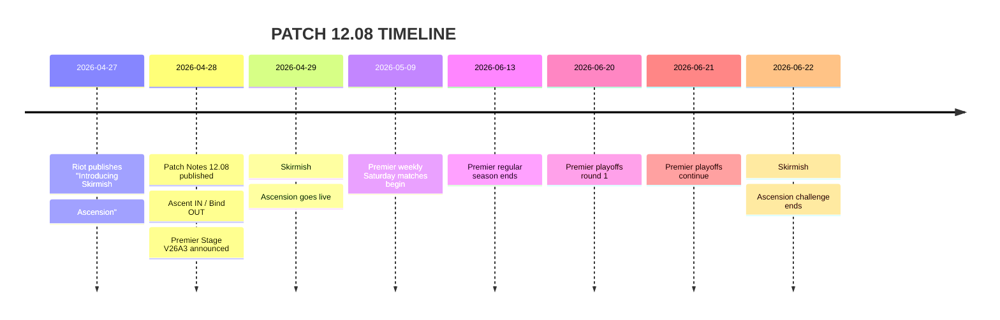
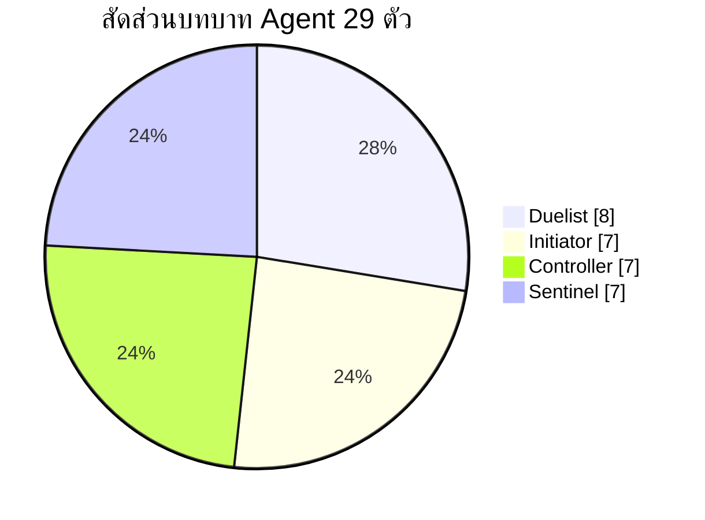

# รายงานสรุปข้อมูลเกม VALORANT สำหรับแพตช์ 12.08

## บทสรุปผู้บริหาร

- แพตช์ 12.08 ของ VALORANT ออกวันที่ 28 เมษายน 2026 และแกนหลักของแพตช์นี้คือ **Skirmish: Ascension**, การสลับแผนที่ **Ascent เข้า / Bind ออก** ในคิว Competitive และ Deathmatch, การกลับมาของ **Premier** บน PC และชุด **bug fixes** จำนวนหนึ่ง โดย **ไม่มีการประกาศ buff / nerf / rework ของ Agent หรืออาวุธแบบตรง ๆ** ในโน้ตทางการของแพตช์นี้เลย citeturn3view0turn3view3  
- Skirmish: Ascension เป็นโหมดแรงค์จำกัดเวลาแยกจาก 5v5 ปกติ เล่นได้ทั้ง 1v1 และ 2v2 มี ladder แยกบน FTW, ใช้ Agent แบบจำกัดรายชื่อ 14 ตัว, ให้ใช้เพียง 1 สกิลต่อ Agent และใช้อาวุธแบบ staged rounds ทำให้โหมดนี้เน้น mechanical skill และ clutch มากกว่าเมตา 5v5 ปกติ citeturn2view1turn2view2turn3view1  
- ดังนั้น “เมตา” ที่ขยับจริงในเกมหลักหลัง 12.08 จึงมาจาก **การเปลี่ยน map pool** มากกว่าจาก balance patch: การกลับมาของ Ascent ดันค่าให้กับ comp ที่ชอบ mid control, initiator สายข้อมูล, sentinel ยืน anchor และ Operator angles ขณะที่การถอด Bind ออกทำให้ comp สาย no-mid, teleporter fake และ close-quarters exec ถูกใช้น้อยลงใน ranked/premier โดยธรรมชาติ ข้อนี้เป็นการวิเคราะห์จากแผนที่และการหมุนเวียน map pool ของ Riot ไม่ใช่ถ้อยคำ balance ตรงจากผู้พัฒนา citeturn3view0turn23view0  
- Premier Stage V26A3 เริ่มรอบใหม่ โดยมีแมตช์วันเสาร์ตั้งแต่ 9 พฤษภาคม ถึง 13 มิถุนายน 2026 และ playoffs วันที่ 20–21 มิถุนายน 2026 ทำให้ทีมที่เล่น Premier ต้องย้ายภาระซ้อมจาก Bind ไป Ascent ทันที citeturn3view3  

## แพตช์ 12.08 และผลกระทบเชิงเมตา

ตารางนี้สรุป “ของที่เปลี่ยนจริง” ใน 12.08 และแปลผลเชิงการเล่นให้สั้นที่สุด โดยยึด Riot patch notes เป็นหลัก และใช้บทสรุปจากสื่อ esports เป็นแหล่งประกอบเท่านั้น citeturn2view0turn2view1turn2view3

| หมวด | สิ่งที่เปลี่ยนใน 12.08 | ผลในทางปฏิบัติ |
|---|---|---|
| Balance | **ไม่มี** buff/nerf/rework ฝั่ง Agent หรือ Weapon แบบตรง ๆ ใน patch notes | เมตา 5v5 เปลี่ยนเพราะ **map pool** และ **โหมดใหม่** ไม่ใช่เพราะค่าสเตตัส/ราคา/สกิลโดนแก้ |
| Map Rotation | **Ascent IN**, **Bind OUT** ใน Competitive + Deathmatch | ranked/premier ต้องกลับไปซ้อม mid control, anti-operator utility, และ sentinel anchor setups บน Ascent |
| New Mode | **Skirmish: Ascension** เปิดเป็น ranked-limited mode สำหรับ Act 3 | ส่งผลต่อการฝึก aim/clutch/flash timing แต่ไม่ใช่ตัวแทนเมตา 5v5 เต็มรูปแบบ |
| LTM Rotation | **Knockout ออก** | ผู้เล่นสายโหมดพิเศษจะถูกพาไปโฟกัส Skirmish แทน |
| Premier | **Stage V26A3 กลับมา** พร้อมตาราง 6 สัปดาห์ และ playoffs หลายวัน | ทีมที่เล่นเป็นสแต็กต้องอัปเดต playbook/map prep เร็วขึ้น |
| Bug Fixes | แก้เคสของ Miks, Veto, KAY/O, Neon, Tejo, Gekko, Yoru, Viper, Sage และปัญหา settings/replay บน PC | ลดความเพี้ยนจากบั๊กในบาง interaction; โดยรวมคือ “เพิ่มความเสถียร” มากกว่า “เปลี่ยนความเก่ง” |

ในเชิงรายละเอียดของ Skirmish: Ascension, Riot ระบุไว้ชัดว่าโหมดนี้เป็นประสบการณ์ competitive แบบจำกัดเวลาที่ใช้ Agent pool แบบคัดเฉพาะ, อนุญาตแค่ 1 ability ต่อ Agent, มีรอบอาวุธแบบ staged weapons และแยก ladder ระหว่าง 1v1 กับ 2v2 โดยเริ่มเล่นได้ตั้งแต่ 29 เมษายน ถึง 22 มิถุนายน 2026 บน FTW site. Roster ที่ใช้ในโหมดนี้ประกอบด้วย Jett, Waylay, Chamber, Cypher, Omen, Phoenix, Yoru, Iso, Sage, Raze, Vyse, KAY/O, Breach และ Veto พร้อมสกิลเดี่ยวที่กำหนดตายตัวต่อ Agent. citeturn3view0turn2view1turn2view2

ส่วน bug fixes ที่ “พอมีผลต่อความรู้สึกเมตา” มากที่สุดคือการแก้ interaction ของ **Viper’s Toxic Screen**, การแก้เคส **Sage resurrection ภายใน Viper decay**, และการแก้ **Tejo’s Armageddon targeting** เพราะทั้งหมดเป็นเคสที่ทำให้ round outcome เพี้ยนได้เมื่อเกิดจริง แต่ Riot ไม่ได้นำเสนอสิ่งเหล่านี้ในฐานะ balance changes จึงควรตีความว่าเป็น **reliability fixes** มากกว่า power shift. citeturn3view2turn3view3

ไทม์ไลน์ด้านล่างสรุปวันประกาศและหน้าต่างการใช้งานที่สำคัญจาก Riot และ FTW อย่างเป็นลำดับเวลา citeturn2view1turn2view2turn3view3

## รายชื่อ Agent ทั้ง 29 ตัวพร้อมสกิลและวิธีเล่น

คีย์สกิลในตารางด้านล่างใช้รูปแบบ **Q / C / E / X ตาม current client mapping** จากฐานข้อมูล Agent ปัจจุบัน และสรุปแนวใช้สกิล/การเล่นให้อ่านง่ายในเชิงโค้ช ไม่ใช่การคัดลอกคำอธิบายแบบยาวจากหน้าเว็บทางการทั้งหมด citeturn14view0turn19view2

จาก roster ปัจจุบัน Agent ทั้ง 29 ตัวแบ่งเป็น **Duelist 8, Initiator 7, Controller 7, Sentinel 7** ตาม current agent pages. citeturn24view0turn25view0turn25view1turn26view0turn26view1turn26view2turn27view0turn27view1turn28view0turn28view1turn28view2turn29view1turn29view2turn31view0turn31view1turn31view2turn34view0turn34view1turn35view0turn35view1turn36view2turn37search1turn37search2

**Duelists**

| Agent | Role | Abilities | Use-case timing | Playstyle |
|---|---|---|---|---|
| Jett | Duelist | **Q Updraft** — ขึ้นมุมสูง **E Tailwind** — dash รีโพสิชัน **C Cloudburst** — smoke สั้นโค้งได้ **X Blade Storm** — มีดแม่นสูง | ใช้ Q/E ตอนเปิดมุมแรกหรือหนี trade; C ตอนครอส/แก้ควัน; X ตอน eco หรือรอบที่ต้องเก็บเครดิต | entry/Op carry, เล่น pick แล้วถอย |
| Waylay | Duelist | **Q Lightspeed** — dash สองจังหวะ **E Refract** — วาง beacon แล้วย้อนกลับ **C Saturate** — Hinder ชะลอหนัก **X Convergent Paths** — beam ใหญ่+speed | วาง E ก่อน peek เสี่ยง; ใช้ C ก่อนเข้าหรือกัน retake; Q ใช้กินพื้นที่หลัง util ทีม; X ใช้เปิดไซต์ | entry ที่ต้องวางแผนทางหนี |
| Iso | Duelist | **Q Undercut** — ยิงทะลุให้ Vulnerable+Suppress **E Double Tap** — โล่กัน 1 hit + flow **C Contingency** — กำแพงกันกระสุน **X Kill Contract** — ดึง 1v1 | E ก่อน duel แรก; Q/C ก่อน swing มุมยาก; X ดึงตัว carry/anchor ออกจาก round | เล่น isolate duel และบังคับ 1v1 |
| Neon | Duelist | **Q Relay Bolt** — concuss เด้งพื้น **E High Gear** — วิ่งเร็ว+slide **C Fast Lane** — กำแพงวิชั่นคู่ **X Overdrive** — ลำแสงยิงแม่นระหว่างวิ่ง | Q ก่อนเข้ามุม; C ใช้ครอสหรือแยกไซต์; E ใช้เปิดพื้นที่เร็ว/retake; X ดีมากใน eco และ fast hit | hyper-entry, เร่ง tempo ให้ทีม |
| Phoenix | Duelist | **Q Curveball** — flash โค้ง **E Hot Hands** — fire zone + heal ตัวเอง **C Blaze** — กำแพงไฟบังวิชั่น **X Run It Back** — ได้ “ชีวิตฟรี” ชั่วคราว | Q ตอนออกมุม; E เคลียร์ close corner/deny plant; C แบ่งไซต์; X ใช้ entry, retake หรือเช็กข้อมูล | self-sufficient duelist, เล่นนำทีมได้ด้วยตัวเอง |
| Raze | Duelist | **Q Blast Pack** — satchel ดันตัว/ดันศัตรู **E Paint Shells** — grenade แตกย่อย **C Boom Bot** — bot เช็กมุม **X Showstopper** — rocket พื้นที่ใหญ่ | ใช้ C/E ล้างมุมก่อนเข้า; Q ใช้ mobility หรือหยุด defuse; X ใช้ปิดไซต์/ปิดรอบ | explosive entry, เก่งในพื้นที่แคบ |
| Reyna | Duelist | **Q Devour** — heal จาก Soul Orb **E Dismiss** — intangible/invis ตอน Empress **C Leer** — nearsight eye **X Empress** — combat stim + soul loop | C ก่อน duel line-of-sight; Q/E หลังกด kill ทันที; X ใช้ตอนมั่นใจว่าสามารถ chain kills ได้ | snowball fragger, เก่งเมื่อชนะ duel แรก |
| Yoru | Duelist | **Q Blindside** — bounce flash **E Gatecrash** — TP / fake TP **C Fakeout** — clone หลอกศัตรู **X Dimensional Drift** — invis scout/ตั้ง flank | ใช้ C/E ก่อน fake หรือ lurk; Q คอมโบจาก TP; X ใช้เก็บข้อมูล วางจังหวะ flank หรือดึง utility | trickster/lurker, เล่น mindgame สูง |

ที่มาเรื่องชื่อ Agent, บทบาท, และคีย์สกิลของ Duelist table มาจาก Riot roster/current pages และฐานข้อมูลปัจจุบันของ Jett, Waylay, Iso, Neon, Phoenix, Raze, Reyna, Yoru โดยเฉพาะ Phoenix/Yoru ใช้ Riot current page และ current secondary references เสริมเพราะ web preview บางหน้าไม่แสดง ability blocks ครบทุกบรรทัด citeturn14view0turn19view1turn19view0turn28view2turn31view0turn40view0turn32view1turn34view2turn42search14turn42search18turn43search1turn43search2

**Initiators**

| Agent | Role | Abilities | Use-case timing | Playstyle |
|---|---|---|---|---|
| Breach | Initiator | **Q Flashpoint** — flash ทะลุกำแพง **E Fault Line** — concuss เป็นเส้น **C Aftershock** — burst damage หลังผนัง **X Rolling Thunder** — quake ใหญ่ | Q/E ก่อนให้ duelists swing; C ไล่คนในซอกหรือหยุด defuse; X ใช้เปิดไซต์หรือ retake | support-entry initiator, เน้นคอมโบกับทีม |
| Fade | Initiator | **Q Seize** — จับคา + Deafened/Decayed **E Haunt** — reveal + trail **C Prowler** — ตาม trail และ nearsight **X Nightfall** — คลื่น Mark/Deafen/Decay | E เปิดข้อมูลก่อน hit; C ไล่ตาม trail; Q ล็อกเป้าให้เพื่อนตามยิง; X ใช้เปิดไซต์หรือ retake | info + hunt initiator, เก่งกับคอมโบสังหาร |
| Gekko | Initiator | **Q Wingman** — concuss/plant/defuse **E Dizzy** — flash ยิงพลาสมา **C Mosh Pit** — zone damage แล้วระเบิด **X Thrash** — ควบคุม detain | E/Q ก่อนเข้าไซต์; C กดพื้นที่ plant/defuse; X ใช้เปิด/retake และปิดพื้นที่แคบ | initiator ที่ยืดหยุ่นและเด่นเรื่อง objective control |
| KAY/O | Initiator | **Q FLASH/drive** — flash ขว้างเร็ว/ช้า **E ZERO/point** — suppression knife **C FRAG/ment** — molly หลายระลอก **X NULL/cmd** — pulse suppress + revive state | E เปิดไซต์ก่อน trade; Q ใช้ self-pop หรือ support; C ไล่มุม/หยุด defuse; X ใช้ก่อน hard exec | anti-ability initiator, ชอบเล่นกับ tempo เร็ว |
| Skye | Initiator | **Q Trailblazer** — tiger concuss **E Guiding Light** — hawk flash บังคับทิศได้ **C Regrowth** — heal allies **X Seekers** — seekers หา 3 เป้า | E/Q ใช้หาข้อมูลก่อน swing; C หลังไฟต์หรือก่อน retake; X ใช้ล็อกตำแหน่งก่อนบุก | all-round initiator, utility ครบและอ่านเกมง่าย |
| Sova | Initiator | **Q Shock Bolt** — damage bolt เด้งได้ **E Recon Bolt** — reveal bolt **C Owl Drone** — drone + mark dart **X Hunter’s Fury** — wall-piercing blast | E/C ก่อนเข้าหรือ retake; Q ใช้เคลียร์ trap/มุม; X ปิดคน plant/defuse หรือยิงตามข้อมูล | info initiator ระยะไกล, เล่นตำแหน่งที่สองเด่น |
| Tejo | Initiator | **Q Special Delivery** — sticky concuss nade **E Guided Salvo** — เลือก 2 จุดยิงมิสไซล์ **C Stealth Drone** — drone suppress+reveal **X Armageddon** — strike line ระเบิดรุนแรง | C เปิดข้อมูลก่อน hit; E บีบ anchor ออกจากจุด; Q ปิดมุม; X ใช้ล้างเส้นทาง plant/retake | artillery initiator, เน้นบังคับพื้นที่จากระยะปลอดภัย |

ที่มาเรื่องชื่อ Agent, บทบาท, และคีย์สกิลของ Initiator table มาจาก Riot roster/current pages และฐานข้อมูลปัจจุบันของ Breach, Fade, Gekko, KAY/O, Skye, Sova และ Tejo citeturn14view0turn25view0turn27view1turn28view0turn31view2turn34view1turn35view0turn35view1

**Controllers**

| Agent | Role | Abilities | Use-case timing | Playstyle |
|---|---|---|---|---|
| Astra | Controller | **Q Nova Pulse** — concuss จากดาว **E Nebula/Dissipate** — smoke/เก็บดาว **C Gravity Well** — pull + Vulnerable **X Astral Form / Cosmic Divide** — วางดาว/กำแพงตัดเสียง | วางดาวก่อน exec; กด Q/C ตอนศัตรูติดมุม; X ใช้แบ่งไซต์, post-plant หรือ retake | macro controller, เล่นระยะสองและคุม tempo |
| Brimstone | Controller | **Q Incendiary** — molly พื้นที่ **E Sky Smoke** — map smokes **C Stim Beacon** — combat stim + speed **X Orbital Strike** — laser DoT | E ก่อนเข้าไซต์; Q หลัง plant หรือ stopping push; C ตอน commit; X ใช้ clear default plant/retake spot | controller ตรงไปตรงมา, exec/post-plant เก่งมาก |
| Clove | Controller | **Q Meddle** — decay grenade **E Ruse** — smokes ใช้ได้แม้ตาย **C Pick-me-up** — haste + temp HP **X Not Dead Yet** — ชุบตัวเอง | E ใช้คุมเส้นเข้าเสมอ; Q ก่อน swing; C หลังได้ kill; X ใช้เมื่อมีโอกาสเก็บ kill/assist ต่อ | fragging controller, เดินกับทีมแล้ว trade ดี |
| Harbor | Controller | **Q High Tide** — กำแพงน้ำพับทิศได้ **E Cove** — smoke โล่น้ำกันกระสุน **C Storm Surge** — whirlpool slow + nearsight **X Reckoning** — คลื่นน้ำกดพื้นที่ | ใช้ Q/E ตอนข้ามพื้นที่โล่ง; C ปิดมุมหลบหรือหยุด push; X เปิดไซต์/retake | controller สายครอสพื้นที่และตัดมุม OP |
| Miks | Controller | **Q Harmonize** — stim ให้ตนเอง/เพื่อน **E Waveform** — map smokes **C M-pulse** — โหมด concuss หรือ heal **X Bassquake** — knockback + deafen + slow | E ก่อน exec; Q เมื่อทีมจะ commit; C ใช้ทั้งตั้งรับและ sustain หลังไฟต์; X ใช้เปิดทางเข้าหรือหยุด push | support-controller, ขับ tempo และช่วยทีมรวมเป็นก้อน |
| Omen | Controller | **Q Paranoia** — nearsight/deafen ทะลุกำแพง **E Dark Cover** — long smoke **C Shrouded Step** — short TP **X From the Shadows** — global TP | E ใช้ default/exec; Q คอมโบก่อนเพื่อน swing; C ใช้หลบมุมหรือ off-angle; X ใช้ lurk flip/เก็บข้อมูล | flexible controller, เล่น fake/lurk ได้ดี |
| Viper | Controller | **Q Poison Cloud** — orb smoke decay **E Toxic Screen** — กำแพงพิษยาว **C Snake Bite** — molly + Vulnerable **X Viper’s Pit** — ult คุมพื้นที่ใหญ่ | Q/E ใช้ default ยืดรอบ; C หลัง plant หรือหยุด rush; X ใช้ยึดไซต์/ปิด retake | controller สาย attrition และ post-plant |

ที่มาเรื่องชื่อ Agent, บทบาท, และคีย์สกิลของ Controller table มาจาก Riot roster/current pages และฐานข้อมูลปัจจุบันของ Astra, Brimstone, Clove, Harbor, Miks, Omen และ Viper citeturn14view0turn24view0turn25view1turn26view1turn28view1turn29view2turn31view1turn37search1

**Sentinels**

| Agent | Role | Abilities | Use-case timing | Playstyle |
|---|---|---|---|---|
| Chamber | Sentinel | **Q Headhunter** — heavy pistol **E Rendezvous** — TP anchor **C Trademark** — slow trap **X Tour De Force** — custom sniper | วาง E ก่อน wide peek; ใช้ C กัน flank/main; Q/X ใช้คุมเครดิตหรือถือ long angle | sentinel ที่เอียงไปทาง pick/Operator |
| Cypher | Sentinel | **Q Cyber Cage** — ควันบังวิชั่น + audio cue **E Spycam** — camera reveal dart **C Trapwire** — trip slow/reveal **X Neural Theft** — reveal ทั้งทีมศัตรู | C/E ตั้งก่อน round; Q เปิดตอนศัตรูเข้าหรือ retake; X ใช้หลังได้ body ทันที | info sentinel, เด่นมากใน anchor และ flank watch |
| Deadlock | Sentinel | **Q Sonic Sensor** — ตรวจเสียงแล้ว concuss **E GravNet** — บังคับ crouch/slow **C Barrier Mesh** — wall บล็อกทางเดิน **X Annihilation** — cocoon kill | ตั้ง Q/C กัน rush; E ใช้หยุด entry; X ใช้จับคนเปิดหรือคนคุม post-plant | anti-rush sentinel, เก่งใน choke ชัด ๆ |
| Killjoy | Sentinel | **Q ALARMBOT** — hunt แล้วให้ Vulnerable **E TURRET** — ป้อมคุมมุม **C Nanoswarm** — molly ซ่อน **X Lockdown** — detain พื้นที่ใหญ่ | วาง E/Q ก่อน round; C ใช้ deny plant/defuse; X ตอนจะยึดไซต์หรือบังคับ retake | anchor sentinel มาตรฐาน, เก่ง setup และ post-plant |
| Sage | Sentinel | **Q Slow Orb** — slow field **E Healing Orb** — heal **C Barrier Orb** — กำแพง **X Resurrection** — ชุบเพื่อน | C ใช้ตัดทางหรือชะลอ hit; E หลังไฟต์; Q เวลา rush มา; X เมื่อชุบแล้วทีมตั้งรูปได้จริง | support sentinel, ช่วยยืดเวลาและประคอง round |
| Veto | Sentinel | **Q Chokehold** — trap ล็อกเป้า + Deafened/Decayed **E Interceptor** — anti-utility device **C Crosscut** — vortex TP **X Evolution** — regen + stim + immune debuffs | E ตั้งรับเส้นเข้า utility หนัก; Q ดัก choke; C ใช้ hold off-angle/กลับจุด; X ใช้ถือไซต์หรือ retake ไฟต์ยาว | anti-utility sentinel เชิงรุก |
| Vyse | Sentinel | **Q Shear** — hidden wall trap **E Arc Rose** — trap flash **C Razorvine** — slow + damage ตอนขยับ **X Steel Garden** — jam อาวุธหลักศัตรู | E/Q วางก่อน round; C ใช้หยุด push หรือ retake path; X ใช้ก่อน exec/retake ให้ยิงคืนยาก | funnel sentinel, ชอบบังคับศัตรูเข้าช่องแคบ |

ที่มาเรื่องชื่อ Agent, บทบาท, และคีย์สกิลของ Sentinel table มาจาก Riot roster/current pages และฐานข้อมูลปัจจุบันของ Chamber, Cypher, Deadlock, Killjoy, Sage, Veto และ Vyse citeturn14view0turn26view0turn26view2turn27view0turn29view1turn34view0turn37search2turn36view2

## แผนที่ทั้ง 12 และแนวทางเล่นแบบย่อยง่าย

คำแนะนำด้านล่างเป็น **analytical synthesis** จากเลย์เอาต์และคำอธิบายแผนที่ทางการของ Riot รวมถึงบริบท callouts/guide ปัจจุบันของแผนที่ใหม่อย่าง Corrode เพื่อให้ใช้งานได้จริงใน ranked มากกว่าจะเป็นคำอธิบาย lore ของแผนที่ citeturn23view0turn22view0turn44search0turn44search1

| Map | จุดเด่นโครงสร้าง | ฝั่งโจมตีควรเล่นอย่างไร | ฝั่งป้องกันควรเล่นอย่างไร | choke / smoke / utility ที่พบบ่อย |
|---|---|---|---|---|
| Corrode | 3-lane, layered defense | สู้ mid เร็วแล้ว split ไซต์; ใช้ flash/molly เคลียร์แนวซ้อน | เก็บข้อมูล mid แล้วถอยไปเล่น crossfire ชั้นใน | A Main, Mid/Elbow, B Main; smoke Mid-Connector, A Heaven, B Backsite |
| Abyss | 2 ไซต์ + death drops | เล่นช้าเพื่อบังคับคนจากขอบตกเหว; mid split สำคัญ | ลงโทษคน overpeek ใกล้ขอบ; retake เป็นหน่วย | A Main, Mid, B Main; smoke A Bridge/Heaven, B Pillar/Backsite |
| Sunset | 3-lane คลาสสิก เน้น mid | mid control สำคัญมาก โดยเฉพาะ split B ผ่าน Market/Boba | ถ้าปล่อย mid ฟรีจะเสียทั้ง A และ B link | Top Mid, Market, Boba, A Elbow, B CT |
| Lotus | 3 sites + rotating doors | ใช้เสียงประตูและ fast pivot หลอกไซต์; default กว้างได้ผล | เก็บ A Main/C Main info และใช้ประตูช่วย rotate | A Main/Tree, B Main, C Main/Mound; smoke Tree, B Site, C Waterfall/CT |
| Pearl | no mechanics, mid แน่น, long wings | ชนะ mid ก่อนจึง split B ง่าย; ถ้าไม่ชนะ mid ให้ดัน long ทีละด้าน | ห้ามปล่อย Art/Mid ฟรี; long lanes เหมาะกับ rifle/Op | Mid Connector/Art, A Dugout, B Link/Heaven |
| Fracture | attackers เข้าจากสองฝั่ง | pinch พร้อมกันจากสองทาง, utility ต้องลงพร้อม | ฝั่งรับควร push info บางจังหวะ ไม่งั้นโดนบีบสองด้าน | A Main/A Drop, B Main/Arcade; smoke A Heaven, B Canteen/Tower |
| Breeze | open map, long sightlines | ใช้ wall/smoke หนา ๆ ครอสพื้นที่ยาว, lurk doors/halls | เล่น Operator และอย่า trade angle ยาวแบบไม่มี util | A Nest/Pyramids, Mid Top/Doors, B CT/Backsite |
| Icebox | verticality สูง, zipline | ใช้ smoke/wall คลุมจุด plant; เคลียร์มุมสูงก่อนลง spike | ตั้ง utility แคบ ๆ ที่ choke และ retake จาก rafters/backsite | A Screens/410/Nest, B Yellow/Orange/CT |
| Ascent | mid-centric, เปิด/ปิดประตูไซต์ได้ | default ช้า เก็บ mid แล้วเลือก split A หรือ B; อย่ารีบ 5 คนวิ่ง main เดียว | contest mid ด้วย info/one-way; sentinel anchor แข็งมาก | Top Mid, Market, Cat, A Tree/Heaven, B Market/CT |
| Split | vertical mid + ropes | ถ้าไม่คุม Mid Mail/Vents จะเข้ายากมาก; เล่น split เป็นหลัก | เล่น heaven crossfire และใช้ stall utility ที่ funnel | Mid Vent/Mail, A Heaven/Screens, B Heaven/Garage |
| Haven | 3 sites | default กระจาย เก็บ info ก่อน commit; punishes rotation ได้ดี | เร่ง info ที่ A Long, Garage, C Long แล้ว rotate ไว | A Heaven/CT, B Window/CT, C Platform/CT/Garage |
| Bind | 2 sites, no mid, teleports | control Hookah/Showers แล้วใช้ TP fake; exec ตรง ๆ ทำได้แรง | anchor extremities ให้แน่นและใช้ TP rotate อย่างมีข้อมูล | A Heaven/Truck, B CT/Elbow/Hookah, TP exits |

ในมุมเชิงเมตา “เล่นยังไงให้ชนะขึ้น” ถ้าสรุปแบบสั้นจริง ๆ: **Ascent, Split, Sunset, Pearl** ต้องให้ค่ากับ **mid control** สูง; **Lotus, Haven** ต้องคิดเรื่อง **rotation** มากกว่าแค่ site hit; **Bind, Fracture** ต้องซ้อม **timing พร้อมกันหลายทาง**; **Breeze, Icebox, Abyss** ต้องจัด utility เพื่อรับมือ **ระยะยิงยาวและมุมแนวตั้ง** ให้ดีเป็นพิเศษ citeturn23view0turn22view0

## อาวุธทั้ง 19 ปืน + 1 มีด และตารางซื้อสำหรับแต่ละ Agent

ชื่อหมวดอาวุธอ้างอิงจาก Riot Arsenal และราคาจาก current weapons database ที่อัปเดตชุดอาวุธปัจจุบัน ซึ่งรวม **Bandit** และ **Outlaw** แล้วเรียบร้อย citeturn6view0turn21view0turn8search1

| Weapon | Category | Price | Recoil / Accuracy แบบย่อ | ช่วงซื้อที่เหมาะ |
|---|---|---:|---|---|
| Classic | Sidearm | 0 | สมดุล, alt-fire เด่นระยะใกล้ | pistol / eco |
| Bandit | Sidearm | 600 | semi-auto แม่น, ยิงหัวคุ้มราคา | light-buy / eco |
| Shorty | Sidearm | 300 | spread หนัก, เก่งมากระยะประชิด | eco / anti-eco / มุมแคบ |
| Frenzy | Sidearm | 450 | ยิงรัวแรง แต่คุมระยะไกลยาก | force / close-range |
| Ghost | Sidearm | 500 | silenced, tap แม่นกลาง-ไกล | pistol / light-buy |
| Sheriff | Sidearm | 800 | recoil สูงแต่ one-tap คุ้ม | eco / half-buy |
| Stinger | SMG | 1,100 | recoil พุ่งแรง, เก่งระยะใกล้ | force / anti-eco |
| Spectre | SMG | 1,600 | silenced, spray คุมง่ายกว่า Stinger | force / bonus / anti-eco |
| Bucky | Shotgun | 850 | ยิงแคบใกล้ ๆ คุ้มมาก, ไกลตกแรง | eco / anti-rush |
| Judge | Shotgun | 1,850 | auto shotgun, hold choke โหด | force / anti-eco / มุมควัน |
| Bulldog | Rifle | 2,050 | ADS burst เสถียร, full-auto พอใช้ | half-buy / bonus |
| Guardian | Rifle | 2,250 | semi-auto แม่นสูง, พึ่ง aim ล้วน | half-buy / bonus / long angle |
| Phantom | Rifle | 2,900 | recoil นุ่มกว่า Vandal, silenced | full-buy / anti-eco / spray site |
| Vandal | Rifle | 2,900 | recoil เด้งกว่า Phantom แต่ headshot ทุกระยะ | full-buy มาตรฐาน |
| Marshal | Sniper | 950 | เบา, คล่อง, เปิดมุมดีมาก | eco / bonus / light-armor punish |
| Outlaw | Sniper | 2,400 | burst-snipe สองนัด, เด่นมากใส่ light shield | half-buy punisher |
| Operator | Sniper | 4,700 | angle hold แรงสุด แต่แพงมาก | full-buy เมื่อเศรษฐกิจพร้อม |
| Ares | Heavy | 1,600 | สเปรย์ยาว, wallbang ได้ดี | force / anti-rush / niche |
| Odin | Heavy | 3,200 | fire volume สูง, ทะลุกำแพงแรง | full-buy เฉพาะบางแผน |
| Tactical Knife | Melee | 0 | ไม่มี recoil; ใช้เพื่อความเร็ววิ่ง/ตีปิดงาน | ทุกรอบเฉพาะ movement/last hit |

หมายเหตุ: คอลัมน์ recoil/accuracy และช่วงซื้อเป็นการสังเคราะห์จากหมวดอาวุธ, ราคาปัจจุบัน, และรูปแบบการยิงของฐานข้อมูลอาวุธ ไม่ใช่ “คำแนะนำทางการ” ตรงจาก Riot แต่ยึดชุดข้อมูลอาวุธปัจจุบันเป็นฐานทั้งหมด citeturn6view0turn21view0turn21view1turn21view2turn8search1

ตารางแนะนำการซื้อด้านล่างเป็นแนวทางเชิงแข่งขันแบบย่อ: **Eco = ประหยัดมาก**, **Half-buy = มีของพอสู้**, **Full buy = ซื้อเต็ม**, **Anti-eco = เรามีเงินมากกว่าและคาดว่าศัตรูประหยัด**. หลักสำคัญคือ **อย่าทิ้ง utility หลักของ role เพื่ออัปปืนเกินจำเป็น**. citeturn21view0turn14view0turn19view2

| Agent | Eco | Half-buy | Full buy | Anti-eco |
|---|---|---|---|---|
| Astra | Classic/Ghost + util | Spectre/Bulldog | Phantom/Vandal | Spectre/Phantom |
| Breach | Classic/Frenzy + util | Spectre/Bulldog | Phantom/Vandal | Spectre/Phantom |
| Brimstone | Classic/Ghost + util | Spectre/Bulldog | Phantom/Vandal | Spectre/Phantom |
| Chamber | Headhunter/Bandit/Ghost | Marshal/Headhunter | Operator/Vandal | Marshal/Vandal |
| Clove | Ghost/Frenzy + util | Spectre/Bulldog | Phantom/Vandal | Spectre/Phantom |
| Cypher | Classic/Shorty | Judge/Spectre/Sheriff | Phantom/Vandal | Judge/Spectre |
| Deadlock | Classic/Shorty | Judge/Bucky/Spectre | Phantom/Vandal | Judge/Spectre |
| Fade | Classic/Ghost | Spectre/Guardian | Phantom/Vandal | Spectre/Phantom |
| Gekko | Classic/Ghost | Spectre/Bulldog | Phantom/Vandal | Spectre/Phantom |
| Harbor | Classic/Ghost | Spectre/Bulldog | Phantom/Vandal | Spectre/Phantom |
| Iso | Sheriff/Bandit | Bulldog/Guardian/Spectre | Vandal/Phantom | Spectre/Vandal |
| Jett | Sheriff/Bandit | Marshal/Stinger/Spectre | Operator/Vandal/Phantom | Spectre/Phantom |
| KAY/O | Ghost/Frenzy | Spectre/Bulldog | Phantom/Vandal | Spectre/Phantom |
| Killjoy | Classic/Shorty | Judge/Spectre | Phantom/Vandal | Judge/Spectre |
| Miks | Classic/Ghost + util | Spectre/Bulldog | Phantom/Vandal | Spectre/Phantom |
| Neon | Frenzy/Shorty | Stinger/Spectre/Judge | Phantom/Vandal | Spectre/Judge |
| Omen | Ghost/Classic | Spectre/Bulldog | Phantom/Vandal | Spectre/Phantom |
| Phoenix | Frenzy/Ghost | Spectre/Bulldog | Phantom/Vandal | Spectre/Phantom |
| Raze | Shorty/Frenzy | Stinger/Judge/Spectre | Vandal/Phantom | Judge/Spectre |
| Reyna | Sheriff/Ghost | Bulldog/Guardian/Spectre | Vandal/Phantom | Spectre/Vandal |
| Sage | Classic/Ghost | Spectre/Bulldog | Phantom/Vandal | Spectre/Phantom |
| Skye | Ghost/Frenzy | Spectre/Bulldog | Phantom/Vandal | Spectre/Phantom |
| Sova | Classic/Ghost | Guardian/Spectre/Ares | Vandal/Phantom/Odin | Spectre/Guardian |
| Tejo | Classic/Ghost | Bulldog/Guardian/Spectre | Vandal/Phantom | Spectre/Guardian |
| Veto | Ghost/Shorty | Spectre/Judge | Phantom/Vandal | Judge/Spectre |
| Viper | Classic/Ghost | Spectre/Bulldog | Phantom/Vandal | Spectre/Phantom |
| Vyse | Classic/Shorty | Judge/Spectre | Phantom/Vandal | Judge/Spectre |
| Waylay | Sheriff/Bandit | Stinger/Spectre | Vandal/Phantom | Spectre/Phantom |
| Yoru | Ghost/Sheriff | Spectre/Bulldog | Vandal/Phantom | Spectre/Vandal |

## เมตาหลังแพตช์ 12.08 และแหล่งอ้างอิงหลัก

ถ้าตอบแบบตรงที่สุด: **12.08 ไม่ได้เปลี่ยนเมตาผ่าน buff/nerf**, แต่เปลี่ยนผ่าน **map pool**. การกลับมาของ **Ascent** ทำให้คุณค่าของ Agent/อาวุธที่เก่งในเกมช้า, การคุม mid, การ anchor และการใช้ข้อมูลกลับมาสูงขึ้นอีกครั้ง เช่น Sova, KAY/O, Cypher, Killjoy, Omen, Astra รวมถึงผู้เล่นที่ถือ Operator ได้ดีอย่าง Jett และ Chamber เพราะ Ascent เป็นแผนที่ที่แบ่งไซต์ด้วย “position and attrition” และการยึด mid มีผลมหาศาลต่อการแยก A/B. นี่เป็นการวิเคราะห์จาก map swap และคำอธิบายทางการของแผนที่เอง ไม่ใช่ข้อความประกาศ meta ตรงจาก Riot. citeturn3view0turn23view0

ในทางกลับกัน การที่ **Bind ออกจากคิว** ทำให้หนึ่งในบ้านที่ดีที่สุดของคอมพ์ no-mid, ใส่ utility หนา, fake ด้วย teleporter, และเล่น close-range explosive exec ถูกถอดออกจาก ranked/premier rotation ไปชั่วคราว ซึ่งลดน้ำหนักของ playbook บางประเภทที่พึ่งพา Hookah/Showers/teleporter heavily. Agent อย่าง Raze, Brimstone, Gekko หรือ shotgun-centric anti-eco plans ยังดีเหมือนเดิมในเชิงพลังรวม แต่มี “สนามถนัด” น้อยลงหนึ่งสนามในคิวแข่งขัน ณ 12.08. citeturn3view0turn22view0

Skirmish: Ascension เองน่าจะเพิ่มชั่วโมงฝึกแบบ micro ให้กับผู้เล่นที่หยิบ Jett, Waylay, Chamber, Phoenix, Yoru, Breach, KAY/O และ Veto เพราะ roster ในโหมดจำกัดนี้เน้น dash, flash, teleport, cage และ utility ที่สร้าง duel โดยตรง แต่เพราะกติกาของโหมดใช้เพียง 1 ability ต่อ Agent, staged weapons และ ladder แยก จึงไม่ควรตีความผลการเล่นในโหมดนี้ว่าเป็นสัญญาณ balance 5v5 โดยตรง. citeturn2view1turn2view2turn3view1

บั๊กที่ถูกแก้ใน 12.08 ยังช่วยลด “ความแปลก” ของ interaction สำคัญ เช่น Viper/Sage/Tejo และปรับเสถียรภาพของ settings/replay ฝั่ง PC แต่ไม่ใช่ระดับที่จะพลิก tier list ด้วยตัวมันเอง. ถ้าจะมีผลที่สุด ก็มักเป็นผลเชิงความน่าเชื่อถือของ utility มากกว่า power budget. citeturn3view2turn3view3

แหล่งอ้างอิงหลักที่ควรใช้เป็นลำดับแรกหากจะอัปเดตฐานข้อมูลโปรเจกต์ RAG หรือทำ knowledge base ต่อ มีดังนี้

- **entity["company","Riot Games","game developer"]** — Patch Notes 12.08, Skirmish article, Agents, Maps, Arsenal citeturn1search0turn1search2turn14view0turn22view0turn6view0  
- **entity["company","Tracker Network","gaming stats platform"]** — current-client Agent ability mappings และ current weapons prices/database pages citeturn19view2turn24view0turn21view0  
- **entity["organization","Dexerto","esports news site"]** — external esports recap ของ 12.08/Act 3 เพื่อใช้เป็นบริบทประกอบ ไม่ใช่ source หลักแทน Riot citeturn2view3  
- **entity["company","Red Bull","media company"]** — ไกด์ Corrode เชิงปฏิบัติและภาพรวมการเล่นแผนที่ใหม่ citeturn44search0  
- **entity["company","Mobalytics","gaming guide platform"]** — fallback overview สำหรับ Phoenix/Yoru และ interactive map/callout context บางส่วน citeturn42search14turn43search0turn44search1